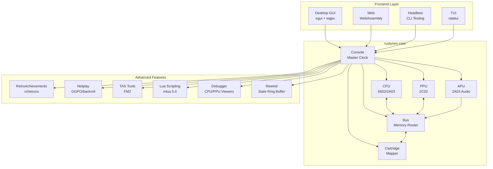
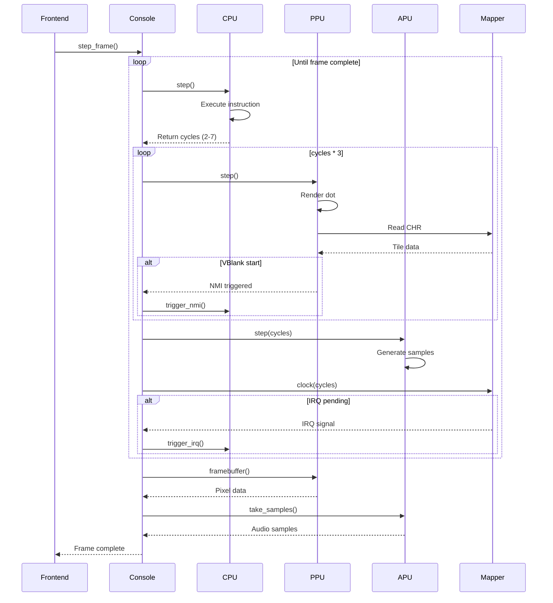

# RustyNES Architecture

**Document Version:** 1.0.0
**Last Updated:** 2025-12-18

---

## Table of Contents

- [System Overview](#system-overview)
- [Component Architecture](#component-architecture)
- [Data Flow](#data-flow)
- [Timing Model](#timing-model)
- [Memory Architecture](#memory-architecture)
- [Crate Structure](#crate-structure)
- [Design Patterns](#design-patterns)
- [Performance Considerations](#performance-considerations)

---

## System Overview

RustyNES follows a **component-based architecture** where major subsystems (CPU, PPU, APU, Cartridge) are independent modules communicating through well-defined interfaces. The **Bus** acts as the central interconnect, routing memory accesses and coordinating timing.

### High-Level Architecture Diagram



### Design Principles

1. **Separation of Concerns**: Each component has a single, well-defined responsibility
2. **Loose Coupling**: Components interact through traits, not concrete types
3. **High Cohesion**: Related functionality is grouped together
4. **Dependency Inversion**: High-level modules don't depend on low-level details
5. **Testability**: Every component can be tested in isolation

---

## Component Architecture

### Console (Master Coordinator)

The `Console` struct is the top-level orchestrator that owns all components and drives the emulation loop.

```rust
pub struct Console {
    // Core components
    cpu: Cpu,
    ppu: Ppu,
    apu: Apu,
    bus: Bus,
    cartridge: Box<dyn Mapper>,

    // Timing state
    master_clock: u64,      // Total PPU dots elapsed
    cpu_cycles: u64,        // CPU cycles completed
    frame_count: u64,       // Frames rendered

    // Interrupt state
    nmi_pending: bool,
    irq_pending: bool,

    // Configuration
    region: Region,         // NTSC, PAL, Dendy
}

impl Console {
    pub fn new(rom: &[u8]) -> Result<Self, EmulatorError> {
        let cartridge = Cartridge::from_ines(rom)?;
        let mapper = create_mapper(cartridge)?;

        Ok(Self {
            cpu: Cpu::new(),
            ppu: Ppu::new(),
            apu: Apu::new(48000.0), // 48 kHz output
            bus: Bus::new(),
            cartridge: mapper,
            master_clock: 0,
            cpu_cycles: 0,
            frame_count: 0,
            nmi_pending: false,
            irq_pending: false,
            region: Region::NTSC,
        })
    }

    /// Execute one CPU instruction
    pub fn step(&mut self) -> u8 {
        // CPU executes one instruction (2-7 cycles)
        let cpu_cycles = self.cpu.step(&mut self.bus);

        // PPU runs 3x as fast (3 dots per CPU cycle)
        for _ in 0..(cpu_cycles * 3) {
            self.ppu.step(&mut self.bus, &mut self.cartridge);

            // Check for NMI (VBlank start)
            if self.ppu.nmi_triggered() {
                self.nmi_pending = true;
            }
        }

        // APU runs at CPU speed
        self.apu.step(cpu_cycles);

        // Mappers may have IRQ counters
        self.cartridge.clock(cpu_cycles);
        if self.cartridge.irq_pending() {
            self.irq_pending = true;
        }

        // Update interrupt lines
        if self.nmi_pending {
            self.cpu.trigger_nmi();
            self.nmi_pending = false;
        }
        if self.irq_pending {
            self.cpu.trigger_irq();
        }

        self.master_clock += (cpu_cycles * 3) as u64;
        self.cpu_cycles += cpu_cycles as u64;

        cpu_cycles
    }

    /// Run until frame complete
    pub fn step_frame(&mut self) -> &[u8] {
        let target = self.frame_count + 1;
        while self.frame_count < target {
            self.step();
            if self.ppu.frame_complete() {
                self.frame_count += 1;
            }
        }
        self.ppu.framebuffer()
    }
}
```

### CPU (6502 Core)

The CPU module implements a cycle-accurate Ricoh 2A03 (6502 without decimal mode).

**Key Features:**
- Table-driven instruction dispatch
- Exact cycle timing with page-crossing penalties
- Dummy read/write emulation for timing accuracy
- Precise interrupt handling (NMI, IRQ, BRK)
- Support for all unofficial opcodes

**Interface:**
```rust
pub trait CpuBus {
    fn read(&mut self, addr: u16) -> u8;
    fn write(&mut self, addr: u16, value: u8);
}

pub struct Cpu {
    // Registers
    pub a: u8,              // Accumulator
    pub x: u8,              // X index
    pub y: u8,              // Y index
    pub sp: u8,             // Stack pointer
    pub pc: u16,            // Program counter
    pub p: Status,          // Status flags

    // Internal state
    cycles: u64,
    // ... (see cpu/CPU_6502.md for details)
}

impl Cpu {
    pub fn step(&mut self, bus: &mut dyn CpuBus) -> u8;
    pub fn trigger_nmi(&mut self);
    pub fn trigger_irq(&mut self);
    pub fn reset(&mut self, bus: &mut dyn CpuBus);
}
```

See [cpu/CPU_6502.md](cpu/CPU_6502.md) for complete specification.

### PPU (Picture Processing Unit)

The PPU module implements dot-level rendering of the Ricoh 2C02.

**Key Features:**
- Per-dot rendering (341 dots × 262 scanlines)
- Accurate scrolling (Loopy's model)
- Sprite evaluation and rendering (8-sprite limit)
- Sprite 0 hit detection
- VBlank and NMI timing

**Interface:**
```rust
pub trait PpuBus {
    fn read(&mut self, addr: u16) -> u8;
    fn write(&mut self, addr: u16, value: u8);
}

pub struct Ppu {
    // Registers
    ctrl: PpuCtrl,          // $2000
    mask: PpuMask,          // $2001
    status: PpuStatus,      // $2002

    // Timing
    scanline: u16,          // 0-261
    dot: u16,               // 0-340

    // Rendering state
    v: VramAddress,         // Current VRAM address
    t: VramAddress,         // Temporary VRAM address
    fine_x: u8,             // Fine X scroll
    w: bool,                // Write toggle

    // Buffers
    framebuffer: [u8; 256 * 240],
    // ... (see ppu/PPU_OVERVIEW.md)
}

impl Ppu {
    pub fn step(&mut self, bus: &mut dyn PpuBus, mapper: &mut dyn Mapper);
    pub fn read_register(&mut self, addr: u16) -> u8;
    pub fn write_register(&mut self, addr: u16, value: u8);
    pub fn framebuffer(&self) -> &[u8];
}
```

See [ppu/PPU_OVERVIEW.md](ppu/PPU_OVERVIEW.md) for complete specification.

### APU (Audio Processing Unit)

The APU module synthesizes 5 audio channels with hardware-accurate mixing.

**Key Features:**
- 2× Pulse wave channels (duty cycle, sweep, envelope)
- Triangle wave channel (linear counter)
- Noise channel (LFSR)
- DMC channel (delta modulation)
- Frame counter (4-step/5-step modes)
- Expansion audio support (VRC6, MMC5, etc.)

**Interface:**
```rust
pub struct Apu {
    // Channels
    pulse1: PulseChannel,
    pulse2: PulseChannel,
    triangle: TriangleChannel,
    noise: NoiseChannel,
    dmc: DmcChannel,

    // Frame counter
    frame_counter: FrameCounter,

    // Output
    output_buffer: Vec<f32>,
}

impl Apu {
    pub fn step(&mut self, cpu_cycles: u8);
    pub fn write_register(&mut self, addr: u16, value: u8);
    pub fn read_status(&mut self) -> u8;
    pub fn take_samples(&mut self) -> Vec<f32>;
}
```

See [apu/APU_OVERVIEW.md](apu/APU_OVERVIEW.md) for complete specification.

### Bus (Memory Interconnect)

The Bus routes memory accesses to appropriate components.

```rust
pub struct Bus {
    // Internal RAM (2KB, mirrored to $1FFF)
    ram: [u8; 2048],

    // DMA state
    dma_active: bool,
    dma_page: u8,
    dma_addr: u8,
    dma_dummy: bool,
}

impl Bus {
    pub fn read(&mut self, addr: u16, components: &mut Components) -> u8 {
        match addr {
            0x0000..=0x1FFF => {
                // Internal RAM (2KB mirrored 4x)
                self.ram[addr as usize & 0x07FF]
            }
            0x2000..=0x3FFF => {
                // PPU registers (mirrored every 8 bytes)
                components.ppu.read_register(0x2000 + (addr & 0x07))
            }
            0x4000..=0x4015 => {
                // APU registers
                components.apu.read_register(addr)
            }
            0x4016 => {
                // Controller 1
                components.input.read_controller1()
            }
            0x4017 => {
                // Controller 2
                components.input.read_controller2()
            }
            0x4020..=0xFFFF => {
                // Cartridge space
                components.mapper.read_prg(addr)
            }
            _ => 0, // Open bus
        }
    }

    pub fn write(&mut self, addr: u16, value: u8, components: &mut Components) {
        match addr {
            0x0000..=0x1FFF => {
                self.ram[addr as usize & 0x07FF] = value;
            }
            0x2000..=0x3FFF => {
                components.ppu.write_register(0x2000 + (addr & 0x07), value);
            }
            0x4000..=0x4013 | 0x4015 | 0x4017 => {
                components.apu.write_register(addr, value);
            }
            0x4014 => {
                // OAM DMA
                self.trigger_dma(value);
            }
            0x4016 => {
                components.input.write_strobe(value);
            }
            0x4020..=0xFFFF => {
                components.mapper.write_prg(addr, value);
            }
            _ => {}
        }
    }
}
```

See [bus/MEMORY_MAP.md](bus/MEMORY_MAP.md) for complete address space details.

### Mapper Trait

Mappers handle cartridge-specific hardware (banking, IRQs, expansion audio).

```rust
pub trait Mapper: Send {
    /// Read from PRG-ROM space ($4020-$FFFF)
    fn read_prg(&self, addr: u16) -> u8;

    /// Write to PRG space (may control banking)
    fn write_prg(&mut self, addr: u16, value: u8);

    /// Read from CHR space ($0000-$1FFF)
    fn read_chr(&self, addr: u16) -> u8;

    /// Write to CHR-RAM (if present)
    fn write_chr(&mut self, addr: u16, value: u8);

    /// Current nametable mirroring mode
    fn mirroring(&self) -> Mirroring;

    /// Check if IRQ is pending
    fn irq_pending(&self) -> bool { false }

    /// Clear IRQ flag
    fn clear_irq(&mut self) {}

    /// Clock the mapper (for IRQ counters)
    fn clock(&mut self, _cycles: u8) {}

    /// Scanline signal (for MMC3/VRC)
    fn scanline(&mut self) {}

    /// Get expansion audio output (if applicable)
    fn audio_output(&self) -> Option<f32> { None }
}

pub enum Mirroring {
    Horizontal,
    Vertical,
    SingleScreenLower,
    SingleScreenUpper,
    FourScreen,
}
```

See [mappers/MAPPER_OVERVIEW.md](mappers/MAPPER_OVERVIEW.md) for mapper details.

---

## Data Flow

### Frame Execution Cycle



### Memory Access Paths

**CPU Memory Read:**
```
CPU → Bus → Match address:
    $0000-$1FFF → Internal RAM
    $2000-$3FFF → PPU registers
    $4000-$4017 → APU/Input registers
    $4020-$FFFF → Mapper (PRG-ROM/RAM)
```

**PPU Memory Read:**
```
PPU → Mapper:
    $0000-$1FFF → CHR-ROM/RAM (pattern tables)
    $2000-$2FFF → VRAM (nametables, controlled by mirroring)
    $3000-$3EFF → Mirror of $2000-$2EFF
    $3F00-$3F1F → Palette RAM (internal to PPU)
```

---

## Timing Model

### Master Clock System

The NES operates on a **21.477272 MHz** master clock (NTSC):

```
Master Clock: 21.477272 MHz
├─ CPU Clock: ÷12 = 1.789773 MHz (~559 ns/cycle)
├─ PPU Clock: ÷4  = 5.369318 MHz (~186 ns/dot)
└─ APU Clock: Same as CPU (1.789773 MHz)
```

**Critical Ratio:** 3 PPU dots per 1 CPU cycle (exact, no accumulation error)

### Frame Timing (NTSC)

```
Frame duration: 262 scanlines × 341 dots = 89,342 PPU dots
               (89,341 on odd frames due to skipped dot)

CPU cycles per frame: 89,342 ÷ 3 = 29,780.67 cycles
Frames per second: 1,789,773 ÷ 29,780.67 ≈ 60.0988 Hz
```

### Scanline Breakdown

```
Scanline 0-239:   Visible rendering
Scanline 240:     Post-render idle
Scanline 241-260: VBlank period
Scanline 261:     Pre-render scanline

Dot 0:            Idle
Dot 1-256:        Visible pixels + tile fetches
Dot 257-320:      Sprite fetches for next scanline
Dot 321-336:      First two tiles of next scanline
Dot 337-340:      Unused nametable fetches
```

---

## Memory Architecture

### CPU Address Space (16-bit)

```
$0000-$07FF   2KB Internal RAM
$0800-$0FFF   Mirror of $0000-$07FF
$1000-$17FF   Mirror of $0000-$07FF
$1800-$1FFF   Mirror of $0000-$07FF

$2000-$2007   PPU Registers
$2008-$3FFF   Mirrors of $2000-$2007 (every 8 bytes)

$4000-$4017   APU and I/O Registers
$4018-$401F   APU/IO test mode (usually disabled)

$4020-$5FFF   Expansion ROM (rarely used)
$6000-$7FFF   SRAM (battery-backed save RAM)
$8000-$FFFF   PRG-ROM (cartridge program code)
```

### PPU Address Space (14-bit)

```
$0000-$0FFF   Pattern Table 0 (4KB)
$1000-$1FFF   Pattern Table 1 (4KB)

$2000-$23FF   Nametable 0 (1KB)
$2400-$27FF   Nametable 1 (1KB)
$2800-$2BFF   Nametable 2 (1KB)
$2C00-$2FFF   Nametable 3 (1KB)

$3000-$3EFF   Mirrors of $2000-$2EFF
$3F00-$3F1F   Palette RAM (32 bytes)
$3F20-$3FFF   Mirrors of $3F00-$3F1F
```

**Note:** Nametable 2 and 3 are usually mirrors of 0 and 1 (only 2KB VRAM). Mirroring mode controlled by cartridge hardware.

---

## Crate Structure

RustyNES is organized as a Cargo workspace with multiple crates:

```
rustynes/
├── Cargo.toml                  # Workspace definition
├── crates/
│   ├── rustynes-core/          # Core emulation (no_std compatible)
│   │   ├── src/
│   │   │   ├── console.rs      # Main Console struct
│   │   │   ├── cpu.rs          # Re-export from rustynes-cpu
│   │   │   ├── ppu.rs          # Re-export from rustynes-ppu
│   │   │   ├── apu.rs          # Re-export from rustynes-apu
│   │   │   ├── bus.rs          # Memory bus
│   │   │   └── lib.rs
│   │   └── Cargo.toml
│   │
│   ├── rustynes-cpu/           # 6502 CPU (reusable)
│   │   ├── src/
│   │   │   ├── registers.rs
│   │   │   ├── instructions.rs
│   │   │   ├── addressing.rs
│   │   │   └── lib.rs
│   │   └── Cargo.toml
│   │
│   ├── rustynes-ppu/           # 2C02 PPU
│   │   ├── src/
│   │   │   ├── registers.rs
│   │   │   ├── rendering.rs
│   │   │   ├── scrolling.rs
│   │   │   └── lib.rs
│   │   └── Cargo.toml
│   │
│   ├── rustynes-apu/           # 2A03 APU
│   │   ├── src/
│   │   │   ├── pulse.rs
│   │   │   ├── triangle.rs
│   │   │   ├── noise.rs
│   │   │   ├── dmc.rs
│   │   │   ├── mixer.rs
│   │   │   └── lib.rs
│   │   └── Cargo.toml
│   │
│   ├── rustynes-mappers/       # Mapper implementations
│   │   ├── src/
│   │   │   ├── mapper_000.rs   # NROM
│   │   │   ├── mapper_001.rs   # MMC1
│   │   │   ├── mapper_004.rs   # MMC3
│   │   │   └── lib.rs
│   │   └── Cargo.toml
│   │
│   ├── rustynes-desktop/       # Desktop GUI (egui)
│   ├── rustynes-web/           # WebAssembly frontend
│   ├── rustynes-tas/           # TAS recording/playback
│   ├── rustynes-netplay/       # GGPO netplay
│   └── rustynes-achievements/  # RetroAchievements
```

---

## Design Patterns

### Newtype Pattern for Type Safety

```rust
#[derive(Copy, Clone, Debug, PartialEq, Eq)]
struct CpuAddress(u16);

#[derive(Copy, Clone, Debug, PartialEq, Eq)]
struct PpuAddress(u16);

// Can't accidentally mix CPU and PPU addresses
fn read_cpu_memory(addr: CpuAddress) -> u8;
fn read_ppu_memory(addr: PpuAddress) -> u8;
```

### Trait Objects for Polymorphism

```rust
// Mappers use dynamic dispatch
let mapper: Box<dyn Mapper> = match mapper_number {
    0 => Box::new(Mapper000::new(rom)),
    1 => Box::new(Mapper001::new(rom)),
    4 => Box::new(Mapper004::new(rom)),
    _ => return Err(UnsupportedMapper),
};
```

### State Machines with Enums

```rust
enum DmcState {
    Idle,
    Reading { bytes_remaining: u16 },
    OutputSilence,
}

impl Dmc {
    fn step(&mut self) {
        match self.state {
            DmcState::Idle => { /* wait for start */ }
            DmcState::Reading { bytes_remaining } => {
                if bytes_remaining == 0 {
                    self.state = DmcState::Idle;
                }
            }
            DmcState::OutputSilence => { /* output zero */ }
        }
    }
}
```

### Builder Pattern for Configuration

```rust
let console = ConsoleBuilder::new()
    .region(Region::NTSC)
    .sample_rate(48000)
    .enable_rewind(true)
    .buffer_frames(2)
    .load_rom(rom_data)?
    .build()?;
```

---

## Performance Considerations

### Hot Path Optimization

Identified hot paths (70% of execution time):
1. CPU instruction dispatch (30%)
2. PPU pixel rendering (25%)
3. Memory bus routing (15%)

**Optimization strategies:**
- Inline critical functions
- Use jump tables for dispatch
- Minimize bounds checking
- Cache frequently-accessed data

### Memory Layout

**Cache-friendly structure:**
```rust
// Bad: Scattered fields
struct Cpu {
    a: u8,
    some_other_data: [u8; 1024],
    x: u8,
    y: u8,
}

// Good: Related fields together
struct Cpu {
    // Hot path data (frequently accessed together)
    a: u8,
    x: u8,
    y: u8,
    sp: u8,
    pc: u16,
    p: Status,

    // Cold data (rarely accessed)
    cycle_count: u64,
    debug_info: Option<Box<DebugState>>,
}
```

### Profiling Strategy

Use Criterion for micro-benchmarks:
```rust
#[bench]
fn bench_cpu_instruction(b: &mut Bencher) {
    let mut cpu = Cpu::new();
    let mut bus = MockBus::new();

    b.iter(|| {
        cpu.step(&mut bus)
    });
}
```

Target metrics:
- <1000 ns per CPU instruction
- <500 ns per PPU dot
- <16.67 ms per frame (60 FPS)

---

## Conclusion

RustyNES's architecture prioritizes **accuracy**, **maintainability**, and **extensibility**. The component-based design allows independent testing and optimization of each subsystem, while trait-based abstractions enable flexibility in frontend and feature implementations.

The crate structure supports both monolithic builds (for performance) and modular use (for library consumers), making RustyNES suitable for everything from standalone emulation to embedded applications.

---

## Related Documentation

- [OVERVIEW.md](OVERVIEW.md) - Project philosophy and goals
- [cpu/CPU_6502.md](cpu/CPU_6502.md) - CPU implementation details
- [ppu/PPU_OVERVIEW.md](ppu/PPU_OVERVIEW.md) - PPU architecture
- [apu/APU_OVERVIEW.md](apu/APU_OVERVIEW.md) - APU design
- [bus/MEMORY_MAP.md](bus/MEMORY_MAP.md) - Complete memory layout
- [mappers/MAPPER_OVERVIEW.md](mappers/MAPPER_OVERVIEW.md) - Cartridge hardware
