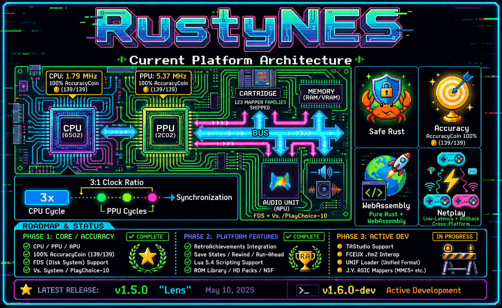
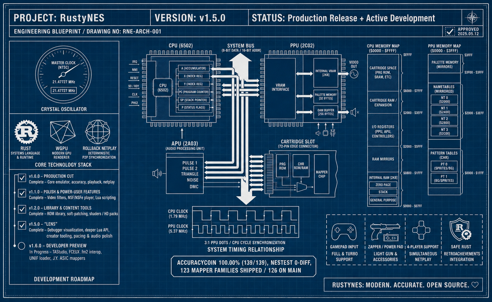
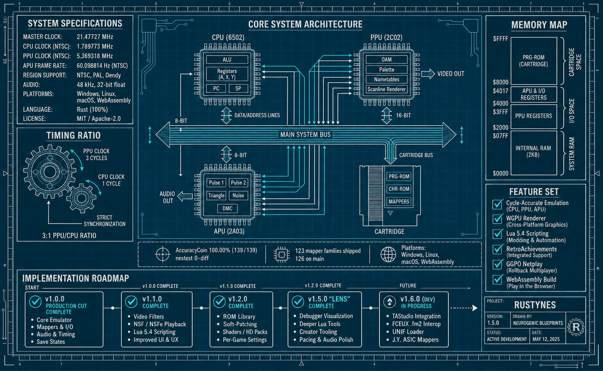
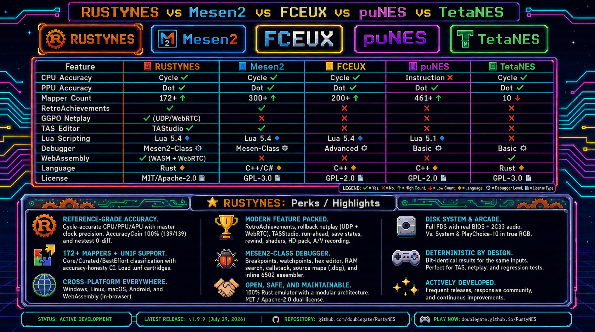

# RustyNES


> **Precise. Pure. Powerful.**

<p align="center">
  
</p>

<p align="center">
  <a href="https://github.com/doublegate/RustyNES/actions"></a> <a href="#license"></a> <a href="https://github.com/doublegate/RustyNES/releases"></a> <a href="rust-toolchain.toml"></a><br>
  <a href="#compatibility-and-accuracy"></a> <a href="#compatibility-and-accuracy"></a> <a href="https://doublegate.github.io/RustyNES/"></a><br>
  <a href="#platform-support"></a>
</p>

## Overview

**RustyNES is a cycle-accurate Nintendo Entertainment System emulator written in
pure Rust.** It targets the Mesen2 / higan / ares accuracy bar — tight, lockstep
scheduling at PPU-dot resolution on a master-clock-precise timebase — clearing
**AccuracyCoin 100% (141/141)** and matching the Nintendulator golden log on
`nestest` with **zero diff**. (As of v2.0.3 every assigned test passes, including the
two newest upstream PPU tests, "ALE + Read" and "Hybrid Addresses", via the promoted
2-cycle-ALE fetch model — ADR 0030.)

Beyond reference accuracy, RustyNES is a complete, modern emulation platform:
**172 mapper families** covering the vast majority of the commercial library (plus a
UNIF `.unf` cartridge loader), the full **Famicom Disk System** (real-BIOS boot with a
timed disk-head model), **Vs. System / PlayChoice-10** arcade games in true RGB,
**GGPO-style rollback netplay** (native UDP and browser WebRTC, 2-4 players),
**RetroAchievements**, a **native Libretro core** for RetroArch, a **scriptable TAStudio piano-roll TAS editor** with `.fm2` /
`.bk2` / `.fcm` / `.fmv` / `.vmv` movie interop, editing-capable debug tools
(palette / nametable / CHR / OAM writeback, an iNES / NES 2.0 header editor, an inline
6502 assembler), save states with rewind, run-ahead latency reduction, a **Mesen2-class
debugger** (expression / conditional breakpoints, R/W/X watchpoints, a hex editor, RAM
search, a callstack, `.dbg` source maps), **A/V recording**, **HD-pack** video + audio
(with an HD-Pack Builder), a **shader / filter ecosystem**, and a localized
(i18n) UI — all on a strict bit-determinism contract. The frontend is pure Rust (`winit` + `wgpu` +
`cpal` + `egui`) with native binaries for Linux, macOS, and Windows, plus a WebAssembly
build that runs in the browser.

**[Try it in your browser](https://doublegate.github.io/RustyNES/)** — no install
required.

---

## Why RustyNES?

RustyNES combines **accuracy-first emulation** with **modern features** and the
**safety guarantees of Rust**. Whether you are a casual player, a TAS creator, a
speedrunner, or a homebrew developer, RustyNES provides a comprehensive and faithful
platform for NES emulation.

**Key differentiators:**

- **Reference-grade accuracy** — a from-scratch core on a `u64` master clock with
  run-to-timestamp catch-up; region-exact 3:1 NTSC/Dendy and **3.2:1 PAL** clock
  ratios; sub-instruction PPU events visible to subsequent CPU code.
- **Determinism as a hard contract** — same seed, ROM, and input sequence yield a
  bit-identical framebuffer and audio. This is what makes save-state round-trips,
  regression testing, and rollback netplay correct by construction.
- **Modern features** — RetroAchievements, rollback netplay, a scriptable TAStudio,
  run-ahead, display-sync pacing, an Android app, and a Mesen2-class, editing-capable
  debugger (read-only by default, determinism-preserving).
- **Safe, modular Rust** — the chip stack is `no_std + alloc` with a one-directional
  workspace graph, so each component (CPU, PPU, APU) is independently fuzzable and
  benchmarkable. The only `unsafe` lives behind opt-in feature boundaries.

---

## Highlights

| Feature                | Description                                                                                  |
| ---------------------- | -------------------------------------------------------------------------------------------- |
| **Cycle-Accurate**     | Master-clock-precise CPU / PPU / APU — AccuracyCoin 100% (141/141), nestest 0-diff           |
| **172 Mapper Families** | NROM through MMC5, the full VRC line, Sunsoft FME-7, Namco 163, Taito, J.Y. Company ASIC, reusable-ASIC multicarts (FK23C / COOLBOY / MINDKIDS / Sachen / Waixing / Kaiser), and Vs.-System boards — classified Core / Curated / BestEffort behind a CI accuracy-honesty gate — plus a UNIF (`.unf`) cartridge loader |
| **Famicom Disk System**| `.fds` games with real-BIOS boot, writable disks, side-swapping, and 2C33 wavetable audio    |
| **Vs. / PlayChoice-10**| Arcade ROMs in true 2C03 / 2C04 / 2C05 RGB with per-game DIP presets                          |
| **RetroAchievements**  | Native `rcheevos` integration: achievements, leaderboards, rich presence, hardcore mode      |
| **Rollback Netplay**   | GGPO-style rollback for up to 4 players, over UDP or browser WebRTC                           |
| **TAS Tools**          | Frame-perfect deterministic record / replay with save-state branching (`.rnm` format)        |
| **Run-Ahead**          | Latency reduction that hides a game's internal input lag                                      |
| **Video Filters** *(v1.1.0)* | Full NES_NTSC composite / S-video, a CRT / scanline shader pass, and custom `.pal` palettes |
| **Lua Scripting** *(v1.1.0)* | Sandboxed Lua 5.4 — memory/state access, frame & access callbacks, HUD overlay (opt-in)  |
| **ROM Library** *(v1.2.0)* | `.zip` loading + automatic `.ips`/`.ups`/`.bps` soft-patching + a per-game DB and in-app ROM-Database editor |
| **Shaders & HD Packs** *(v1.2.0)* | Live NTSC knobs, a composable shader stack + CRT preset bank, and a (default-off) Mesen-style HD-pack loader |
| **TAStudio Editor** *(v1.6.0)* | A piano-roll TAS editor — per-frame button grid with drag-paint, a save-state greenzone + lag log, markers, forkable branches, and `.rnmproj` projects |
| **Movie Interop** *(v1.6.0)* | FCEUX `.fm2` and BizHawk `.bk2` movie import / export to and from the native `.rnm` format, plus Lua movie driving (`emu.run` / `emu.frameadvance`) |
| **Mesen2-Class Debugger** *(v1.6.0)* | Expression / conditional breakpoints, R/W/X watchpoints, a watch window, conditional trace, a full hex editor (poke / freeze / heatmap / find), and RAM watch / search |
| **A/V Recording** *(v1.6.0)* | Synchronized video + audio capture to `.mp4` / `.mkv` via an `ffmpeg` pipe (default-off `av-record`, output-only) |
| **HD Audio** *(v1.6.0)* | HD-pack `<bgm>` / `<sfx>` OGG tracks triggered through the `$4100` register, mixed on top of the produced APU buffer (default-off `hd-pack`) |
| **Shader Ecosystem** *(v1.6.0)* | LMP88959 NTSC/PAL, hqNx / xBRZ upscalers, and a constrained `.slangp` / `.cgp` preset import on the composable ShaderStack |
| **Writable + Programmable** *(v1.7.0)* | Editing-capable debug tools (palette / nametable / CHR / OAM writeback, an iNES / NES 2.0 header editor, an inline 6502 assembler), a scriptable `tastudio.*` Lua API, host IPC automation (`script-ipc`), `.dbg` source maps, Zwinder tiered rewind, audio depth (stereo / reverb / 20-band EQ), web parity, and an i18n framework |
| **Android App** *(v1.8.x)* | A complete native Android app on the byte-identical core — a multi-touch + hardware-controller (P1–P4) UI, wgpu `SurfaceView` rendering, save-states, Lua, RetroAchievements, direct-IP / CGNAT-TURN netplay, and a box-art ROM library (GitHub-sideload now; Google Play at v2.3.0) |
| **iOS / iPadOS App** *(v1.9.x)* | A complete native iOS app on the byte-identical core — a native SwiftUI shell over Metal (`wgpu`), multi-touch + GameController support, iCloud save-state sync, room-code rollback netplay, RetroAchievements, and the full TAStudio power-user suite (TestFlight now; App Store at v2.3.0) |
| **Libretro Core** *(v1.10.0)* | A complete, cycle-accurate Libretro core (the `rustynes_libretro` shared library — `.so` / `.dylib` / `.dll` by platform) integrating RustyNES seamlessly into RetroArch with RetroAchievements, dynamic audio sync, and deterministic rollback/save-state support |
| **One-Clock Timebase** *(v2.0.0)* | A single canonical cycle counter with every CPU cycle a real bus access and a split-around-the-access PPU catch-up, replacing the five-counter dot-lockstep scheduler; the release's designated breaking-behavior change (ADR 0002 / ADR 0029) |
| **Vs. DualSystem** *(v2.0.0 core · v2.1.2 desktop)* | Core-level emulation of the two-CPU/two-PPU Vs. arcade cabinet boards (Tennis, Baseball, Wrecking Crew, Balloon Fight) via a shared-WRAM + cross-wired `$4016`/IRQ convergence model — now presented on desktop as a composed **two-screen** view (side-by-side / stacked) with both consoles cross-wired |
| **Audio Filter Model** *(v2.1.3)* | Pick the APU analog filter — `nes` (default, authentic front-loader), `famicom` (fuller low end), or `clean` (Mesen2-like) — a tonal-only fix for the "thin / missing bass channel" character; the default stays byte-identical |
| **Game Genie Database** *(v2.1.3)* | Per-game code nomination from a bundled catalog of **~10,800 codes across ~520 USA/World games**, header-robust CRC matching, and a Game Genie encoder — shipping on every target including the browser demo |
| **Generated NTSC Palette + Shaders** *(v2.1.2)* | An in-core, byte-identical-across-targets NTSC palette synthesizer (off by default) feeding a three-rung composite-shader ladder (simplified blur → LMP88959 → Bisqwit per-dot) with live emulator-synced dot-crawl |
| **NSF / NSFe, non-60 Hz** *(v2.1.2)* | The chiptune player parses the header play-speed divider and drives non-standard rates (PAL 50 Hz and custom) off a mapper cycle-timer IRQ, plus the chunked `NSFE` container |
| **OAM Decay** *(v2.1.4, opt-in)* | Mesen2-modeled dynamic-RAM decay of un-refreshed OAM rows with rendering disabled; off by default (byte-identical), deterministic when on, round-trips the save-state |
| **Documentation Handbook** *(v2.1.3)* | A Material-for-MkDocs site at [`/docs/`](https://doublegate.github.io/RustyNES/docs/) rendering the subsystem specs + user guide, alongside the playable demo (`/`) and rustdoc (`/api/`) on GitHub Pages |
| **Pure Rust**          | `winit` + `wgpu` + `cpal` + `egui` frontend; safe `no_std + alloc` chip stack                 |

<p align="center">
  
</p>

---

## Showcase

A cross-section of the commercial library running pixel-accurately on RustyNES —
launch classics like Donkey Kong, Excitebike, and Super Mario Bros.; the Famicom
Disk System's Kid Icarus; Konami's Castlevania and Contra; the Mega Man
boss-select; and Mike Tyson's Punch-Out!! — spanning NROM up through MMC3 / MMC5,
FME-7, and the full VRC line, plus Vs.-arcade RGB.

<p align="center">
  
</p>

The full per-mapper visual corpus lives in
[`screenshots/external/`](screenshots/external/) (Core / Curated) and
[`screenshots/besteffort/`](screenshots/besteffort/) (BestEffort) — boot / title /
gameplay frames spanning the bulk of the 172 mapper families.

---

## Features

### Emulation core

- **Master-clock-precise scheduler.** A `u64` master clock drives the CPU, PPU, and
  APU off the fundamental NES timebase with run-to-timestamp catch-up (the
  TetaNES / Mesen2 model). This is the central architectural choice and the reason
  mid-instruction PPU events — a sprite-zero hit at a precise dot, an MMC3 IRQ at a
  PPU dot, a mid-scanline scroll write — work without per-quirk patches.
- **Cycle-accurate 6502 CPU** — all 256 opcodes including the full unofficial set
  (incl. the unstable SH\* / TAS / LAS / XAA family), per-cycle bus interleaving,
  cycle-exact interrupt-sample timing, and sub-instruction DMC/OAM DMA via one
  unified dispatch.
- **Cycle-accurate 2C02 PPU** — per-dot scheduling, the full cycle-resolution
  sprite-evaluation FSM (including the hardware `n+m` overflow increment bug), the
  background-fetch pipeline, the `PPUMASK`→dot-skip delay, and a rendering-time
  `$2007` state machine.
- **Cycle-accurate 2A03 APU** — the non-linear lookup mixer, 256-phase × 32-tap
  Blackman-windowed sinc synthesis (SFDR 81.6 dB), a 3-stage analog filter chain, and
  the DMC byte timer on the shared master clock.

### Cartridges and platforms

- **172 mapper families** covering the bulk of the licensed library — NROM, all
  MMC1-5, the full VRC1/2/4/6/7 line (incl. VRC6 and VRC7 expansion audio), Sunsoft
  FME-7/1/2/3/4 (+ 5B audio), Namco 163 (+ wavetable), the Taito
  TC0190/TC0690/X1-005/X1-017, J.Y. Company ASIC boards, and the
  Irem/Jaleco/Bandai/Tengen and Vs.-System mappers — classified Core / Curated /
  BestEffort behind a CI accuracy-honesty gate. A **UNIF (`.unf`) cartridge loader**
  resolves board names to the corresponding mapper. See
  [`docs/mappers.md`](docs/mappers.md).
- **Famicom Disk System** — `.fds` games with a user-supplied `disksys.rom` BIOS; the
  disk drive and IRQs, writable disks (`.fds.sav`, `F9` side-swap), and 2C33 wavetable
  audio. Real-BIOS boot works — Zelda, Metroid, and others boot into the game. v1.6.0's
  **FDS-proper** pass adds a timed disk-head position model (a motor restart rewinds the
  belt-driven disk and re-seeks across a deterministic not-ready window rather than
  teleporting to track 0), `$4032` drive-status auto-insert, and a per-game CRC quirk
  table — closing the Kid Icarus side-B post-registration replay.
- **Vs. System / PlayChoice-10** — the 2C03 / 2C04 / 2C05 RGB PPUs with per-game DIP
  presets and exact palettes; real arcade ROMs render in true RGB.

### Modern features

- **RetroAchievements** *(opt-in `retroachievements` feature, native-only)* — login,
  achievements, leaderboards, rich presence, and hardcore mode (which disables
  save-state load / rewind / cheats), via the vendored MIT `rcheevos` library.
- **Rollback netplay** — GGPO-style rollback over UDP for up to 4 players (predict →
  advance → roll back and re-simulate on the deterministic core), plus a **browser
  (WebRTC) mesh** path with a deployable signaling / STUN bundle ([`deploy/`](deploy/)).
- **TAS movie recording and playback** — frame-perfect deterministic record / replay
  with save-state branching, in a versioned `.rnm` format.
- **TAStudio piano-roll editor** *(v1.6.0)* — a Mesen2 / BizHawk-class TAS-authoring
  surface: a per-frame button-grid with drag-paint editing, a save-state **greenzone**
  for instant deterministic seeking, a **lag log**, named **markers**, **forkable
  branches**, and `.rnmproj` project files.
- **Movie interop** *(v1.6.0)* — import and export FCEUX `.fm2` and BizHawk `.bk2`
  movies to and from the native `.rnm` format; v1.7.0 widens import to `.fcm` / `.fmv` /
  `.vmv` (and hashes the `.fm2` / `.bk2` exports), so RustyNES interoperates with the wider
  TAS ecosystem.
- **Save state + rewind** — a 600-frame rewind ring, instant save / load, and a
  snapshot fast path used by run-ahead, plus a thumbnail save-state manager.
- **Run-ahead** — hides a game's internal input lag for snappier controls, built on
  the existing deterministic snapshot / restore.
- **Emulation-speed control** — 25 %–300 % speed presets (slow-motion to fast),
  hold-to-fast-forward, and single-frame advance while paused.
- **Display-sync pacing + lock-free audio** — an `auto` / `display` / `vrr` /
  `wallclock` pacing matrix ends display-beat judder; a lock-free SPSC audio ring with
  dynamic rate control keeps audio clean and underrun-free; master volume,
  per-APU-channel mutes, and a graphic equalizer (selectable **5-band** or
  **20-band ISO third-octave**) round out the audio mixer.
- **Video filters** *(v1.1.0)* — a full **NES_NTSC composite / S-video** filter, a
  **CRT / scanline** shader pass (curvature, scanlines, aperture mask), and
  **custom `.pal` palette** loading, layered on the existing 8:7 pixel-aspect + overscan
  pipeline.
- **NSF / NSFe music player** *(v1.1.0; extended v2.1.2)* — drop in a `.nsf` chiptune and
  play it through the real APU, with a track selector and the file's title / artist /
  copyright. v2.1.2 parses the header **play-speed divider** and drives non-standard
  rates correctly (PAL 50 Hz and custom dividers on the NTSC console, via a mapper
  cycle-timer IRQ), and parses the chunked **`NSFE`** container.
- **Lua scripting** *(v1.1.0, opt-in `scripting` feature, native-only)* — a sandboxed
  **Lua 5.4** engine: read / write memory, inspect CPU state, react to per-frame /
  per-access events, draw an HUD overlay, and drive control actions. v1.6.0 adds
  **movie driving** (`emu.run` / `emu.frameadvance` to step the emulator from a script)
  and **data breadth** (named memory domains, sized reads, and a `joypad` table). v1.7.0
  adds a `tastudio.*` API to drive the piano-roll editor from a script, full Lua parity
  (`getScreenBuffer` / `setState` / value-modifying callbacks), and a host-mediated IPC
  sandbox (`comm.*` / `client.*` / `userdata.*`, opt-in `script-ipc`). The browser build
  runs an experimental `piccolo` Lua backend (observational, not byte-parity with native
  `mlua`, ADR 0012). See [`docs/scripting.md`](docs/scripting.md).
- **Cheats and input devices** — Game Genie codes (with a Game Genie *encoder*) and raw
  RAM cheats. *(v2.1.3)* The Cheats panel now **nominates** the known Game Genie codes
  for the loaded game from a bundled catalog of **~10,800 codes across ~520 USA/World
  games** (ingested from the openly-licensed libretro Game Genie database), matched
  header-robustly on both the header-excluded and full-file CRC32 so a re-headered dump
  still resolves — shipping on every target including the browser demo. Plus a broad
  peripheral set: the standard pad, **Four Score** (4-player),
  the **Arkanoid Vaus** paddle (both ports), the **Zapper** light gun, the **Power Pad**,
  the **SNES mouse**, the **Family BASIC keyboard**, the **Family Trainer** mat, the
  Konami / Bandai **Hyper Shot**, and the **Subor keyboard**. **Turbo / autofire** with an
  **input-display overlay** (the consolidated all-device Input Display), a **per-game
  database** of nametable-mirroring overrides, and USB gamepads (`gilrs`) with a deadzone
  control and hot-plug detection.
- **Desktop UX** — a native menu bar, recent-ROMs list, a tabbed Settings window,
  light / dark / system themes, 8:7 pixel-aspect correction, optional overscan
  cropping, integer window-size presets, a pause-dim overlay, a status bar,
  screenshot-to-file/clipboard, and drag-and-drop ROM loading.
- **egui debugger + devtools** — a read-only CPU / PPU / APU / memory / OAM / mapper
  inspector by default, plus opt-in **breakpoints / watchpoints**, a **cycle trace
  logger**, and an **event viewer** (IRQ / NMI / register-write timeline) behind the
  `debug-hooks` feature — all preserving the strict determinism contract when off.
- **Mesen2-class debugger depth** *(v1.6.0, `debug-hooks`)* — **expression /
  conditional breakpoints**, **read / write / execute watchpoints**, a **watch window**,
  **conditional trace** logging, a full **hex editor** (poke, freeze, write-heatmap,
  find), and **RAM watch / search** — the debugging surface a TAS or homebrew developer
  expects, all read-only-by-default and determinism-preserving.
- **A/V recording** *(v1.6.0, opt-in `av-record` feature, native-only)* — capture the
  running game to an `.mp4` / `.mkv` via an external `ffmpeg` pipe (H.264 + AAC). It is
  a read-only tap on the already-produced framebuffer and audio, so it never touches the
  emulator or the determinism contract, and the default build pulls no extra Rust
  dependencies (only the system `ffmpeg` at run time).
- **HD-pack HD audio** *(v1.6.0, opt-in `hd-pack` feature, native-only)* — HD-pack
  `<bgm>` / `<sfx>` OGG tracks triggered through the `$4100` control register and mixed
  (pure-Rust `lewton` decoder) on top of the buffer the core already produced — the audio
  analogue of HD tile substitution, output-only and determinism-neutral.
- **Shader / filter ecosystem** *(v1.6.0)* — built-in **LMP88959** composite NTSC/PAL,
  **hqNx** and **xBRZ** edge-directed pixel-art upscalers, and a constrained RetroArch
  **`.slangp` / `.cgp`** preset importer (mapping well-known shader stems onto the
  built-in passes, never silently dropping the unsupported ones) — all composable on the
  off-by-default ShaderStack, post-framebuffer and never touching the core. See
  [`docs/frontend.md`](docs/frontend.md) and ADR 0013.

### Authoring and automation *(v1.7.0)*

v1.7.0 "Forge" is the release where the tools become **writable** and **programmable** —
every item below is additive and off-by-default, so the shipped core stays byte-identical
and AccuracyCoin holds 100% (139/139).

- **Editing-capable debug tools** *(`debug-hooks`)* — the inspector panels become editors:
  **palette / nametable / CHR / OAM writeback** (gated like `emu.write`), an
  **iNES / NES 2.0 header editor**, and an **inline 6502 assembler** that patches code live.
- **Deeper debugger** *(`debug-hooks`)* — on top of the Mesen2-class breakpoint /
  watchpoint / hex-editor / RAM-search surface, a **CallstackManager** with step-into /
  over / out modes, a **memory-access counter** with uninitialized-read detection, and
  **ca65 / cc65 `.dbg` source maps** (plus the existing `.sym` / `.mlb` / `.nl` symbol
  files) for source-level debugging.
- **Scriptable TAStudio** *(`scripting`)* — a `tastudio.*` Lua API drives the piano-roll
  editor from a script, with analysis-canvas callbacks, alongside full Lua parity
  (`getScreenBuffer`, `setState`, value-modifying callbacks).
- **Host IPC / automation** *(opt-in `script-ipc` feature, native-only)* — a
  host-mediated `comm.*` / `client.*` / `userdata.*` sandbox lets an external process
  drive and observe the emulator over IPC for automation and CI harnesses, behind a
  documented security posture (ADR 0016).
- **Rewind, deepened** — a **HistoryViewer**, an **Export-Last-30-seconds** to `.rnm`, and
  a **Zwinder**-style tiered greenzone (XOR-delta + LZ4) that stretches the rewind window
  far beyond the classic ring without bloating memory.
- **Expansion-audio NSF router** — the NSF / NSFe player now routes through the real
  VRC6 / VRC7 / FDS / MMC5 / Namco 163 / Sunsoft 5B expansion-audio synths, and MMC5's
  expansion audio is synthesized in-game.
- **Movie import breadth** — in addition to FCEUX `.fm2` and BizHawk `.bk2`, RustyNES now
  imports `.fcm` / `.fmv` / `.vmv` movies (and hashes `.fm2` / `.bk2` exports), widening
  TAS-ecosystem interop.
- **HD-Pack Builder** *(`hd-pack`)* — author Mesen-format HD packs from the running game
  (ADR 0017); the loader was also corrected to parse the authentic Mesen `<tile>` format
  (ADR 0018).
- **Audio depth** — bypass-by-default **stereo panning** (per-APU-channel pan), a Schroeder
  **reverb** + headphone **crossfeed**, an **output-device picker**, the **20-band** EQ
  mode, and per-context (game / menu) volume (ADR 0020).
- **Per-game config overlay** — a `<rom>.json` overlay (region / mapper / submapper /
  mirroring overrides), a **DIP-switch editor**, and a **lag-frame counter** (ADR 0019).
- **Internationalization (i18n)** — a compile-time string catalog with a Settings language
  picker; English is the default and universal fallback (byte-identical strings), with
  Spanish shipped to prove the mechanism (ADR 0023).
- **Spectator netplay** — observers can join a rollback session read-only, alongside the
  existing 2–4-player rollback.

### Web / WebAssembly *(v1.7.0 reach wave)*

The browser build closes several desktop-parity gaps with web-specific implementations
(these live only in the wasm build, so the native build is byte-identical):

- **Lua in the browser** — the experimental `piccolo` Lua backend runs end-to-end from a
  `.lua` picker / paste box (observational, off by default, never in the determinism
  oracle — ADR 0012).
- **File System Access API** — TAS `.rnm` exports save through a native "Save As" dialog on
  Chromium browsers, with a graceful download fallback on Firefox / Safari (ADR 0021).
- **Gamepad API** — `navigator.getGamepads()` is polled each frame and routed to player 1
  at the same late-latch as touch / keyboard, so it records and replays identically.
- **PWA / offline** — a web manifest + service worker make the demo installable and
  offline-capable, within a 5 MiB bundle budget.
- **`?settings=` share-links** — a curated subset of `Config` (filter + knobs, overscan,
  theme, aspect, zoom, FPS, volume) round-trips through a compact URL-safe blob, with a
  "Copy share link" button (ADR 0022).

### Display, audio & accuracy — the "Fathom" line *(v2.1.x)*

The v2.1.x "Fathom" releases deepen display fidelity, audio, and accuracy on top of
the v2.0.0 core. Everything here is additive and default-off (or tonal-only on the
default), so the shipped build stays **byte-identical** and AccuracyCoin holds
**141/141** — v2.1.0 landed the accuracy-remediation work (a display-only PPU
palette-backdrop-override fix, 86 mapper families promoted BestEffort → Curated, and
the MMC3 R1/R2 scanline-IRQ residual closed by design), and v2.1.2–v2.1.4 build on it:

- **APU audio filter model** *(v2.1.3)* — the authentic NES front-loader filter (a 90 Hz
  plus an aggressive 440 Hz high-pass plus a 14 kHz low-pass) is byte-correct but rolls off
  the bass hard, reading as a "thin / missing channel". **Settings → Audio → Filter model** lets you
  pick **`nes`** (default, authentic — byte-identical to earlier builds), **`famicom`** (a
  single ~37 Hz high-pass, fuller low end), or **`clean`** (a ~10 Hz DC-block, the
  Mesen2-like character). Tonal only — channel content, determinism, and the audio oracle
  are unchanged on the default.
- **Generated NTSC palette** *(v2.1.2)* — an in-core synthesizer (`generate_base_palette`)
  produces the 64-entry base palette from a model of the 2C02's composite output (Bisqwit /
  ares YIQ integration), tunable via saturation / hue / contrast / brightness / gamma.
  Every transcendental routes through `libm`, so the output is byte-identical across all
  targets (x86 / aarch64 / wasm / `thumbv7em`) and locked by a committed golden. Off by
  default; enable under Settings → Palette → "Generated NTSC".
- **Composite-shader ladder** *(v2.1.2)* — a three-rung display-only ladder (simplified blur
  → **LMP88959** composite → **Bisqwit** per-dot), with live emulator-synced dot-crawl now
  wired to LMP88959 as well as Bisqwit. All passes are display-only — they run entirely in
  the frontend, so the `visual_regression` corpus (which hashes the *pre-shader* core
  framebuffer, `Nes::framebuffer()`) is byte-identical with any filter active.
- **Vs. `DualSystem` second-screen presentation** *(v2.1.2, desktop)* — a loaded Vs.
  `DualSystem` cabinet (Balloon Fight, Wrecking Crew, Tennis, Baseball) now runs **both**
  cross-wired consoles and presents them together, side-by-side (512×240, default) or
  stacked (256×480). P1/P2 drive the main console, P3/P4 the sub. The single-console path
  stays byte-identical (ADR 0032); run-ahead / rewind / netplay / TAS are scoped out of dual
  mode.
- **NSF non-60 Hz + NSFe** *(v2.1.2)* — the chiptune player now honors the header play-speed
  divider (driving sub-60 Hz rates off a mapper cycle-timer IRQ) and parses the chunked
  `NSFE` container; the standard 60 Hz path is byte-identical.
- **Optional OAM decay** *(v2.1.4, opt-in)* — the 2C02's OAM is dynamic RAM; with rendering
  disabled long enough, un-refreshed rows decay to a fixed garbage pattern. RustyNES now
  models this exactly like Mesen2 (a 3000-CPU-cycle refresh window per 8-byte row). It is
  **off by default** (byte-identical output and suites), deterministic when on (driven off
  the PPU's monotonic dot counter), and round-trips the save-state via an additive
  `PPU_SNAPSHOT_VERSION` v7 tail. Enable via **Settings → Emulation → "OAM decay
  (accuracy)"**.
- **Mapper regression + IRQ oracles** *(v2.1.4)* — a CI boot-smoke sweep of all 26
  `BestEffort` mapper families (auto-derived from the tier classifier) and a shared
  MMC3-clone A12/IRQ timing oracle (eleven clone boards driven bit-for-bit against a
  reference `Mmc3`) add safety-net coverage without moving any tier or touching the core.

### Android *(v1.8.x)*

RustyNES runs as a complete native **Android app** on the byte-identical core (so
AccuracyCoin holds 141/141 as on desktop), built on a shared **`rustynes-mobile`**
UniFFI bridge, a **`rustynes-android`** JNI layer, and a Jetpack **Compose** shell:

- **Rendering + audio** — wgpu on a `SurfaceView`, reusing the desktop WGSL CRT /
  scanline / NTSC shaders (shared via `rustynes-gfx-shaders`), plus low-latency
  `AudioTrack`.
- **Input** — a multi-touch on-screen NES controller (foldable-aware and resizable) and
  full hardware-gamepad support (players 1–4, hot-plug, per-pad remapping, turbo).
- **Library + state** — a SHA-256-keyed box-art ROM library with SAF import, save-states
  and battery-SRAM, and save-on-background / auto-resume.
- **Connectivity** — Lua scripting, RetroAchievements, and direct-IP / LAN plus
  CGNAT / TURN room-code rollback netplay over the same `rustynes-script` / `rustynes-ra`
  / `rustynes-netplay` cores as desktop.
- **Platform polish** — adaptive / foldable / TV (Leanback) layouts, Material You and
  EN/ES i18n, screenshot / MP4 capture, Picture-in-Picture, widgets, and accessibility
  (high-contrast + Okabe-Ito).

The apps ship now as **GitHub-Releases / sideload**, full-featured; the Google Play
production launch — with an ad-supported-freemium model and the `foss` / `play` flavor
split — is **deferred to the v2.3.0 joint store launch** (see [Roadmap](#roadmap)).
Details in [`docs/android.md`](docs/android.md).

### iOS / iPadOS *(v1.9.x)*

RustyNES runs as a native **iOS / iPadOS app** on the byte-identical core (maintaining the same 141/141 AccuracyCoin bar as desktop), built on the shared **`rustynes-mobile`** UniFFI bridge and a native SwiftUI shell:

- **Rendering + audio** — Metal via `wgpu` with the same full WGSL shader pipelines (CRT, NTSC, Bisqwit) and ProMotion pacing, plus a low-latency CoreAudio hot path.
- **Input** — multi-touch on-screen pad (NES-001 style), responsive sizing, GameController framework for P1–P4 (hot-plug), and Core Haptics.
- **Connectivity & Tooling** — room-code netplay (CGNAT/TURN) and LAN rollback, RetroAchievements, iCloud save-state sync (CloudKit), Lua console, and power-user tooling (TAS `.rnm` movies, `.pal` palettes, `.zip` ROMs, HD-pack loading).
- **Platform polish** — ReplayKit capture, Game Center, accessibility, EN/ES i18n, 4-slot save-state manager, and the dormant StoreKit `foss`/App-Store seam.

The apps are currently distributed via **TestFlight**; the App Store launch is deferred to the **v2.3.0** joint store launch (see [Roadmap](#roadmap)). Details in [`docs/ios.md`](docs/ios.md).

---

## Quick Start

### Download binaries

Pre-built binaries for the latest release are available on the
[Releases page](https://github.com/doublegate/RustyNES/releases), built automatically
for `aarch64` macOS (Apple silicon), `x86_64` Linux, and `x86_64` Windows. Other targets
(Intel macOS, Linux ARM64, Android) build from source using the instructions below.

```bash
# Linux / macOS
tar xf rustynes-<tag>-<target>.tar.gz && ./rustynes path/to/rom.nes
# Windows (PowerShell)
Expand-Archive rustynes-<tag>-x86_64-pc-windows-msvc.zip; .\rustynes.exe path\to\rom.nes
```

### Build from source

**Prerequisites:**

- **Rust 1.96** — pinned via `rust-toolchain.toml` and auto-installed by
  [rustup](https://rustup.rs).
- **Linux desktop dependencies** for `winit` / `wgpu` / `cpal` / `egui` (see below).
- **Git.**

```bash
# Clone the repository
git clone https://github.com/doublegate/RustyNES.git
cd RustyNES

# Build the workspace (release)
cargo build --release --workspace

# Run a ROM you legally own (or launch bare and use F12 / drag-and-drop)
cargo run --release -p rustynes-frontend -- path/to/rom.nes

# Optional: build with RetroAchievements (needs a C compiler for vendored rcheevos)
cargo run --release -p rustynes-frontend --features retroachievements -- path/to/rom.nes

# Maximal NATIVE build — the "cargo --full equivalent". The `full` feature
# aggregates every native feature (RetroAchievements + Lua scripting + host IPC +
# HD-pack + debugger telemetry + A/V recording). Aliases make it a one-liner:
cargo full-run path/to/rom.nes       # run the most fully-featured desktop binary
cargo full-run --fullscreen rom.nes  # the alias ends in `--`, so flags forward to the binary
cargo full-build                     # build it (= --release -p rustynes-frontend --features full)
```

The `full` build is purely opt-in — the default/shipped build and the emulation
core are unchanged. The WASM-only features (`script-wasm`, `browser-cheevos`,
`wasm-canvas`) are deliberately excluded, since `full` targets a native binary.

The frontend opens a 256×240 window (scaled, with 8:7 pixel-aspect correction),
starts audio via the OS default device, and runs the ROM.

#### Command-line help

The native binary ships a clap 4 CLI with styled `--help`, a `help` subcommand,
shell completions, and an interactive terminal help browser:

```bash
rustynes --help                 # styled usage + examples + keyboard summary
rustynes help                   # browse all topics (interactive TUI on a terminal)
rustynes help mappers           # one topic, printed (also works piped: `… | less`)
rustynes completions fish       # print a shell-completion script
```

Help topics: `controls`, `hotkeys`, `gamepad`, `features`, `mappers`, `config`,
`scripting`, `netplay`, `about`. The interactive browser is behind the default-on
`help-tui` cargo feature; piped / non-terminal output falls back to a static page.

### Platform-specific dependencies

**Ubuntu / Debian:**

```bash
sudo apt-get install -y libxkbcommon-dev libwayland-dev libxkbcommon-x11-dev libasound2-dev libudev-dev
```

**CachyOS / Arch:**

```bash
sudo pacman -S --needed libxkbcommon wayland alsa-lib systemd-libs
```

**macOS / Windows:** no extra system dependencies are required for the default build.
The optional `retroachievements` feature additionally needs a C compiler for the
vendored rcheevos sources.

### Run in the browser (WebAssembly)

A hosted demo is live at
**[doublegate.github.io/RustyNES](https://doublegate.github.io/RustyNES/)**. To build
it yourself you need [trunk](https://trunkrs.dev) (`cargo install trunk`):

```bash
cd crates/rustynes-frontend/web
trunk serve            # dev server at http://127.0.0.1:8081
trunk build --release  # the full winit + wgpu + egui build in ./dist
# Or a lightweight canvas-2D embed:
trunk build --release --no-default-features --features wasm-canvas
```

---

## Desktop UX

The desktop frontend frames the NES image with an always-on **menu bar** (top) and
**status bar** (bottom); the egui debugger is a separate overlay toggled with `` ` ``.
Everything has a keyboard shortcut, but nothing requires one.

- **Menu bar** — File (Open ROM, Open Recent, save / load state, a ten-slot (0–9) Save
  Slot picker, a thumbnail **Save States…** manager, Take Screenshot, Copy Screenshot to
  Clipboard), Emulation (Pause, Reset, Power Cycle, **Speed 25–300 %**, Run-Ahead 0–3,
  the region label, Vs. Insert Coin / FDS Swap Disk Side when relevant), Tools
  (Cheats, TAS Movies, the **TAStudio** piano-roll editor, **Record A/V**, Netplay,
  RetroAchievements, Performance Monitor — opened as floating windows without the
  debugger), View (Settings, Theme, 8:7 Pixel Aspect,
  Hide Overscan, Fullscreen, Window Size 1x–4x, Show FPS, Pause When Unfocused, Show
  Menu Bar), Debug (the debugger overlay + per-chip panels), and Help (Keyboard
  Shortcuts, About).
- **Status bar** — ROM name, region, mapper, run-ahead depth, Running / Paused /
  Netplay state, the current speed when not 100 %, and the FPS readout.
- **Settings window** — a tabbed Display / Audio / Input / Advanced dialog (View →
  Settings…) with a live master-volume slider + mute, per-APU-channel mutes, a gamepad
  deadzone slider, live theme / pixel-aspect / overscan / FPS toggles, and a
  Reset-to-Defaults button per section.
- **Quality-of-life** — 25 %–300 % emulation-speed presets, hold-to-fast-forward (audio
  muted) and single-frame advance while paused, a thumbnail save-state browser, integer
  window-size presets (1x–4x), optional overscan cropping, optional pause-when-unfocused,
  light / dark / system themes, a pause-dim "PAUSED" overlay, a recent-ROMs list (missing
  files greyed out), controller hot-plug toasts, and a first-run Welcome modal.

## Default Controls

Every binding is TOML-rebindable (and remappable in the in-app Settings); see the
[controls guide](docs/user-guide/controls.md) for the full schema. USB gamepads
auto-bind to player 1 (Xbox-style: South = A, West = B, plus Start, Back / Select, and
the D-pad), and you can drag-and-drop a `.nes` / `.fds` onto the window to load it any time.

### Gamepad

| Action         | Player 1            | Player 2      |
| -------------- | ------------------- | ------------- |
| D-Pad          | Arrow keys          | W / A / S / D |
| A / B          | Z / X               | Q / E         |
| Start / Select | Enter / Right-Shift | P / L         |

### System and tools

| Action                       | Key                | Action                  | Key       |
| ---------------------------- | ------------------ | ----------------------- | --------- |
| Pause / Resume               | Space              | Save / Load state       | F1 / F4   |
| Fast-forward (hold)          | Tab                | Rewind (hold)           | F5        |
| Frame-advance (while paused) | `\` (backslash)    | Reset / Power-cycle     | F2 / F3   |
| Speed up / down / reset      | = / - / 0          | Open ROM                | F12       |
| TAS record / play / branch   | F6 / F7 / F8       | Swap disk side (FDS)    | F9        |
| Toggle menu bar              | M                  | Insert coin (Vs.)       | F10       |
| Toggle debugger              | `` ` `` (backtick) | Fullscreen              | F11       |
| Quit / exit fullscreen       | Esc                | Save-state slot         | 0 – 9     |

---

## Architecture

RustyNES is a Cargo workspace of focused crates. Three load-bearing decisions, detailed
in [`docs/architecture.md`](docs/architecture.md) and [`docs/scheduler.md`](docs/scheduler.md):

1. **A shared master-clock timebase.** The CPU advances a `u64` master clock by the
   region's `cpu_divider` per cycle; the PPU is caught up to `master_clock − ppu_offset`
   in both halves of every access (APU and DMA share the same clock). This makes the
   region-exact 3.2:1 PAL ratio and cycle-exact interrupt / DMA timing expressible, and
   makes sub-instruction PPU events work naturally.
2. **The Bus owns everything mutable.** `rustynes-core::Bus` holds the PPU, APU,
   mapper, WRAM, controllers, and open-bus latch; the CPU borrows `&mut Bus` during
   `tick()`. This single choice avoids the borrow-checker fight the alternative creates.
3. **A one-directional workspace graph.** `rustynes-cpu` has no `rustynes-ppu` or
   `rustynes-apu` dependency; each chip is fuzzable and benchmarkable in isolation.

<p align="center">
  
</p>

### Workspace crates

| Crate                    | Role                                                         |
| ------------------------ | ----------------------------------------------------------- |
| `rustynes-cpu`           | Cycle-accurate 6502 / 2A03 CPU core                         |
| `rustynes-ppu`           | Dot-level 2C02 PPU                                          |
| `rustynes-apu`           | Hardware-accurate 2A03 APU with band-limited synthesis      |
| `rustynes-mappers`       | 172 mapper families + expansion audio + UNIF loader         |
| `rustynes-core`          | Integration layer: Bus, scheduler, console, save states     |
| `rustynes-script`        | Sandboxed Lua 5.4 scripting engine (native `mlua`, wasm `piccolo`) |
| `rustynes-frontend`      | `winit` + `wgpu` + `cpal` + `egui` app (binary: `rustynes`) |
| `rustynes-netplay`       | GGPO-style rollback netcode (UDP + WebRTC)                  |
| `rustynes-cheevos`       | RetroAchievements `rcheevos` FFI (opt-in, native-only)      |
| `rustynes-ra`            | Shared RetroAchievements session state (`RaClient`, native-only) |
| `rustynes-libretro`      | Native Libretro API core wrapper (RetroArch)                |
| `rustynes-gfx-shaders`   | Shared WGSL presentation shaders (desktop + Android renderers) |
| `rustynes-hdpack`        | HD-pack loader + compositor + HD audio (shared desktop + mobile) |
| `rustynes-mobile`        | UniFFI bridge for the mobile platforms (Android, and v1.9.0 iOS) |
| `rustynes-android`       | Android JNI glue over the mobile bridge                      |
| `rustynes-monetization`  | `AdPolicy` ad-supported-freemium policy core (v2.3.0; dormant) |
| `rustynes-test-harness`  | Integration tests and the accuracy / commercial-ROM oracles |

### Project layout

```text
crates/        Cargo workspace: the crates above
docs/          Implementation specs, ADRs, the user guide, the monetization
               design set, STATUS.md (single source of truth), and release notes
deploy/        Docker / compose for the browser-netplay signaling server + STUN/TURN
ref-docs/      Deep-research NES hardware reference
tests/         Integration tests + vendored CC0 / MIT / zlib test ROMs (no commercial ROMs)
screenshots/   Committed commercial-game visual corpus + showcase montages
scripts/       Regression-bisect + ROM-survey tooling
fuzz/          cargo-fuzz harnesses
```

---

## Compatibility and Accuracy

RustyNES demonstrates reference-grade emulation accuracy. The single validated
scheduler is the master-clock core; the RAM-direct AccuracyCoin decoder over 141
assigned tests is the authoritative source.

| Suite                       | Result                                                                |
| --------------------------- | --------------------------------------------------------------------- |
| **AccuracyCoin**            | **100% (141/141)** — every assigned test passes, including the two newest upstream PPU tests ("ALE + Read", "Hybrid Addresses"), via the promoted 2-cycle-ALE fetch model (v2.0.3, ADR 0030) |
| nestest                     | 0-diff vs the Nintendulator golden log                                |
| blargg `cpu_interrupts_v2`  | 5/5 strict · SH\* 6/6                                                  |
| `region_timing`             | 4/4 (PAL **3.2:1**) · `$2007` Stress 170/170                          |
| Commercial-ROM oracle       | 99 titles (60-ROM gate + 39-title survey), SHA-256-pinned, byte-identical |

The commercial-ROM oracle is a **regression gate**, not a correctness check — a visual
99-title survey is what catches rendering bugs. The wasm32 target shares the exact
emulator core, so the browser build runs the same scheduler. The **sole strict
expected-fail** is `mmc3_test_2/4` sub-test #3 (a 1-PPU-clock MMC3 reload-pending
bracket that affects no AccuracyCoin score and breaks no commercial game). The full
per-suite breakdown, the mapper coverage matrix, and the version policy live in
**[`docs/STATUS.md`](docs/STATUS.md)**.

v1.6.0's **off-axis accuracy** pass (Workstream D) was a pin-test-first audit that
confirmed the cycle-accurate engine already models the dot/CPU-cycle-granular off-axis
cluster — the DMC/OAM-DMA ↔ `$4016` / `$4017` controller-read double-clock / dropped-bit
conflict, the `$2007` (PPUDATA) read-during-active-rendering window with its deferred
state-machine reload and `v`-increment glitch, and the buggy sprite-overflow `n+m`
evaluation with the three-group open-bus / MDR decay timer — all verified by committed
oracles with no engine change. Those residuals were subsequently taken up by the
**v2.0.0 "Timebase"** one-clock scheduler rewrite (ADR 0002 / ADR 0029) and the v2.1.0
accuracy-remediation pass, which closed the MMC3 R1/R2 scanline-IRQ residual by design
(the full disposition of every remaining approximation lives in
[`docs/accuracy-ledger.md`](docs/accuracy-ledger.md)).

**Everything added since the v1.0.0 core is additive and off-by-default** — each new
workstream is a frontend tap or an opt-in feature flag, so the shipped / native /
`no_std` / wasm builds stay **byte-identical** — with two deliberate exceptions to
that byte-identity guarantee: the **v2.0.0** one-clock "Timebase" scheduler and the
**v2.0.3** promotion of the 2-cycle-ALE PPU fetch model (ADR 0030), which together
bring **AccuracyCoin to 100% (141/141)** — both newest upstream PPU tests, "ALE +
Read" and "Hybrid Addresses", now pass on the shipped default.

> A note on test counts: RustyNES is validated by closed-form test ROMs (AccuracyCoin,
> nestest, blargg, mmc3_test, Holy Mapperel) and a commercial-ROM oracle, not by a
> headline unit-test number. When a doc and a passing test ROM disagree, **the ROM
> wins** — that is the project's definition of "cycle-accurate."

<p align="center">
  
</p>

### Sub-cycle accuracy in action

The screenshot below shows Super Mario Bros. at first light — correct background
rendering, palette, and timing straight from the master-clock scheduler.

<p align="center">
  
</p>

---

## Performance

The headless core is comfortably real-time. On an Intel i9-10850K (rustc 1.86,
release), against the **16.639 ms NTSC frame deadline**:

| Workload                          | Frame time | Headroom                  |
| --------------------------------- | ---------- | ------------------------- |
| `nestest` (static menu)           | 3.92 ms    | 4.25× realtime · 255 fps  |
| `flowing_palette` (render-heavy)  | 2.49 ms    | 6.69× realtime · 402 fps  |

The reproducible record (methodology, all benches, and the historical A/B) is in
[`docs/benchmarks.md`](docs/benchmarks.md).

---

## Platform Support

| Platform            | Status  |
| ------------------- | ------- |
| **Windows x64**     | Primary (release binary) |
| **Linux x64**       | Primary (release binary) |
| **macOS ARM64**     | Primary (release binary; Apple silicon) |
| **macOS x64**       | Supported (Intel; build from source) |
| **WebAssembly**     | Primary (hosted demo + build) |
| **Android (arm64)** | Supported (v1.8.x; GitHub-Releases / sideload — see [`docs/android.md`](docs/android.md)) |
| **Linux ARM64**     | Supported (cross-compile) |
| **Libretro Core**   | Supported (RetroArch via `rustynes-libretro`) |
| **iOS / iPadOS**    | Supported (v1.9.x TestFlight; App Store at v2.3.0) |

### System requirements

- **Rust 1.96 stable** (pinned via `rust-toolchain.toml`; auto-installed by `rustup`).
- A GPU with a `wgpu`-supported backend (Vulkan / Metal / DX12, or WebGPU / WebGL2 in
  the browser).
- The optional `retroachievements` feature needs a C compiler for the vendored
  rcheevos sources; the default build does not.

---

## Documentation

| Document                                | Description                                                        |
| --------------------------------------- | ----------------------------------------------------------------- |
| [User guide](docs/user-guide/README.md) | Install, controls, save states + rewind, debugger, config, FAQ    |
| [Project status matrix](docs/STATUS.md) | Per-suite pass count, mapper coverage, feature flags, version policy |
| [Architecture](docs/architecture.md)    | System design and the load-bearing decisions                      |
| [Scheduler](docs/scheduler.md)          | The master-clock lockstep model                                   |
| [CHANGELOG.md](CHANGELOG.md)            | Version history and release notes                                 |
| [Documentation handbook](https://doublegate.github.io/RustyNES/docs/) | The Material-for-MkDocs site rendering the subsystem specs + user guide (also on GitHub Pages) |
| [Roadmap](to-dos/ROADMAP.md)            | The forward roadmap — deepening the project through v2.2.0 and the v2.3.0 store launch |
| [Release plans](to-dos/plans/README.md) | Per-release design plans (v1.0.0 → the v2.0.0 "Timebase" set and the v2.1.x "Fathom" line) + the reference-emulator research dives that fed them |
| [iOS / iPadOS App](docs/ios.md)         | Native SwiftUI shell over Metal (wgpu) — v1.9.x TestFlight        |
| [Libretro Core](docs/libretro/WALKTHROUGH.md) | Libretro core architecture, snapshot determinism, and RetroArch setup |

### Hardware and subsystem specs

| Component  | Location                                       |
| ---------- | ---------------------------------------------- |
| CPU (6502) | [docs/cpu-6502.md](docs/cpu-6502.md)           |
| PPU (2C02) | [docs/ppu-2c02.md](docs/ppu-2c02.md)           |
| APU (2A03) | [docs/apu-2a03.md](docs/apu-2a03.md)           |
| Mappers    | [docs/mappers.md](docs/mappers.md)             |
| Testing    | [docs/testing-strategy.md](docs/testing-strategy.md) |
| Netplay    | [docs/netplay-webrtc.md](docs/netplay-webrtc.md) |

Architecture Decision Records live in [`docs/adr/`](docs/adr/) (0001–0032, including
0028–0029 the v2.0.0 "Timebase" one-clock timebase + save-state/movie-format break,
0030 the AccuracyCoin 2-cycle-ALE / octal-latch closure, 0031 the game-database
must-not-override-mapper-controlled-state gate, and 0032 the Vs. `DualSystem` desktop
presentation). (The deeper engine-development audit logs are kept locally, outside the
public repo.)

The hosted GitHub Pages deployment serves **three** sections from one artifact: the
playable WebAssembly demo at
**[doublegate.github.io/RustyNES](https://doublegate.github.io/RustyNES/)**, the
workspace API docs (rustdoc) at
**[doublegate.github.io/RustyNES/api/](https://doublegate.github.io/RustyNES/api/)**,
and the Material-for-MkDocs documentation handbook at
**[doublegate.github.io/RustyNES/docs/](https://doublegate.github.io/RustyNES/docs/)**.

---

## Current Release

RustyNES's current release is **v2.1.9 "Fathom" ("Aperture")**, the presentation-and-signal
step of the v2.1.5 → v2.2.0 "deepen the project" run — it adds a **marquee CRT shader stack**
(WGSL ports of **CRT-Royale**, **crt-guest-advanced**, and **Sony Megatron** HDR, selectable
in Settings → Shaders with mask/scanline/curvature controls and per-game presets), a
**raw NTSC composite signal-decode path** (a new `rustynes-ppu::raw_signal` un-decoded 2C02
composite model plus a `signal_decode.wgsl` pass that reconstructs and demodulates the real
signal for artifact-accurate color), **GIF + WAV capture** (extending `av-record`), and a
**generated-NTSC palette editor** with a live preview. Every shader / signal / capture path
is **opt-in and default-off**, so the shipped default presentation stays byte-identical:
**AccuracyCoin stays 141/141 (100.00%)**, nestest 0-diff, `visual_regression` byte-identical.

The v2.1.x line opened with **v2.1.0**, the accuracy-remediation release (a display-only
PPU palette-backdrop-override fix, 86 mapper families promoted BestEffort → Curated, and
the MMC3 R1/R2 scanline-IRQ residual closed by design), then **v2.1.1** (the Wizards &
Warriors game-database mirroring-override freeze fixed at the root), **v2.1.2 "Prism"**
(a generated NTSC palette + composite-shader ladder, Vs. `DualSystem` desktop
second-screen presentation, and NSF non-60 Hz / NSFe), and **v2.1.3 "Codex"** (the APU
audio filter-model selector, the full Game Genie code database + per-game nomination, and
the Material-for-MkDocs documentation handbook). The whole line rides on the **v2.0.0
"Timebase"** one-clock scheduler rewrite, and the same byte-identical cycle-accurate core
powers the desktop, browser, Android, iOS, and Libretro builds.

- **Download:** the [GitHub Releases](https://github.com/doublegate/RustyNES/releases) page — desktop binaries for Linux, macOS (aarch64), and Windows.
- **Full per-version history:** [`CHANGELOG.md`](CHANGELOG.md).
- **Authoritative current state:** [`docs/STATUS.md`](docs/STATUS.md) — the per-suite pass-count and mapper matrix (its release-header version can lag a patch-release bump; [`CHANGELOG.md`](CHANGELOG.md) and the [Releases](https://github.com/doublegate/RustyNES/releases) page are authoritative for the latest tag).

## Roadmap

With the mobile apps finalized (Android across v2.0.1–v2.0.4, iOS across v2.0.5–v2.0.8)
and re-based onto the improved v2.1.x "Fathom" core, the forward arc keeps **deepening the
project** — accuracy, performance, features, and quality — ahead of the joint mobile store
launch:

- **v2.1.5 → v2.2.0** — continued deepening of the existing project across accuracy,
  performance, features, and quality (the v2.1.5 "Regression Net & Residual" work — a
  Holy Mapperel mapper bank-reachability + IRQ regression net wired into CI — is already
  under way in `[Unreleased]`).
- **v2.3.0** — the **joint mobile store launch** (Google Play + Apple App Store + F-Droid +
  AltStore PAL), turning on the `foss` / `play` flavor split (ADR 0025) and the
  ad-supported-freemium monetization (AppLovin MAX + RevenueCat, a one-time **$3.99**
  unlock).

The exact per-release scope beyond v2.1.4 is planning, not a shipped promise — see the
roadmap for the current framing.

The longer forward arc lives as research-grounded design plans in
[`to-dos/plans/`](to-dos/plans/README.md); see [`to-dos/ROADMAP.md`](to-dos/ROADMAP.md)
for the full roadmap and [`docs/STATUS.md`](docs/STATUS.md) for the current state.

---

<p align="center">
  
</p>

## Contributing

Contributions of all kinds are welcome — code, testing, documentation, and design.
Please read [`CONTRIBUTING.md`](CONTRIBUTING.md) for the quality-gate contract, the
conventional-commit format, and the chip-behavior-change rule (a chip change touches
both the code and its `docs/<subsystem>.md` in the same PR).

### Quick contribution workflow

```bash
# 1. Fork and clone, then create a feature branch
git checkout -b feat/my-feature

# 2. Make changes and run the quality gates
cargo test --workspace
cargo clippy --workspace --all-targets -- -D warnings
cargo fmt --all --check

# 3. Commit using conventional commits, then push and open a PR
git commit -m "feat(cpu): implement <thing>"
git push origin feat/my-feature
```

The four quality gates (`fmt`, `clippy`, `doc`, and the test suite) all run in CI and
must be green. See [GitHub Discussions](https://github.com/doublegate/RustyNES/discussions)
if you need guidance.

---

## License

RustyNES is dual-licensed under your choice of:

- **[MIT License](LICENSE-MIT)** — permissive, allows commercial use.
- **[Apache License 2.0](LICENSE-APACHE)** — permissive with a patent grant.

Unless you state otherwise, any contribution you submit is dual-licensed as above.

**Vendored third-party code:** the optional `crates/rustynes-cheevos` crate vendors the
[RetroAchievements `rcheevos`](https://github.com/RetroAchievements/rcheevos) library
under its MIT license (retained verbatim alongside the sources).

**Test ROMs** under `tests/roms/` are individually CC0, MIT, or zlib licensed. **No
commercial Nintendo ROMs are included, and they will never be bundled** — dumps for the
commercial-ROM oracle are the user's responsibility and must come from cartridges they
legally own.

---

## Acknowledgments

RustyNES stands on the shoulders of giants:

- The **[Nesdev wiki](https://www.nesdev.org/wiki/)** community for decades of hardware
  documentation and forum research.
- **[Mesen2](https://github.com/SourMesen/Mesen2)**,
  **[higan](https://github.com/higan-emu/higan)**, and
  **[ares](https://github.com/ares-emulator/ares)** as the accuracy reference bar and
  trace oracles.
- **[TetaNES](https://github.com/lukexor/tetanes)** for the Bus-owns-everything
  architecture postmortem and Rust patterns.
- **[blargg](https://wiki.nesdev.org/w/index.php/Emulator_tests)**, kevtris' nestest,
  **[Tepples' Holy Mapperel](https://github.com/pinobatch/holy-mapperel-build)**, and
  **[100thCoin's AccuracyCoin](https://github.com/100thCoin/AccuracyCoin)** as the
  closed-form definition of "cycle-accurate" used by this project.
- **[RetroAchievements](https://retroachievements.org/)** and the
  **[`rcheevos`](https://github.com/RetroAchievements/rcheevos)** library that powers
  the achievement integration.

---

## Citation

If you use RustyNES in academic research, please cite:

```bibtex
@software{rustynes2026,
  author  = {RustyNES Contributors},
  title   = {RustyNES: A Cycle-Accurate NES Emulator in Rust},
  year    = {2026},
  version = {2.1.9},
  url     = {https://github.com/doublegate/RustyNES},
  note    = {Cycle-accurate NES emulator on a master-clock-precise scheduler;
             AccuracyCoin 100\% (141/141), nestest 0-diff; 172 mapper families,
             Famicom Disk System, Vs./PlayChoice-10 RGB, rollback netplay,
             RetroAchievements, a TAStudio piano-roll TAS editor with .fm2/.bk2
             movie interop, and a Mesen2-class debugger; pure-Rust
             winit/wgpu/cpal/egui frontend with a WebAssembly build}
}
```

---

<p align="center">
  <strong>Built with Rust. Powered by passion for retro gaming.</strong><br>
  <sub>Preserving video game history, one frame at a time.</sub>
</p>

<p align="center">
  <a href="#quick-start">Get Started</a> ·
  <a href="https://doublegate.github.io/RustyNES/">Play in Browser</a> ·
  <a href="CONTRIBUTING.md">Contribute</a> ·
  <a href="docs/">Documentation</a> ·
  <a href="https://github.com/doublegate/RustyNES/discussions">Discuss</a>
</p>
