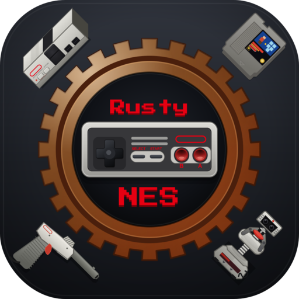
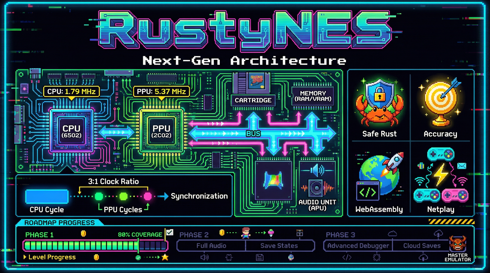
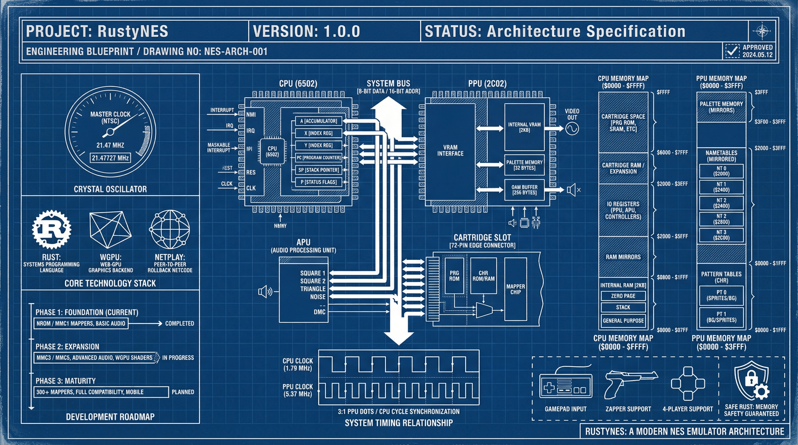
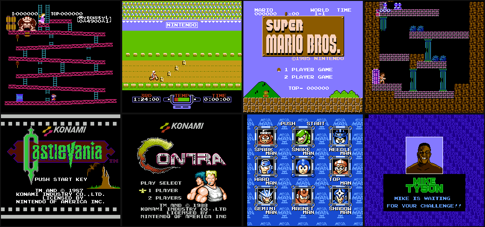
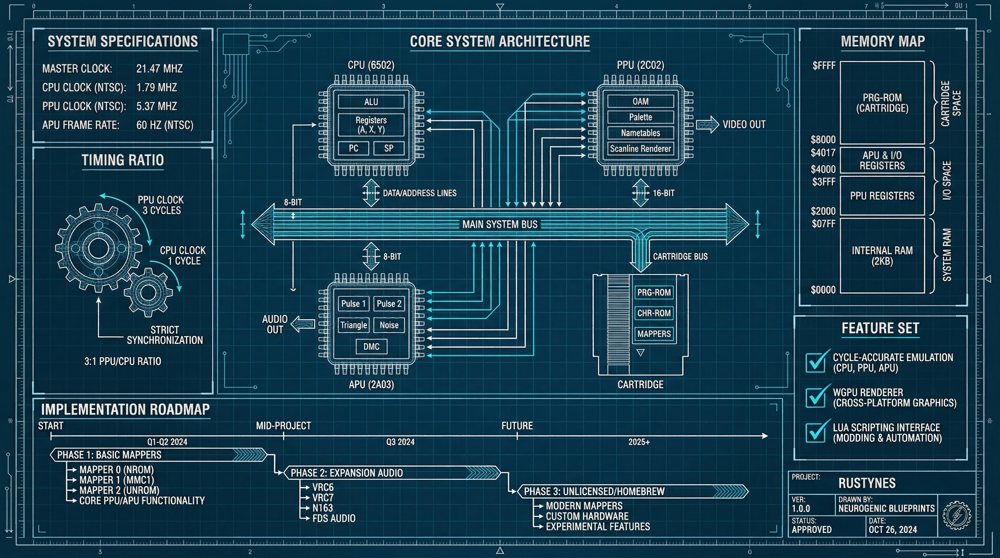
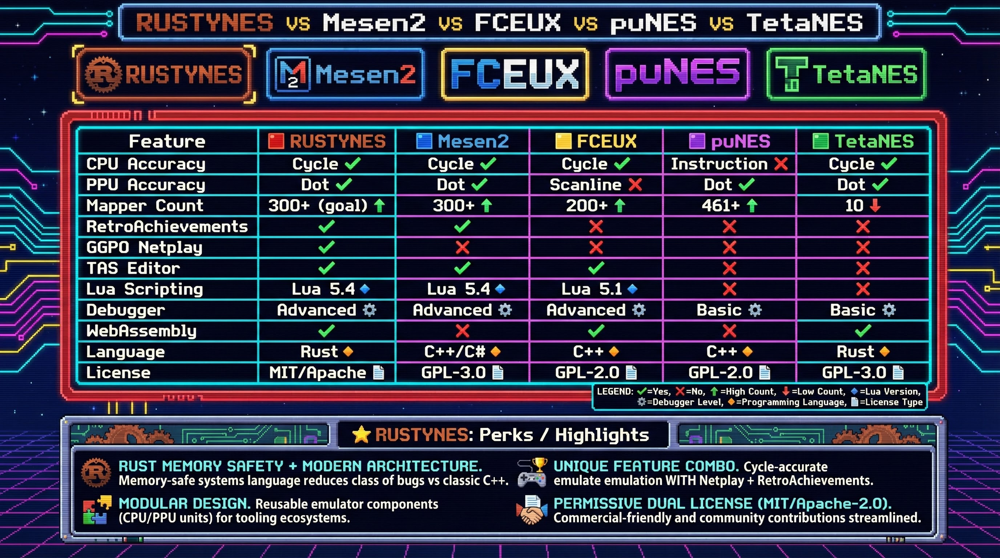
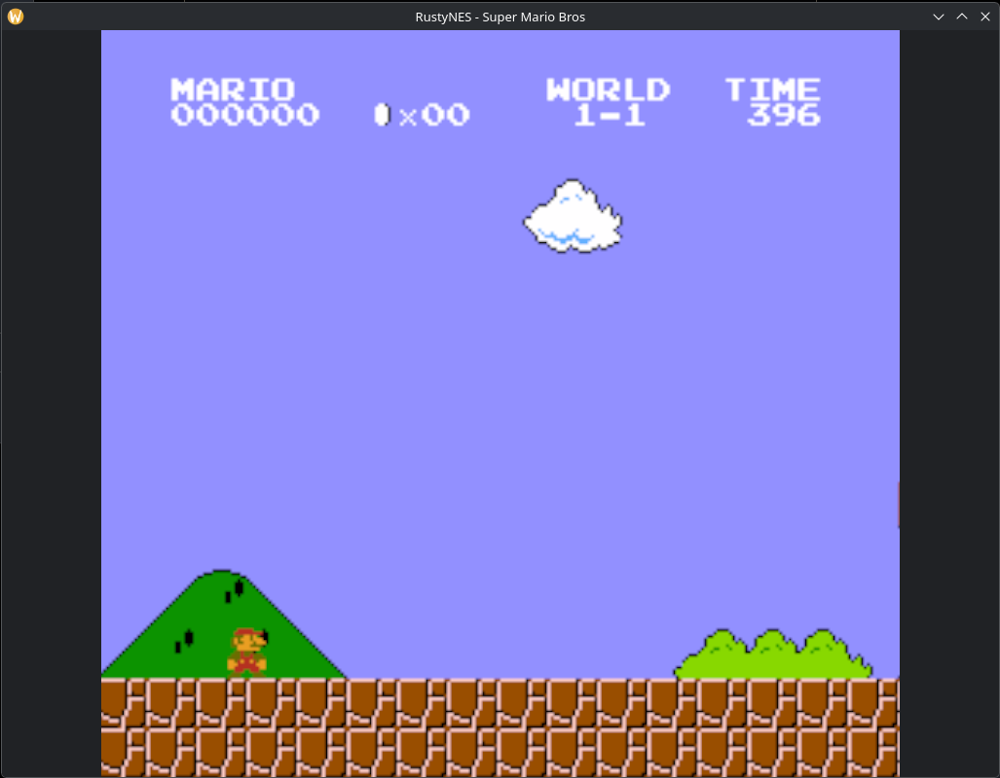
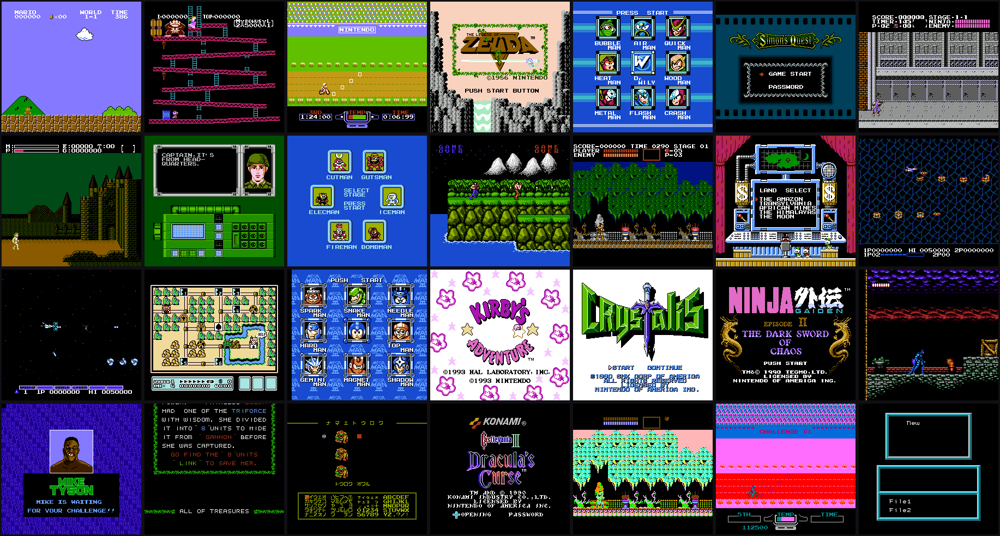

# RustyNES



<p align="center">
  
</p>

> **Precise. Pure. Powerful.**

[](https://github.com/doublegate/RustyNES/actions)
[](#license)
[](https://github.com/doublegate/RustyNES/releases)
[](rust-toolchain.toml)
[](#platform-support)
[-brightgreen.svg>)](#compatibility-and-accuracy)
[](#compatibility-and-accuracy)
[](https://doublegate.github.io/RustyNES/)

## Overview

**RustyNES is a cycle-accurate Nintendo Entertainment System emulator written in
pure Rust.** It targets the Mesen2 / higan / ares accuracy bar — tight, lockstep
scheduling at PPU-dot resolution on a master-clock-precise timebase — clearing
**AccuracyCoin 100.00% (139/139)** and matching the Nintendulator golden log on
`nestest` with **zero diff**.

Beyond reference accuracy, RustyNES is a complete, modern emulation platform:
**123 mapper families** covering the vast majority of the commercial library, the full
**Famicom Disk System** (real-BIOS boot), **Vs. System / PlayChoice-10** arcade games
in true RGB, **GGPO-style rollback netplay** (native UDP and browser WebRTC, 2-4
players), **RetroAchievements**, **TAS movie** recording and playback, save states with
rewind, run-ahead latency reduction, and a full egui debugger — all on a strict
bit-determinism contract. The frontend is pure Rust (`winit` + `wgpu` + `cpal` +
`egui`) with native binaries for Linux, macOS, and Windows, plus a WebAssembly build
that runs in the browser.

**[Try it in your browser](https://doublegate.github.io/RustyNES/)** — no install
required.

---

## Why RustyNES?

RustyNES combines **accuracy-first emulation** with **modern features** and the
**safety guarantees of Rust**. Whether you are a casual player, a TAS creator, a
speedrunner, or a homebrew developer, RustyNES provides a comprehensive and faithful
platform for NES emulation.

**Key differentiators:**

- **Reference-grade accuracy** — a from-scratch core on a `u64` master clock with
  run-to-timestamp catch-up; region-exact 3:1 NTSC/Dendy and **3.2:1 PAL** clock
  ratios; sub-instruction PPU events visible to subsequent CPU code.
- **Determinism as a hard contract** — same seed, ROM, and input sequence yield a
  bit-identical framebuffer and audio. This is what makes save-state round-trips,
  regression testing, and rollback netplay correct by construction.
- **Modern features** — RetroAchievements, rollback netplay, TAS tools, run-ahead,
  display-sync pacing, and a read-only debugger.
- **Safe, modular Rust** — the chip stack is `no_std + alloc` with a one-directional
  workspace graph, so each component (CPU, PPU, APU) is independently fuzzable and
  benchmarkable. The only `unsafe` lives behind opt-in feature boundaries.

---

## Highlights

| Feature                | Description                                                                                  |
| ---------------------- | -------------------------------------------------------------------------------------------- |
| **Cycle-Accurate**     | Master-clock-precise CPU / PPU / APU — AccuracyCoin 100% (139/139), nestest 0-diff           |
| **123 Mapper Families** | NROM through MMC5, the full VRC line, Sunsoft FME-7, Namco 163, Taito, and Vs.-System boards — classified Core / Curated / BestEffort behind a CI accuracy-honesty gate *(123 as of v1.5.0; 126 on `main` with the v1.6.0 J.Y. ASIC family)* |
| **Famicom Disk System**| `.fds` games with real-BIOS boot, writable disks, side-swapping, and 2C33 wavetable audio    |
| **Vs. / PlayChoice-10**| Arcade ROMs in true 2C03 / 2C04 / 2C05 RGB with per-game DIP presets                          |
| **RetroAchievements**  | Native `rcheevos` integration: achievements, leaderboards, rich presence, hardcore mode      |
| **Rollback Netplay**   | GGPO-style rollback for up to 4 players, over UDP or browser WebRTC                           |
| **TAS Tools**          | Frame-perfect deterministic record / replay with save-state branching (`.rnm` format)        |
| **Run-Ahead**          | Latency reduction that hides a game's internal input lag                                      |
| **Video Filters** *(v1.1.0)* | Full NES_NTSC composite / S-video, a CRT / scanline shader pass, and custom `.pal` palettes |
| **Lua Scripting** *(v1.1.0)* | Sandboxed Lua 5.4 — memory/state access, frame & access callbacks, HUD overlay (opt-in)  |
| **ROM Library** *(v1.2.0)* | `.zip` loading + automatic `.ips`/`.ups`/`.bps` soft-patching + a per-game DB and in-app ROM-Database editor |
| **Shaders & HD Packs** *(v1.2.0)* | Live NTSC knobs, a composable shader stack + CRT preset bank, and a (default-off) Mesen-style HD-pack loader |
| **TAStudio Editor** *(v1.6.0, dev)* | A piano-roll TAS editor — per-frame button grid with drag-paint, a save-state greenzone + lag log, markers, forkable branches, and `.rnmproj` projects |
| **UNIF + Movie Interop** *(v1.6.0, dev)* | `.unf` cartridge loading (board-name → mapper resolution) and FCEUX `.fm2` movie import/export |
| **Pure Rust**          | `winit` + `wgpu` + `cpal` + `egui` frontend; safe `no_std + alloc` chip stack                 |

<p align="center">
  
</p>

---

## Showcase

A cross-section of the commercial library running pixel-accurately on RustyNES —
launch classics like Donkey Kong, Excitebike, and Super Mario Bros.; the Famicom
Disk System's Kid Icarus; Konami's Castlevania and Contra; the Mega Man
boss-select; and Mike Tyson's Punch-Out!! — spanning NROM up through MMC3 / MMC5,
FME-7, and the full VRC line, plus Vs.-arcade RGB.

<p align="center">
  
</p>

The full per-mapper visual corpus lives in
[`screenshots/external/`](screenshots/external/) (Core / Curated) and
[`screenshots/besteffort/`](screenshots/besteffort/) (BestEffort) — boot / title /
gameplay frames spanning the bulk of the ~126 mapper families.

---

## Features

### Emulation core

- **Master-clock-precise scheduler.** A `u64` master clock drives the CPU, PPU, and
  APU off the fundamental NES timebase with run-to-timestamp catch-up (the
  TetaNES / Mesen2 model). This is the central architectural choice and the reason
  mid-instruction PPU events — a sprite-zero hit at a precise dot, an MMC3 IRQ at a
  PPU dot, a mid-scanline scroll write — work without per-quirk patches.
- **Cycle-accurate 6502 CPU** — all 256 opcodes including the full unofficial set
  (incl. the unstable SH\* / TAS / LAS / XAA family), per-cycle bus interleaving,
  cycle-exact interrupt-sample timing, and sub-instruction DMC/OAM DMA via one
  unified dispatch.
- **Cycle-accurate 2C02 PPU** — per-dot scheduling, the full cycle-resolution
  sprite-evaluation FSM (including the hardware `n+m` overflow increment bug), the
  background-fetch pipeline, the `PPUMASK`→dot-skip delay, and a rendering-time
  `$2007` state machine.
- **Cycle-accurate 2A03 APU** — the non-linear lookup mixer, 256-phase × 32-tap
  Blackman-windowed sinc synthesis (SFDR 81.6 dB), a 3-stage analog filter chain, and
  the DMC byte timer on the shared master clock.

### Cartridges and platforms

- **123 mapper families** covering the bulk of the licensed library — NROM, all
  MMC1-5, the full VRC1/2/4/6/7 line (incl. VRC6 and VRC7 expansion audio), Sunsoft
  FME-7/1/2/3/4 (+ 5B audio), Namco 163 (+ wavetable), the Taito
  TC0190/TC0690/X1-005/X1-017 and Irem/Jaleco/Bandai/Tengen boards, and the Vs.-System
  mappers. See [`docs/mappers.md`](docs/mappers.md).
- **Famicom Disk System** — `.fds` games with a user-supplied `disksys.rom` BIOS; the
  disk drive and IRQs, writable disks (`.fds.sav`, `F9` side-swap), and 2C33 wavetable
  audio. Real-BIOS boot works — Zelda, Metroid, and others boot into the game.
- **Vs. System / PlayChoice-10** — the 2C03 / 2C04 / 2C05 RGB PPUs with per-game DIP
  presets and exact palettes; real arcade ROMs render in true RGB.

### Modern features

- **RetroAchievements** *(opt-in `retroachievements` feature, native-only)* — login,
  achievements, leaderboards, rich presence, and hardcore mode (which disables
  save-state load / rewind / cheats), via the vendored MIT `rcheevos` library.
- **Rollback netplay** — GGPO-style rollback over UDP for up to 4 players (predict →
  advance → roll back and re-simulate on the deterministic core), plus a **browser
  (WebRTC) mesh** path with a deployable signaling / STUN bundle ([`deploy/`](deploy/)).
- **TAS movie recording and playback** — frame-perfect deterministic record / replay
  with save-state branching, in a versioned `.rnm` format.
- **Save state + rewind** — a 600-frame rewind ring, instant save / load, and a
  snapshot fast path used by run-ahead, plus a thumbnail save-state manager.
- **Run-ahead** — hides a game's internal input lag for snappier controls, built on
  the existing deterministic snapshot / restore.
- **Emulation-speed control** — 25 %–300 % speed presets (slow-motion to fast),
  hold-to-fast-forward, and single-frame advance while paused.
- **Display-sync pacing + lock-free audio** — an `auto` / `display` / `vrr` /
  `wallclock` pacing matrix ends display-beat judder; a lock-free SPSC audio ring with
  dynamic rate control keeps audio clean and underrun-free; master volume,
  per-APU-channel mutes, and a **5-band graphic equalizer** round out the audio mixer.
- **Video filters** *(v1.1.0)* — a full **NES_NTSC composite / S-video** filter, a
  **CRT / scanline** shader pass (curvature, scanlines, aperture mask), and
  **custom `.pal` palette** loading, layered on the existing 8:7 pixel-aspect + overscan
  pipeline.
- **NSF / NSFe music player** *(v1.1.0)* — drop in a `.nsf` chiptune and play it through
  the real APU, with a track selector and the file's title / artist / copyright.
- **Lua scripting** *(v1.1.0, opt-in `scripting` feature, native-only)* — a sandboxed
  **Lua 5.4** engine: read / write memory, inspect CPU state, react to per-frame /
  per-access events, draw an HUD overlay, and drive control actions. See
  [`docs/scripting.md`](docs/scripting.md).
- **Cheats and input devices** — Game Genie and raw RAM cheats, input devices
  (standard pad, Four Score, Arkanoid Vaus, Zapper, and the **Power Pad**),
  **turbo / autofire** with an **input-display overlay**, a **per-game database** of
  nametable-mirroring overrides, and USB gamepads (`gilrs`) with a deadzone control and
  hot-plug detection.
- **Desktop UX** — a native menu bar, recent-ROMs list, a tabbed Settings window,
  light / dark / system themes, 8:7 pixel-aspect correction, optional overscan
  cropping, integer window-size presets, a pause-dim overlay, a status bar,
  screenshot-to-file/clipboard, and drag-and-drop ROM loading.
- **egui debugger + devtools** — a read-only CPU / PPU / APU / memory / OAM / mapper
  inspector by default, plus opt-in **breakpoints / watchpoints**, a **cycle trace
  logger**, and an **event viewer** (IRQ / NMI / register-write timeline) behind the
  `debug-hooks` feature — all preserving the strict determinism contract when off.

---

## Quick Start

### Download binaries

Pre-built binaries for the latest release are available on the
[Releases page](https://github.com/doublegate/RustyNES/releases), built automatically
for `x86_64` / `aarch64` macOS, `x86_64` Linux, and `x86_64` Windows. You can also
build from source using the instructions below.

```bash
# Linux / macOS
tar xf rustynes-<tag>-<target>.tar.gz && ./rustynes path/to/rom.nes
# Windows (PowerShell)
Expand-Archive rustynes-<tag>-x86_64-pc-windows-msvc.zip; .\rustynes.exe path\to\rom.nes
```

### Build from source

**Prerequisites:**

- **Rust 1.86** — pinned via `rust-toolchain.toml` and auto-installed by
  [rustup](https://rustup.rs).
- **Linux desktop dependencies** for `winit` / `wgpu` / `cpal` / `egui` (see below).
- **Git.**

```bash
# Clone the repository
git clone https://github.com/doublegate/RustyNES.git
cd RustyNES

# Build the workspace (release)
cargo build --release --workspace

# Run a ROM you legally own (or launch bare and use F12 / drag-and-drop)
cargo run --release -p rustynes-frontend -- path/to/rom.nes

# Optional: build with RetroAchievements (needs a C compiler for vendored rcheevos)
cargo run --release -p rustynes-frontend --features retroachievements -- path/to/rom.nes
```

The frontend opens a 256×240 window (scaled, with 8:7 pixel-aspect correction),
starts audio via the OS default device, and runs the ROM.

#### Command-line help

The native binary ships a clap 4 CLI with styled `--help`, a `help` subcommand,
shell completions, and an interactive terminal help browser:

```bash
rustynes --help                 # styled usage + examples + keyboard summary
rustynes help                   # browse all topics (interactive TUI on a terminal)
rustynes help mappers           # one topic, printed (also works piped: `… | less`)
rustynes completions fish       # print a shell-completion script
```

Help topics: `controls`, `hotkeys`, `gamepad`, `features`, `mappers`, `config`,
`scripting`, `netplay`, `about`. The interactive browser is behind the default-on
`help-tui` cargo feature; piped / non-terminal output falls back to a static page.

### Platform-specific dependencies

**Ubuntu / Debian:**

```bash
sudo apt-get install -y libxkbcommon-dev libwayland-dev libxkbcommon-x11-dev libasound2-dev libudev-dev
```

**CachyOS / Arch:**

```bash
sudo pacman -S --needed libxkbcommon wayland alsa-lib systemd-libs
```

**macOS / Windows:** no extra system dependencies are required for the default build.
The optional `retroachievements` feature additionally needs a C compiler for the
vendored rcheevos sources.

### Run in the browser (WebAssembly)

A hosted demo is live at
**[doublegate.github.io/RustyNES](https://doublegate.github.io/RustyNES/)**. To build
it yourself you need [trunk](https://trunkrs.dev) (`cargo install trunk`):

```bash
cd crates/rustynes-frontend/web
trunk serve            # dev server at http://127.0.0.1:8081
trunk build --release  # the full winit + wgpu + egui build in ./dist
# Or a lightweight canvas-2D embed:
trunk build --release --no-default-features --features wasm-canvas
```

---

## Desktop UX

The desktop frontend frames the NES image with an always-on **menu bar** (top) and
**status bar** (bottom); the egui debugger is a separate overlay toggled with `` ` ``.
Everything has a keyboard shortcut, but nothing requires one.

- **Menu bar** — File (Open ROM, Open Recent, save / load state, a ten-slot (0–9) Save
  Slot picker, a thumbnail **Save States…** manager, Take Screenshot, Copy Screenshot to
  Clipboard), Emulation (Pause, Reset, Power Cycle, **Speed 25–300 %**, Run-Ahead 0–3,
  the region label, Vs. Insert Coin / FDS Swap Disk Side when relevant), Tools
  (Cheats, TAS Movies, Netplay, RetroAchievements, Performance Monitor — opened as
  floating windows without the debugger), View (Settings, Theme, 8:7 Pixel Aspect,
  Hide Overscan, Fullscreen, Window Size 1x–4x, Show FPS, Pause When Unfocused, Show
  Menu Bar), Debug (the debugger overlay + per-chip panels), and Help (Keyboard
  Shortcuts, About).
- **Status bar** — ROM name, region, mapper, run-ahead depth, Running / Paused /
  Netplay state, the current speed when not 100 %, and the FPS readout.
- **Settings window** — a tabbed Display / Audio / Input / Advanced dialog (View →
  Settings…) with a live master-volume slider + mute, per-APU-channel mutes, a gamepad
  deadzone slider, live theme / pixel-aspect / overscan / FPS toggles, and a
  Reset-to-Defaults button per section.
- **Quality-of-life** — 25 %–300 % emulation-speed presets, hold-to-fast-forward (audio
  muted) and single-frame advance while paused, a thumbnail save-state browser, integer
  window-size presets (1x–4x), optional overscan cropping, optional pause-when-unfocused,
  light / dark / system themes, a pause-dim "PAUSED" overlay, a recent-ROMs list (missing
  files greyed out), controller hot-plug toasts, and a first-run Welcome modal.

## Default Controls

All keys are TOML-rebindable; see the user guide for the full schema.

| Action          | Player 1        | Player 2      |     | System                  | Key                |
| --------------- | --------------- | ------------- | --- | ----------------------- | ------------------ |
| D-Pad           | Arrow keys      | W / A / S / D |     | Save / Load state       | F1 / F4            |
| A / B           | Z / X           | Q / E         |     | Rewind (hold)           | F5                 |
| Start / Select  | Enter / R-Shift | P / L         |     | Fast-forward (hold)     | Tab                |
|                 |                 |               |     | Frame-advance (paused)  | \ (backslash)      |
|                 |                 |               |     | Pause / Resume          | Space              |
|                 |                 |               |     | Speed up / down / reset | = / - / 0          |
|                 |                 |               |     | Reset / Power-cycle     | F2 / F3            |
|                 |                 |               |     | TAS movie record / play | F6 / F7            |
|                 |                 |               |     | TAS movie branch        | F8                 |
|                 |                 |               |     | Swap disk side (FDS)     | F9                 |
|                 |                 |               |     | Insert coin (Vs.)       | F10                |
|                 |                 |               |     | Fullscreen              | F11                |
|                 |                 |               |     | Open ROM                | F12                |
|                 |                 |               |     | Toggle menu bar         | M                  |
|                 |                 |               |     | Debugger                | `` ` `` (backtick) |
|                 |                 |               |     | Quit / exit fullscreen  | Esc                |

USB gamepads auto-bind to player 1 (Xbox-style: South = A, West = B, Start,
Back / Select, D-Pad). Drag and drop a `.nes` file onto the window to load it at any
time.

---

## Architecture

RustyNES is a Cargo workspace of focused crates. Three load-bearing decisions, detailed
in [`docs/architecture.md`](docs/architecture.md) and [`docs/scheduler.md`](docs/scheduler.md):

1. **A shared master-clock timebase.** The CPU advances a `u64` master clock by the
   region's `cpu_divider` per cycle; the PPU is caught up to `master_clock − ppu_offset`
   in both halves of every access (APU and DMA share the same clock). This makes the
   region-exact 3.2:1 PAL ratio and cycle-exact interrupt / DMA timing expressible, and
   makes sub-instruction PPU events work naturally.
2. **The Bus owns everything mutable.** `rustynes-core::Bus` holds the PPU, APU,
   mapper, WRAM, controllers, and open-bus latch; the CPU borrows `&mut Bus` during
   `tick()`. This single choice avoids the borrow-checker fight the alternative creates.
3. **A one-directional workspace graph.** `rustynes-cpu` has no `rustynes-ppu` or
   `rustynes-apu` dependency; each chip is fuzzable and benchmarkable in isolation.

<p align="center">
  
</p>

### Workspace crates

| Crate                    | Role                                                         |
| ------------------------ | ----------------------------------------------------------- |
| `rustynes-cpu`           | Cycle-accurate 6502 / 2A03 CPU core                         |
| `rustynes-ppu`           | Dot-level 2C02 PPU                                          |
| `rustynes-apu`           | Hardware-accurate 2A03 APU with band-limited synthesis      |
| `rustynes-mappers`       | 123 mapper families + expansion audio                       |
| `rustynes-core`          | Integration layer: Bus, scheduler, console, save states     |
| `rustynes-frontend`      | `winit` + `wgpu` + `cpal` + `egui` app (binary: `rustynes`) |
| `rustynes-netplay`       | GGPO-style rollback netcode (UDP + WebRTC)                  |
| `rustynes-cheevos`       | RetroAchievements FFI (opt-in, native-only)                 |
| `rustynes-test-harness`  | Integration tests and the accuracy / commercial-ROM oracles |

### Project layout

```text
crates/        Cargo workspace: the crates above
docs/          Implementation specs, ADRs, audit reports, the user guide,
               STATUS.md (single source of truth), and per-version release notes
deploy/        Docker / compose for the browser-netplay signaling server + STUN/TURN
ref-docs/      Deep-research NES hardware reference
tests/         Integration tests + vendored CC0 / MIT / zlib test ROMs (no commercial ROMs)
screenshots/   Committed commercial-game visual corpus + showcase montages
scripts/       Regression-bisect + ROM-survey tooling
fuzz/          cargo-fuzz harnesses
```

---

## Compatibility and Accuracy

RustyNES demonstrates reference-grade emulation accuracy. The single validated
scheduler is the master-clock core; the RAM-direct AccuracyCoin decoder over 139
assigned tests is the authoritative source.

| Suite                       | Result                                                                |
| --------------------------- | --------------------------------------------------------------------- |
| **AccuracyCoin**            | **100.00% (139/139, 0 fail)**                                         |
| nestest                     | 0-diff vs the Nintendulator golden log                                |
| blargg `cpu_interrupts_v2`  | 5/5 strict · SH\* 6/6                                                  |
| `region_timing`             | 4/4 (PAL **3.2:1**) · `$2007` Stress 170/170                          |
| Commercial-ROM oracle       | 99 titles (60-ROM gate + 39-title survey), SHA-256-pinned, byte-identical |

The commercial-ROM oracle is a **regression gate**, not a correctness check — a visual
99-title survey is what catches rendering bugs. The wasm32 target shares the exact
emulator core, so the browser build runs the same scheduler. The **sole strict
expected-fail** is `mmc3_test_2/4` sub-test #3 (a 1-PPU-clock MMC3 reload-pending
bracket that affects no AccuracyCoin score and breaks no commercial game). The full
per-suite breakdown, the mapper coverage matrix, and the version policy live in
**[`docs/STATUS.md`](docs/STATUS.md)**.

> A note on test counts: RustyNES is validated by closed-form test ROMs (AccuracyCoin,
> nestest, blargg, mmc3_test, Holy Mapperel) and a commercial-ROM oracle, not by a
> headline unit-test number. When a doc and a passing test ROM disagree, **the ROM
> wins** — that is the project's definition of "cycle-accurate."

<p align="center">
  
</p>

### Sub-cycle accuracy in action

The screenshot below shows Super Mario Bros. at first light — correct background
rendering, palette, and timing straight from the master-clock scheduler.

<p align="center">
  
</p>

---

## Performance

The headless core is comfortably real-time. On an Intel i9-10850K (rustc 1.86,
release), against the **16.639 ms NTSC frame deadline**:

| Workload                          | Frame time | Headroom                  |
| --------------------------------- | ---------- | ------------------------- |
| `nestest` (static menu)           | 3.92 ms    | 4.25× realtime · 255 fps  |
| `flowing_palette` (render-heavy)  | 2.49 ms    | 6.69× realtime · 402 fps  |

The reproducible record (methodology, all benches, and the historical A/B) is in
[`docs/benchmarks.md`](docs/benchmarks.md).

---

## Platform Support

| Platform            | Status  |
| ------------------- | ------- |
| **Windows x64**     | Primary |
| **Linux x64**       | Primary |
| **macOS x64/ARM64** | Primary |
| **WebAssembly**     | Primary |
| **Linux ARM64**     | Supported (cross-compile) |

### System requirements

- **Rust 1.86 stable** (pinned via `rust-toolchain.toml`; auto-installed by `rustup`).
- A GPU with a `wgpu`-supported backend (Vulkan / Metal / DX12, or WebGPU / WebGL2 in
  the browser).
- The optional `retroachievements` feature needs a C compiler for the vendored
  rcheevos sources; the default build does not.

---

## Documentation

| Document                                | Description                                                        |
| --------------------------------------- | ----------------------------------------------------------------- |
| [User guide](docs/user-guide/README.md) | Install, controls, save states + rewind, debugger, config, FAQ    |
| [Project status matrix](docs/STATUS.md) | Per-suite pass count, mapper coverage, feature flags, version policy |
| [Architecture](docs/architecture.md)    | System design and the load-bearing decisions                      |
| [Scheduler](docs/scheduler.md)          | The master-clock lockstep model                                   |
| [CHANGELOG.md](CHANGELOG.md)            | Version history and release notes                                 |

### Hardware and subsystem specs

| Component  | Location                                       |
| ---------- | ---------------------------------------------- |
| CPU (6502) | [docs/cpu-6502.md](docs/cpu-6502.md)           |
| PPU (2C02) | [docs/ppu-2c02.md](docs/ppu-2c02.md)           |
| APU (2A03) | [docs/apu-2a03.md](docs/apu-2a03.md)           |
| Mappers    | [docs/mappers.md](docs/mappers.md)             |
| Testing    | [docs/testing-strategy.md](docs/testing-strategy.md) |
| Netplay    | [docs/netplay-webrtc.md](docs/netplay-webrtc.md) |

Architecture Decision Records live in [`docs/adr/`](docs/adr/). (The deeper
engine-development audit logs are kept locally, outside the public repo.)

---

## Version History

The current release is **v1.5.0 "Lens"**, the insight, scriptability, creator-tooling, and
polish release on the cycle-accurate v1.0.0 production core (it follows the v1.4.0 "Fidelity"
and v1.4.1 compatibility line). **v1.6.0 "Studio" is now in active development**, with several
workstreams already merged to `main` (see the top row). The road so far:

| Version    | Highlights                                                                                  |
| ---------- | ------------------------------------------------------------------------------------------- |
| **v1.6.0** *(in development)* | "Studio" — creator-power + accuracy-polish + reach; **in active development, partially merged to `main`.** Landed so far: a **TAStudio-class piano-roll TAS editor** (a density-tiered save-state greenzone + lag log, markers/forkable branches/`.rnmproj` projects, and the egui piano-roll grid with drag-paint + deterministic seek), **`.fm2` (FCEUX) movie import/export**, a **UNIF (`.unf`) cartridge loader** (board-name → iNES-mapper resolution), the **J.Y. Company ASIC** mapper family (m90/209/211 → **126 families**), a `dorny/paths-filter` CI gate, and a much-expanded per-mapper boot-screenshot corpus. Still ahead: `.bk2` interop, Lua driving (`frameadvance`/coroutine) + data breadth, Mesen2-class conditional breakpoints/watchpoints + hex editor, an off-axis accuracy cluster (DMC/OAM-DMA controller-corruption, `$2007` blocking read, sprite-overflow), mappers → ~150, FDS-proper, A/V recording, HD audio, and shader import. Additive / off-by-default; AccuracyCoin 100% (139/139) held. |
| **v1.5.0** | "Lens" — insight + scriptability + creator tooling + polish: debugger **visualization** (Input Miniatures overlay, a graphical PPU event-viewer heatmap, a per-scanline trace, an HD-pack pixel inspector), a Lua **dev/TAS API** (memory/cart/save-state/symbol queries), a **TASVideos** compatibility pass + replay/TAS-window polish + an NSF waveform scope, a measure-first **frontend pacing & audio-sync** perf pass with perf-log↔panel parity, **UX polish** (named-palette editor, per-side overscan WYSIWYG, an Enhancements settings group, device-config controls), **accessibility** (UI scaling, high-contrast + Okabe-Ito colorblind themes, keyboard-only nav), a **native-UI overhaul** + in-app **Documentation** pane, mapper coverage 113 → **123 families**, and **casual-mode browser RetroAchievements** scaffolding (ADR 0015, off by default — emcc-built rcheevos side module + auth-proxy contract; live-browser verify is maintainer-manual). All additive / off-by-default so shipped / native / `no_std` / wasm stay byte-identical; AccuracyCoin 100% (139/139) held. |
| **v1.4.1** | Patch — four more BestEffort mapper boot/decode fixes from the boot-smoke-vs-real-dumps pass (m92 Jaleco JF-19 PRG layout, m94 UN1ROM bank decode + bus conflict, m145 Sachen 16 KiB PRG, m147 Sachen 3018 / TXC JV001 protection handshake), plus the boot-smoke screenshot corpus reorganized to mirror the per-mapper `tests/roms/` tier layout. BestEffort-only; AccuracyCoin 100% (139/139) held, byte-identical to v1.4.0. |
| **v1.4.0** | "Fidelity" — compatibility + finish: accuracy polish (triangle ultrasonic silence, DMC-DMA ↔ controller-read conflict verified), per-channel audio mixing, devtools finish (symbol-file `.sym`/`.mlb`/`.nl` loading + event breakpoints), browser QoL (wasm `.rnm` movie I/O + IndexedDB save-states), a measure-first perf pass (−8% on the rendering-heavy bench), a colorful **`rustynes help` TUI** + styled `--help` (clap 4 + ratatui), and mapper coverage 101 → **113 families** (boot-smoke verified, with reset-vector / decode fixes to m132/m143/m225/m226/m233/m242/m246). AccuracyCoin 100% (139/139) held. |
| **v1.3.0** | "Bedrock" — foundation + breadth: edition 2024 / Rust 1.96 / egui 0.34 + wgpu 29 toolchain, the frame-pacing fix, Memory Compare + menu/Settings reorg + auto-save, mapper coverage 87 → **101 families** + Vs. DualSystem detection, HD-pack `<condition>`/`<background>` rules, netplay desync diagnostics + niche peripheral aliases, and the exercised PGO/BOLT gate. AccuracyCoin 100% held. (Casual-mode browser RetroAchievements is a documented carryover — ADR 0015.) |
| **v1.2.0** | "Curator" — library breadth + compatibility + reach: mapper coverage 51 → **87 families** (accuracy-tiering honesty gate), `.zip` loading + `.ips`/`.ups`/`.bps` soft-patching, a per-game DB + in-app ROM-Database editor, live NTSC knobs + a composable shader stack + CRT preset bank + a (default-off) HD-pack loader, new peripherals (Family BASIC keyboard, SNES mouse, Arkanoid-both-ports, Game Genie code DB), Lua `onNmi`/`onIrq`/`setInput`, menu-bar polish (contextual enable/disable + remappable shortcuts + Font Awesome icons), web touch controls + Power Pad + experimental wasm Lua, a turn-key netplay `deploy/` bundle, and a PGO CI promotion gate. AccuracyCoin 100% held |
| **v1.1.0** | First feature release — visual filters (full NES_NTSC + CRT/scanline shader + `.pal` loading), input & peripherals (Power Pad, turbo/autofire, input-display overlay, per-game mirroring database), debugger devtools (breakpoints, trace logger, event viewer), audio (NSF/NSFe player, 5-band EQ), and the flagship **Lua scripting** engine |
| **v1.0.0** | First stable release — the production UX (menu bar, themes, tabbed settings, debugger) and documentation synthesis on top of the cycle-accurate engine |
| v0.9.7     | Performance pass: display-sync pacing, lock-free audio + dynamic rate control, run-ahead, a dedicated emulation thread, core micro-opts |
| v0.9.6     | RetroAchievements; Vs. DIP / palette database; deployable browser netplay; netplay hardening |
| v0.9.5     | GGPO-style rollback netplay (UDP, then up-to-4-player + WebRTC)                              |
| v0.9.4     | +mappers (→51); real-BIOS Famicom Disk System boot; the 99-title rendering survey + fixes   |
| v0.9.3     | The master-clock milestone — AccuracyCoin reaches 100% (139/139)                            |
| v0.9.2     | Nesdev accuracy hardening; region (PAL / Dendy) timing validation                           |
| v0.9.1     | Expansion audio (VRC6/7, FME-7 5B, N163, MMC5), the WebAssembly target, TAS movies, Game Genie |
| v0.9.0     | The cycle-accurate core: per-cycle CPU bus interleaving, the lockstep PPU, the band-limited APU |

> Note: **v1.0.0** was RustyNES's first stable release. The original RustyNES line
> (v0.8.x) used an earlier, less-accurate emulation core; v1.0.0 replaced that core
> wholesale with the cycle-accurate engine described above; **v1.1.0** added the
> scripting/filters/peripherals feature set; **v1.2.0 "Curator"** added the library /
> compatibility / reach set; **v1.3.0 "Bedrock"** added the toolchain + breadth set;
> **v1.4.0 "Fidelity"** (+ the v1.4.1 patch) added the compatibility-and-finish set; and
> **v1.5.0 "Lens"** adds the insight / scriptability / creator-tooling / polish set above. See
> [`CHANGELOG.md`](CHANGELOG.md) for full per-version detail.

### Roadmap

With **v1.5.0 "Lens"** shipped, the non-architectural backlog is essentially consumed:
emulation accuracy is at or beyond the GeraNES bar, the GeraNES-class debugger visualization
and creator/TAS tooling now exists, and the remaining accuracy residuals all converge on a
single future **v2.0 master-clock (fractional-timebase) refactor** (ADR 0002). The next
release, **v1.6.0 "Studio", is now in active development** — a creator-power + accuracy-polish +
reach pass: a TAStudio-class piano-roll TAS editor, `.fm2`/`.bk2` movie interop, Mesen2-class
conditional breakpoints/watchpoints/hex editor, an off-axis accuracy cluster adoptable without
v2.0, and breadth (mappers → ~150, FDS-proper, A/V recording). Several of its workstreams are
already merged to `main` (the TAStudio editor, `.fm2` interop, the UNIF loader, the J.Y. ASIC
mappers — see Version History); the v2.0 refactor remains the subsequent architectural
milestone. Browser
RetroAchievements has its buildable scaffolding in v1.5.0 (ADR 0015); finishing it (deploy the
auth proxy, live-browser verify) + mobile (iOS / Android) frontends remain further-out. See
[`docs/STATUS.md`](docs/STATUS.md) for the authoritative current state.

---

<p align="center">
  
</p>

## Contributing

Contributions of all kinds are welcome — code, testing, documentation, and design.
Please read [`CONTRIBUTING.md`](CONTRIBUTING.md) for the quality-gate contract, the
conventional-commit format, and the chip-behavior-change rule (a chip change touches
both the code and its `docs/<subsystem>.md` in the same PR).

### Quick contribution workflow

```bash
# 1. Fork and clone, then create a feature branch
git checkout -b feat/my-feature

# 2. Make changes and run the quality gates
cargo test --workspace
cargo clippy --workspace --all-targets -- -D warnings
cargo fmt --all --check

# 3. Commit using conventional commits, then push and open a PR
git commit -m "feat(cpu): implement <thing>"
git push origin feat/my-feature
```

The four quality gates (`fmt`, `clippy`, `doc`, and the test suite) all run in CI and
must be green. See [GitHub Discussions](https://github.com/doublegate/RustyNES/discussions)
if you need guidance.

---

## License

RustyNES is dual-licensed under your choice of:

- **[MIT License](LICENSE-MIT)** — permissive, allows commercial use.
- **[Apache License 2.0](LICENSE-APACHE)** — permissive with a patent grant.

Unless you state otherwise, any contribution you submit is dual-licensed as above.

**Vendored third-party code:** the optional `crates/rustynes-cheevos` crate vendors the
[RetroAchievements `rcheevos`](https://github.com/RetroAchievements/rcheevos) library
under its MIT license (retained verbatim alongside the sources).

**Test ROMs** under `tests/roms/` are individually CC0, MIT, or zlib licensed. **No
commercial Nintendo ROMs are included, and they will never be bundled** — dumps for the
commercial-ROM oracle are the user's responsibility and must come from cartridges they
legally own.

---

## Acknowledgments

RustyNES stands on the shoulders of giants:

- The **[Nesdev wiki](https://www.nesdev.org/wiki/)** community for decades of hardware
  documentation and forum research.
- **[Mesen2](https://github.com/SourMesen/Mesen2)**,
  **[higan](https://github.com/higan-emu/higan)**, and
  **[ares](https://github.com/ares-emulator/ares)** as the accuracy reference bar and
  trace oracles.
- **[TetaNES](https://github.com/lukexor/tetanes)** for the Bus-owns-everything
  architecture postmortem and Rust patterns.
- **[blargg](https://wiki.nesdev.org/w/index.php/Emulator_tests)**, kevtris' nestest,
  **[Tepples' Holy Mapperel](https://github.com/pinobatch/holy-mapperel-build)**, and
  **[100thCoin's AccuracyCoin](https://github.com/100thCoin/AccuracyCoin)** as the
  closed-form definition of "cycle-accurate" used by this project.
- **[RetroAchievements](https://retroachievements.org/)** and the
  **[`rcheevos`](https://github.com/RetroAchievements/rcheevos)** library that powers
  the achievement integration.

---

## Citation

If you use RustyNES in academic research, please cite:

```bibtex
@software{rustynes2026,
  author  = {RustyNES Contributors},
  title   = {RustyNES: A Cycle-Accurate NES Emulator in Rust},
  year    = {2026},
  version = {1.5.0},
  url     = {https://github.com/doublegate/RustyNES},
  note    = {Cycle-accurate NES emulator on a master-clock-precise scheduler;
             AccuracyCoin 100\% (139/139), nestest 0-diff; 123 mapper families,
             Famicom Disk System, Vs./PlayChoice-10 RGB, rollback netplay,
             RetroAchievements, TAS movies; pure-Rust winit/wgpu/cpal/egui frontend
             with a WebAssembly build}
}
```

---

<p align="center">
  <strong>Built with Rust. Powered by passion for retro gaming.</strong><br>
  <sub>Preserving video game history, one frame at a time.</sub>
</p>

<p align="center">
  <a href="#quick-start">Get Started</a> ·
  <a href="https://doublegate.github.io/RustyNES/">Play in Browser</a> ·
  <a href="CONTRIBUTING.md">Contribute</a> ·
  <a href="docs/">Documentation</a> ·
  <a href="https://github.com/doublegate/RustyNES/discussions">Discuss</a>
</p>
