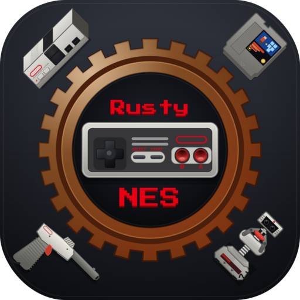
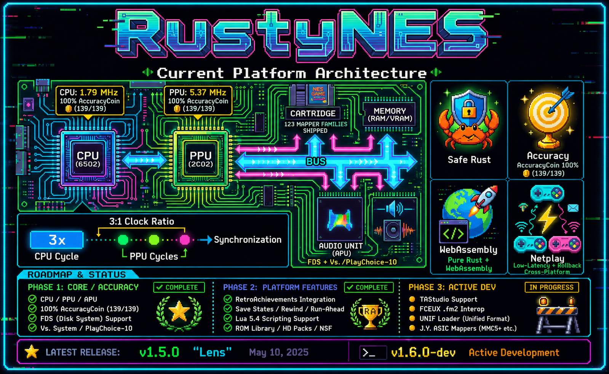
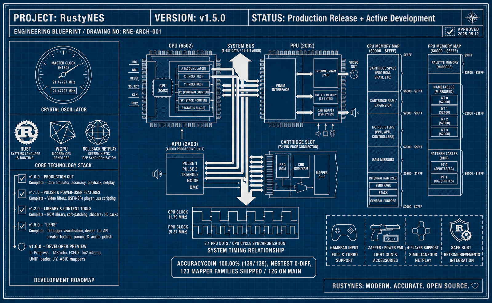
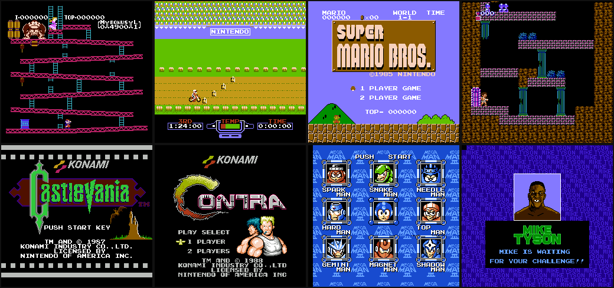
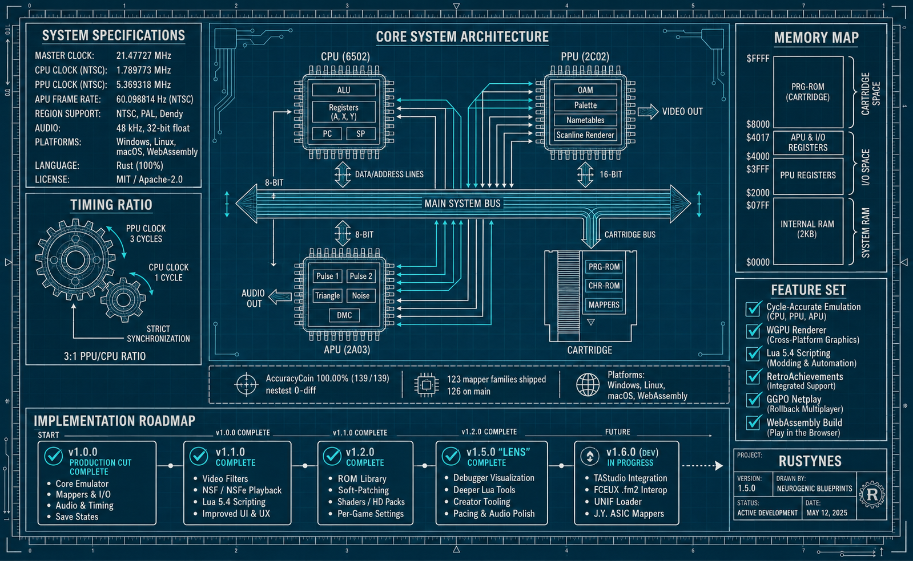
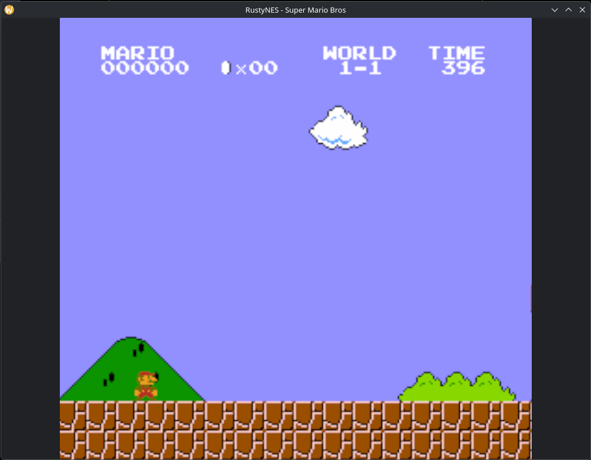
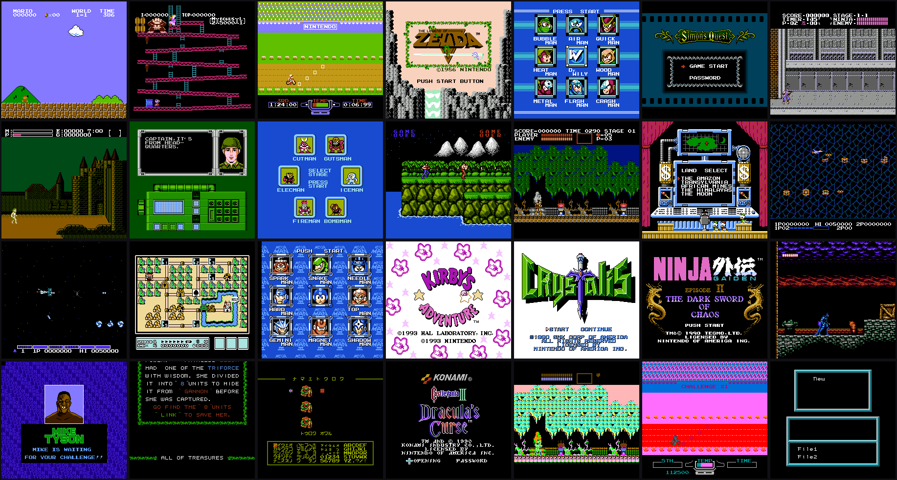

# RustyNES



> **Precise. Pure. Powerful.**

<p align="center">
  
</p>

<p align="center">
  <a href="https://github.com/doublegate/RustyNES/actions"></a> <a href="#license"></a> <a href="https://github.com/doublegate/RustyNES/releases"></a> <a href="rust-toolchain.toml"></a><br>
  <a href="#compatibility-and-accuracy"></a> <a href="#compatibility-and-accuracy"></a> <a href="https://doublegate.github.io/RustyNES/"></a><br>
  <a href="#platform-support"></a>
</p>

## Overview

**RustyNES is a cycle-accurate Nintendo Entertainment System emulator written in
pure Rust.** It targets the Mesen2 / higan / ares accuracy bar — tight, lockstep
scheduling at PPU-dot resolution on a master-clock-precise timebase — clearing
**AccuracyCoin 100% (141/141)** and matching the Nintendulator golden log on
`nestest` with **zero diff**. (As of v2.0.3 every assigned test passes, including the
two newest upstream PPU tests, "ALE + Read" and "Hybrid Addresses", via the promoted
2-cycle-ALE fetch model — ADR 0030.)

> **Development note — AI-assisted:** RustyNES is heavily AI-assisted software,
> built with LLM tooling under a human-directed, test-driven workflow (public
> test ROMs as the oracle, a `no_std` core, and continuous CI). See
> [`docs/originality-and-provenance.md`](docs/originality-and-provenance.md) for
> what that means for originality and licensing, and the
> [Acknowledgments](#acknowledgments) for the references and components it builds
> on. Accuracy claims are meant to be *checked* by running the public suites, not
> taken on faith; comparisons to other emulators are comparisons, not a claim of
> being "better."

Beyond reference accuracy, RustyNES is a complete, modern emulation platform:
**174 mapper families** covering the vast majority of the commercial library (plus a
UNIF `.unf` cartridge loader), the full **Famicom Disk System** (real-BIOS boot with a
timed disk-head model), **Vs. System / PlayChoice-10** arcade games in true RGB,
**GGPO-style rollback netplay** (native UDP and browser WebRTC, 2-4 players),
**RetroAchievements**, a **native Libretro core** for RetroArch, a **scriptable TAStudio piano-roll TAS editor** with `.fm2` /
`.bk2` / `.fcm` / `.fmv` / `.vmv` movie interop, editing-capable debug tools
(palette / nametable / CHR / OAM writeback, an iNES / NES 2.0 header editor, an inline
6502 assembler), save states with rewind, run-ahead latency reduction, a **Mesen2-class
debugger** (expression / conditional breakpoints, R/W/X watchpoints, a hex editor, RAM
search, a callstack, `.dbg` source maps), **A/V recording**, **HD-pack** video + audio
(with an HD-Pack Builder), a **shader / filter ecosystem**, and a localized
(i18n) UI — all on a strict bit-determinism contract. The frontend is pure Rust (`winit` + `wgpu` +
`cpal` + `egui`) with native binaries for Linux, macOS, and Windows, plus a WebAssembly
build that runs in the browser.

**[Try it in your browser](https://doublegate.github.io/RustyNES/)** — no install
required.

---

## Why RustyNES?

RustyNES combines **accuracy-first emulation** with **modern features** and the
**safety guarantees of Rust**. Whether you are a casual player, a TAS creator, a
speedrunner, or a homebrew developer, RustyNES provides a comprehensive and faithful
platform for NES emulation.

**Key differentiators:**

- **Reference-grade accuracy** — a from-scratch core on a `u64` master clock with
  run-to-timestamp catch-up; region-exact 3:1 NTSC/Dendy and **3.2:1 PAL** clock
  ratios; sub-instruction PPU events visible to subsequent CPU code.
- **Determinism as a hard contract** — same seed, ROM, and input sequence yield a
  bit-identical framebuffer and audio. This is what makes save-state round-trips,
  regression testing, and rollback netplay correct by construction.
- **Modern features** — RetroAchievements, rollback netplay, a scriptable TAStudio,
  run-ahead, display-sync pacing, an Android app, and a Mesen2-class, editing-capable
  debugger (read-only by default, determinism-preserving).
- **Safe, modular Rust** — the chip stack is `no_std + alloc` with a one-directional
  workspace graph, so each component (CPU, PPU, APU) is independently fuzzable and
  benchmarkable. The only `unsafe` lives behind opt-in feature boundaries.

---

## Highlights

| Feature | Description |
| --- | --- |
| **Cycle-Accurate** | Master-clock-precise CPU / PPU / APU — AccuracyCoin 100% (141/141), nestest 0-diff |
| **One-Clock Timebase** | A single canonical cycle counter, every CPU cycle a real bus access, with a split-around-the-access PPU catch-up |
| **172 Mapper Families** | NROM through MMC5, the full VRC line, Sunsoft FME-7, Namco 163, Taito, J.Y. Company ASIC, reusable-ASIC multicarts (FK23C / COOLBOY / MINDKIDS / Sachen / Waixing / Kaiser), and Vs.-System boards — classified Core / Curated / BestEffort behind a CI accuracy-honesty gate — plus a UNIF (`.unf`) loader |
| **Famicom Disk System** | `.fds` games with real-BIOS boot, writable disks, side-swapping, a timed disk-head model, and 2C33 wavetable audio |
| **Vs. / PlayChoice-10** | Arcade ROMs in true 2C03 / 2C04 / 2C05 RGB with per-game DIP presets; Vs. DualSystem two-screen presentation on desktop |
| **RetroAchievements** | Native `rcheevos` integration: achievements, leaderboards, rich presence, hardcore mode |
| **Rollback Netplay** | GGPO-style rollback for up to 4 players over UDP or browser WebRTC — room-code / TURN traversal, matchmaking / lobby, and spectators |
| **TAStudio + Movie Interop** | A piano-roll TAS editor (drag-paint grid, save-state greenzone, lag log, markers, forkable branches) with `.fm2` / `.bk2` / `.fcm` / `.fmv` / `.vmv` import and the native `.rnm` format |
| **Run-Ahead & Rewind** | Input-lag-hiding run-ahead and a tiered (Zwinder) rewind window, on the deterministic snapshot path |
| **Mesen2-Class Debugger** | Expression / conditional breakpoints, R/W/X watchpoints, a hex editor, RAM search, a callstack, and `.dbg` source maps — editing-capable (palette / nametable / CHR / OAM writeback, header editor, inline 6502 assembler), read-only by default |
| **Lua Scripting** | Sandboxed Lua 5.4 — memory / state access, frame & access callbacks, a `tastudio.*` API, HUD overlay, and host-IPC automation (opt-in) |
| **Shaders & HD Packs** | An NES-NTSC composite / S-video filter, a composable CRT / scanline shader stack (CRT-Royale / guest-advanced / Megatron look), a generated NTSC palette, custom `.pal` palettes, and a Mesen-style HD-pack loader + builder (video + OGG audio) |
| **Cheats & Peripherals** | A ~10,800-code Game Genie database with per-game nomination + encoder, raw RAM cheats, and a broad peripheral set (Four Score, Zapper, Arkanoid, Power Pad, keyboards, mouse) |
| **A/V Recording** | Synchronized video + audio capture to `.mp4` / `.mkv` via an `ffmpeg` pipe (opt-in, output-only) |
| **NSF / NSFe Player** | Chiptune playback through the real APU + expansion synths, honoring non-60 Hz play-speed dividers |
| **Android & iOS Apps** | Complete native apps on the byte-identical core — touch + hardware controllers, save-states, netplay, RetroAchievements, and the shader stack (sideload / TestFlight; free store listing possible later) |
| **Libretro Core** | A cycle-accurate `rustynes_libretro` core for RetroArch (RetroAchievements, dynamic audio sync, deterministic rollback / save-state, region-correct NTSC / PAL / Dendy pacing, FDS multi-disk swapping, Game Genie cheats, and the NES Zapper on ports 1-2) |
| **Pure Rust** | `winit` + `wgpu` + `cpal` + `egui` frontend; safe `no_std + alloc` chip stack |

<p align="center">
  
</p>

---

## Showcase

A cross-section of the commercial library running pixel-accurately on RustyNES —
launch classics like Donkey Kong, Excitebike, and Super Mario Bros.; the Famicom
Disk System's Kid Icarus; Konami's Castlevania and Contra; the Mega Man
boss-select; and Mike Tyson's Punch-Out!! — spanning NROM up through MMC3 / MMC5,
FME-7, and the full VRC line, plus Vs.-arcade RGB.

<p align="center">
  
</p>

The full per-mapper visual corpus lives in
[`screenshots/external/`](screenshots/external/) (Core / Curated) and
[`screenshots/besteffort/`](screenshots/besteffort/) (BestEffort) — boot / title /
gameplay frames spanning the bulk of the 174 mapper families.

---

## Features

### Emulation core

- **Master-clock-precise scheduler.** A `u64` master clock drives the CPU, PPU, and
  APU off the fundamental NES timebase with run-to-timestamp catch-up (the
  TetaNES / Mesen2 model). This is the central architectural choice and the reason
  mid-instruction PPU events — a sprite-zero hit at a precise dot, an MMC3 IRQ at a
  PPU dot, a mid-scanline scroll write — work without per-quirk patches.
- **Cycle-accurate 6502 CPU** — all 256 opcodes including the full unofficial set
  (incl. the unstable SH\* / TAS / LAS / XAA family), per-cycle bus interleaving,
  cycle-exact interrupt-sample timing, and sub-instruction DMC/OAM DMA via one
  unified dispatch.
- **Cycle-accurate 2C02 PPU** — per-dot scheduling, the full cycle-resolution
  sprite-evaluation FSM (including the hardware `n+m` overflow increment bug), the
  background-fetch pipeline, the `PPUMASK`→dot-skip delay, and a rendering-time
  `$2007` state machine.
- **Cycle-accurate 2A03 APU** — the non-linear lookup mixer, 256-phase × 32-tap
  Blackman-windowed sinc synthesis (SFDR 81.6 dB), a 3-stage analog filter chain, and
  the DMC byte timer on the shared master clock.

### Cartridges and platforms

- **174 mapper families** covering the bulk of the licensed library — NROM, all
  MMC1-5, the full VRC1/2/4/6/7 line (incl. VRC6 and VRC7 expansion audio), Sunsoft
  FME-7/1/2/3/4 (+ 5B audio), Namco 163 (+ wavetable), the Taito
  TC0190/TC0690/X1-005/X1-017, J.Y. Company ASIC boards, and the
  Irem/Jaleco/Bandai/Tengen and Vs.-System mappers — classified Core / Curated /
  BestEffort behind a CI accuracy-honesty gate. A **UNIF (`.unf`) cartridge loader**
  resolves board names to the corresponding mapper. See
  [`docs/mappers.md`](docs/mappers.md).
- **Famicom Disk System** — `.fds` games with a user-supplied `disksys.rom` BIOS: the disk
  drive and IRQs, writable disks (`.fds.sav`, `F9` side-swap), 2C33 wavetable audio, a timed
  disk-head position / not-ready model, `$4032` drive-status auto-insert, and a per-game CRC
  quirk table. Real-BIOS boot works — Zelda, Metroid, and others boot into the game.
- **Vs. System / PlayChoice-10** — the 2C03 / 2C04 / 2C05 RGB PPUs with per-game DIP
  presets and exact palettes; real arcade ROMs render in true RGB.

### Modern features

- **RetroAchievements** *(opt-in, native-only)* — login, achievements, leaderboards, rich
  presence, and hardcore mode, via the vendored MIT `rcheevos` library.
- **Rollback netplay** — GGPO-style rollback over UDP for up to 4 players (predict →
  advance → roll back on the deterministic core), plus a browser **WebRTC** mesh with a
  deployable signaling / STUN bundle ([`deploy/`](deploy/)), room-code / TURN traversal,
  matchmaking / lobby, and read-only spectators.
- **TAS + TAStudio** — frame-perfect deterministic record / replay in the versioned `.rnm`
  format, plus a Mesen2 / BizHawk-class piano-roll editor: a drag-paint button grid, a
  save-state **greenzone** for instant seeking, a lag log, markers, forkable branches, and
  `.rnmproj` projects. Imports FCEUX `.fm2` / BizHawk `.bk2` / `.fcm` / `.fmv` / `.vmv`.
- **Save state, rewind, run-ahead** — instant save / load, a thumbnail manager, a tiered
  (Zwinder) rewind window, and input-lag-hiding run-ahead — all on the deterministic
  snapshot path.
- **Speed, pacing, audio** — 25 %–300 % speed presets, hold-to-fast-forward, frame advance;
  an `auto` / `display` / `vrr` / `wallclock` display-sync matrix; and a lock-free audio
  ring with dynamic rate control, per-channel mutes, and a 5- / 20-band equalizer.
- **Lua scripting** *(opt-in, native-only)* — a sandboxed **Lua 5.4** engine: read / write
  memory, inspect state, react to per-frame / per-access events, draw an HUD, and drive
  movies (`emu.run` / `emu.frameadvance`) and the piano-roll (`tastudio.*`), with a
  host-mediated IPC sandbox. The browser build runs an experimental `piccolo` backend
  (observational, never in the determinism oracle). See [`docs/scripting.md`](docs/scripting.md).
- **Cheats + peripherals** — a Game Genie encoder plus a bundled ~10,800-code database with
  per-game nomination (header-robust CRC matching), raw RAM cheats, and a broad peripheral
  set (standard pad, Four Score, Arkanoid Vaus, Zapper, Power Pad, SNES mouse, Family BASIC
  and Subor keyboards, Family Trainer, Hyper Shot). Turbo / autofire, an all-device
  input-display overlay, and USB gamepads (`gilrs`) with deadzone + hot-plug.
- **Debugger + devtools** *(opt-in `debug-hooks`)* — a read-only CPU / PPU / APU / memory /
  OAM / mapper inspector by default; opt-in expression / conditional breakpoints, R/W/X
  watchpoints, a watch window, conditional + cycle trace, an event viewer, a full hex editor
  (poke / freeze / heatmap / find), RAM search, and a callstack with step in / over / out —
  all determinism-preserving when off.
- **A/V recording** *(opt-in `av-record`, native-only)* — capture to `.mp4` / `.mkv` via an
  external `ffmpeg` pipe; a read-only tap on the produced framebuffer / audio, so it never
  touches the core.

### Authoring and automation *(opt-in `debug-hooks` / `scripting` / `script-ipc`)*

- **Editing-capable debug tools** — the inspectors become editors: palette / nametable /
  CHR / OAM writeback, an iNES / NES 2.0 header editor, and an inline 6502 assembler; plus
  `ca65` / `cc65` `.dbg` source maps (and `.sym` / `.mlb` / `.nl`) for source-level debugging.
- **Host IPC / automation** — a host-mediated `comm.*` / `client.*` / `userdata.*` sandbox
  lets an external process drive and observe the emulator over IPC for CI harnesses, behind
  a documented security posture.
- **HD packs** — an HD-Pack Builder authors Mesen-format packs from the running game, and
  the loader mixes HD-pack `<bgm>` / `<sfx>` OGG audio through `$4100`.
- **Audio depth** — stereo panning, Schroeder reverb + crossfeed, an output-device picker,
  and per-context (game / menu) volume.
- **Per-game config + i18n** — a `<rom>.json` overlay (region / mapper / mirroring
  overrides), a DIP-switch editor, a lag-frame counter, and a compile-time i18n catalog
  (English default + universal fallback; Spanish shipped).

### Display and audio

- **Video filters + shaders** — a full NES-NTSC composite / S-video filter and a composable
  CRT / scanline shader stack (curvature, scanlines, aperture mask; LMP88959 composite,
  hqNx / xBRZ upscalers, and a constrained RetroArch `.slangp` / `.cgp` importer), plus a
  three-rung composite-shader ladder (blur → LMP88959 → Bisqwit per-dot) with live
  emulator-synced dot-crawl and custom `.pal` palettes — all display-only and off by
  default, so the pre-shader framebuffer stays byte-identical. See [`docs/frontend.md`](docs/frontend.md).
- **Generated NTSC palette** *(opt-in)* — an in-core synthesizer builds the 64-entry palette
  from a 2C02 composite model (tunable saturation / hue / contrast / brightness / gamma),
  byte-identical across all targets via `libm` and locked by a committed golden.
- **APU filter model** — pick the analog filter: `nes` (default, authentic front-loader),
  `famicom` (fuller low end), or `clean` (Mesen2-like) — tonal-only, byte-identical on the
  default.
- **NSF / NSFe player** — chiptune playback through the real APU and expansion synths, with a
  track selector and metadata, honoring non-60 Hz play-speed dividers and the chunked `NSFE`
  container.
- **OAM decay** *(opt-in)* — Mesen2-modeled dynamic-RAM decay of un-refreshed OAM rows; off
  by default (byte-identical), deterministic when on, and round-trips the save-state.

### Web / WebAssembly

The browser build runs the same core with web-specific glue (native builds are byte-identical):

- **Lua in the browser** — the experimental `piccolo` backend runs from a `.lua` picker /
  paste box (observational, off by default, never in the determinism oracle).
- **File System Access API** — TAS `.rnm` exports use a native "Save As" on Chromium, with a
  download fallback on Firefox / Safari.
- **Gamepad API** — `navigator.getGamepads()` is polled each frame at the same late-latch as
  touch / keyboard, so it records and replays identically.
- **PWA + share-links** — an installable, offline-capable manifest + service worker (within a
  5 MiB budget), plus `?settings=` URL share-links for a curated `Config` subset.

### Android

RustyNES runs as a complete native **Android app** on the byte-identical core (so
AccuracyCoin holds 141/141 as on desktop), built on a shared **`rustynes-mobile`**
UniFFI bridge, a **`rustynes-android`** JNI layer, and a Jetpack **Compose** shell:

- **Rendering + audio** — wgpu on a `SurfaceView`, reusing the desktop WGSL CRT /
  scanline / NTSC shaders (shared via `rustynes-gfx-shaders`), plus low-latency
  `AudioTrack`.
- **Input** — a multi-touch on-screen NES controller (foldable-aware and resizable) and
  full hardware-gamepad support (players 1–4, hot-plug, per-pad remapping, turbo).
- **Library + state** — a SHA-256-keyed box-art ROM library with SAF import, save-states
  and battery-SRAM, and save-on-background / auto-resume.
- **Connectivity** — Lua scripting, RetroAchievements, and direct-IP / LAN plus
  CGNAT / TURN room-code rollback netplay over the same `rustynes-script` / `rustynes-ra`
  / `rustynes-netplay` cores as desktop.
- **Platform polish** — adaptive / foldable / TV (Leanback) layouts, Material You and
  EN/ES i18n, screenshot / MP4 capture, Picture-in-Picture, widgets, and accessibility
  (high-contrast + Okabe-Ito).

The apps ship now as **GitHub-Releases / sideload**, full-featured; a possible
**free** Google Play / F-Droid listing — a free app with the `foss` / `play` flavor
split distinguishing pure-AOSP builds from optional free Google Play services
(achievements, Cast, Integrity, in-app update, cloud save) — is a **later** step with
no fixed version (see [Roadmap](#roadmap)). RustyNES is permanently open-source and
income-free (ADR 0035): no ads, no tracking, no paid unlock. Details in
[`docs/android.md`](docs/android.md).

### iOS / iPadOS

RustyNES runs as a native **iOS / iPadOS app** on the byte-identical core (maintaining the same 141/141 AccuracyCoin bar as desktop), built on the shared **`rustynes-mobile`** UniFFI bridge and a native SwiftUI shell:

- **Rendering + audio** — Metal via `wgpu` with the same full WGSL shader pipelines (CRT, NTSC, Bisqwit) and ProMotion pacing, plus a low-latency CoreAudio hot path.
- **Input** — multi-touch on-screen pad (NES-001 style), responsive sizing, GameController framework for P1–P4 (hot-plug), and Core Haptics.
- **Connectivity & Tooling** — room-code netplay (CGNAT/TURN) and LAN rollback, RetroAchievements, iCloud save-state sync (CloudKit), Lua console, and power-user tooling (TAS `.rnm` movies, `.pal` palettes, `.zip` ROMs, HD-pack loading).
- **Platform polish** — ReplayKit capture, Game Center, accessibility, EN/ES i18n, and a 4-slot save-state manager. (No monetization — the app is free; see [ADR 0035](docs/adr/0035-rustynes-is-permanently-non-commercial.md).)

The apps are currently distributed via **TestFlight**; a future **free** App Store listing (no ads, no purchase) is possible but has no fixed version. Details in [`docs/ios.md`](docs/ios.md).

---

## Quick Start

### Download binaries

Pre-built binaries for the latest release are available on the
[Releases page](https://github.com/doublegate/RustyNES/releases), built automatically
for `aarch64` macOS (Apple silicon), `x86_64` Linux, and `x86_64` Windows. Other targets
(Intel macOS, Linux ARM64, Android) build from source using the instructions below.

```bash
# Linux / macOS
tar xf rustynes-<tag>-<target>.tar.gz && ./rustynes path/to/rom.nes
# Windows (PowerShell)
Expand-Archive rustynes-<tag>-x86_64-pc-windows-msvc.zip; .\rustynes.exe path\to\rom.nes
```

### Build from source

**Prerequisites:**

- **Rust 1.96** — pinned via `rust-toolchain.toml` and auto-installed by
  [rustup](https://rustup.rs).
- **Linux desktop dependencies** for `winit` / `wgpu` / `cpal` / `egui` (see below).
- **Git.**

```bash
# Clone the repository
git clone https://github.com/doublegate/RustyNES.git
cd RustyNES

# Build the workspace (release)
cargo build --release --workspace

# Run a ROM you legally own (or launch bare and use F12 / drag-and-drop)
cargo run --release -p rustynes-frontend -- path/to/rom.nes

# Optional: build with RetroAchievements (needs a C compiler for vendored rcheevos)
cargo run --release -p rustynes-frontend --features retroachievements -- path/to/rom.nes

# Maximal NATIVE build — the "cargo --full equivalent". The `full` feature
# aggregates every native feature (RetroAchievements + Lua scripting + host IPC +
# HD-pack + debugger telemetry + A/V recording). Aliases make it a one-liner:
cargo full-run path/to/rom.nes       # run the most fully-featured desktop binary
cargo full-run --fullscreen rom.nes  # the alias ends in `--`, so flags forward to the binary
cargo full-build                     # build it (= --release -p rustynes-frontend --features full)
```

The `full` build is purely opt-in — the default/shipped build and the emulation
core are unchanged. The WASM-only features (`script-wasm`, `browser-cheevos`,
`wasm-canvas`) are deliberately excluded, since `full` targets a native binary.

The frontend opens a 256×240 window (scaled, with 8:7 pixel-aspect correction),
starts audio via the OS default device, and runs the ROM.

#### Command-line help

The native binary ships a clap 4 CLI with styled `--help`, a `help` subcommand,
shell completions, and an interactive terminal help browser:

```bash
rustynes --help                 # styled usage + examples + keyboard summary
rustynes help                   # browse all topics (interactive TUI on a terminal)
rustynes help mappers           # one topic, printed (also works piped: `… | less`)
rustynes completions fish       # print a shell-completion script
```

Help topics: `controls`, `hotkeys`, `gamepad`, `features`, `mappers`, `config`,
`scripting`, `netplay`, `about`. The interactive browser is behind the default-on
`help-tui` cargo feature; piped / non-terminal output falls back to a static page.

### Platform-specific dependencies

**Ubuntu / Debian:**

```bash
sudo apt-get install -y libxkbcommon-dev libwayland-dev libxkbcommon-x11-dev libasound2-dev libudev-dev
```

**CachyOS / Arch:**

```bash
sudo pacman -S --needed libxkbcommon wayland alsa-lib systemd-libs
```

**macOS / Windows:** no extra system dependencies are required for the default build.
The optional `retroachievements` feature additionally needs a C compiler for the
vendored rcheevos sources.

### Run in the browser (WebAssembly)

A hosted demo is live at
**[doublegate.github.io/RustyNES](https://doublegate.github.io/RustyNES/)**. To build
it yourself you need [trunk](https://trunkrs.dev) (`cargo install trunk`):

```bash
cd crates/rustynes-frontend/web
trunk serve            # dev server at http://127.0.0.1:8081
trunk build --release  # the full winit + wgpu + egui build in ./dist
# Or a lightweight canvas-2D embed:
trunk build --release --no-default-features --features wasm-canvas
```

---

## Desktop UX

The desktop frontend frames the NES image with an always-on **menu bar** (top) and
**status bar** (bottom); the egui debugger is a separate overlay toggled with `` ` ``.
Everything has a keyboard shortcut, but nothing requires one.

- **Menu bar** — File (Open ROM, Open Recent, save / load state, a ten-slot (0–9) Save
  Slot picker, a thumbnail **Save States…** manager, Take Screenshot, Copy Screenshot to
  Clipboard), Emulation (Pause, Reset, Power Cycle, **Speed 25–300 %**, Run-Ahead 0–3,
  the region label, Vs. Insert Coin / FDS Swap Disk Side when relevant), Tools
  (Cheats, TAS Movies, the **TAStudio** piano-roll editor, the **Audio Mixer**, **Record
  A/V**, Netplay, RetroAchievements, a read-only **ROM Info** browser, and the **Performance
  Monitor** — opened as floating panels; on native, every tool panel also offers a **Detach**
  button that pops it out into a real, separate OS window you can move to another monitor),
  View (Settings, Theme, 8:7 Pixel Aspect,
  Hide Overscan, Fullscreen, Window Size 1x–4x, Show FPS, Pause When Unfocused, Show
  Menu Bar), Debug (the debugger overlay + per-chip panels), and Help (Keyboard
  Shortcuts, About).
- **Status bar** — ROM name, region, mapper, run-ahead depth, Running / Paused /
  Netplay state, the current speed when not 100 %, and the FPS readout.
- **Settings window** — a tabbed Display / Audio / Input / Advanced dialog (View →
  Settings…) with a live master-volume slider + mute, per-APU-channel mutes, a gamepad
  deadzone slider, live theme / pixel-aspect / overscan / FPS toggles, and a
  Reset-to-Defaults button per section.
- **Quality-of-life** — 25 %–300 % emulation-speed presets, hold-to-fast-forward (audio
  muted) and single-frame advance while paused, a thumbnail save-state browser, integer
  window-size presets (1x–4x), optional overscan cropping, optional pause-when-unfocused,
  light / dark / system themes, a pause-dim "PAUSED" overlay, a recent-ROMs list (missing
  files greyed out), controller hot-plug toasts, and a first-run Welcome modal.

## Default Controls

Every binding is TOML-rebindable (and remappable in the in-app Settings); see the
[controls guide](docs/user-guide/controls.md) for the full schema. USB gamepads
auto-bind to player 1 (Xbox-style: South = A, West = B, plus Start, Back / Select, and
the D-pad), and you can drag-and-drop a `.nes` / `.fds` onto the window to load it any time.

### Gamepad

| Action         | Player 1            | Player 2      |
| -------------- | ------------------- | ------------- |
| D-Pad          | Arrow keys          | W / A / S / D |
| A / B          | Z / X               | Q / E         |
| Start / Select | Enter / Right-Shift | P / L         |

### System and tools

| Action                       | Key                | Action                  | Key       |
| ---------------------------- | ------------------ | ----------------------- | --------- |
| Pause / Resume               | Space              | Save / Load state       | F1 / F4   |
| Fast-forward (hold)          | Tab                | Rewind (hold)           | F5        |
| Frame-advance (while paused) | `\` (backslash)    | Reset / Power-cycle     | F2 / F3   |
| Speed up / down / reset      | = / - / 0          | Open ROM                | F12       |
| TAS record / play / branch   | F6 / F7 / F8       | Swap disk side (FDS)    | F9        |
| Toggle menu bar              | M                  | Insert coin (Vs.)       | F10       |
| Toggle debugger              | `` ` `` (backtick) | Fullscreen              | F11       |
| Quit / exit fullscreen       | Esc                | Save-state slot         | 0 – 9     |

---

## Architecture

RustyNES is a Cargo workspace of focused crates. Three load-bearing decisions, detailed
in [`docs/architecture.md`](docs/architecture.md) and [`docs/scheduler.md`](docs/scheduler.md):

1. **A shared master-clock timebase.** The CPU advances a `u64` master clock by the
   region's `cpu_divider` per cycle; the PPU is caught up to `master_clock − ppu_offset`
   in both halves of every access (APU and DMA share the same clock). This makes the
   region-exact 3.2:1 PAL ratio and cycle-exact interrupt / DMA timing expressible, and
   makes sub-instruction PPU events work naturally.
2. **The Bus owns everything mutable.** `rustynes-core::Bus` holds the PPU, APU,
   mapper, WRAM, controllers, and open-bus latch; the CPU borrows `&mut Bus` during
   `tick()`. This single choice avoids the borrow-checker fight the alternative creates.
3. **A one-directional workspace graph.** `rustynes-cpu` has no `rustynes-ppu` or
   `rustynes-apu` dependency; each chip is fuzzable and benchmarkable in isolation.

<p align="center">
  
</p>

### Workspace crates

| Crate                    | Role                                                         |
| ------------------------ | ----------------------------------------------------------- |
| `rustynes-cpu`           | Cycle-accurate 6502 / 2A03 CPU core                         |
| `rustynes-ppu`           | Dot-level 2C02 PPU                                          |
| `rustynes-apu`           | Hardware-accurate 2A03 APU with band-limited synthesis      |
| `rustynes-mappers`       | 174 mapper families + expansion audio + UNIF loader         |
| `rustynes-core`          | Integration layer: Bus, scheduler, console, save states     |
| `rustynes-script`        | Sandboxed Lua 5.4 scripting engine (native `mlua`, wasm `piccolo`) |
| `rustynes-frontend`      | `winit` + `wgpu` + `cpal` + `egui` app (binary: `rustynes`) |
| `rustynes-netplay`       | GGPO-style rollback netcode (UDP + WebRTC)                  |
| `rustynes-cheevos`       | RetroAchievements `rcheevos` FFI (opt-in, native-only)      |
| `rustynes-ra`            | Shared RetroAchievements session state (`RaClient`, native-only) |
| `rustynes-libretro`      | Native Libretro API core wrapper (RetroArch)                |
| `rustynes-gfx-shaders`   | Shared WGSL presentation shaders (desktop + Android renderers) |
| `rustynes-hdpack`        | HD-pack loader + compositor + HD audio (shared desktop + mobile) |
| `rustynes-mobile`        | UniFFI bridge for the mobile platforms (Android, and v1.9.0 iOS) |
| `rustynes-android`       | Android JNI glue over the mobile bridge                      |
| `rustynes-test-harness`  | Integration tests and the accuracy / commercial-ROM oracles |

### Project layout

```text
crates/        Cargo workspace: the crates above
docs/          Implementation specs, ADRs, the user guide,
               STATUS.md (single source of truth), and release notes
deploy/        Docker / compose for the browser-netplay signaling server + STUN/TURN
ref-docs/      Deep-research NES hardware reference
tests/         Integration tests + vendored CC0 / MIT / zlib test ROMs (no commercial ROMs)
screenshots/   Committed commercial-game visual corpus + showcase montages
scripts/       Regression-bisect + ROM-survey tooling
fuzz/          cargo-fuzz harnesses
```

---

## Compatibility and Accuracy

RustyNES demonstrates reference-grade emulation accuracy. The single validated
scheduler is the master-clock core; the RAM-direct AccuracyCoin decoder over 141
assigned tests is the authoritative source.

| Suite                       | Result                                                                |
| --------------------------- | --------------------------------------------------------------------- |
| **AccuracyCoin**            | **100% (141/141)** — every assigned test passes, including the two newest upstream PPU tests ("ALE + Read", "Hybrid Addresses"), via the promoted 2-cycle-ALE fetch model (v2.0.3, ADR 0030) |
| nestest                     | 0-diff vs the Nintendulator golden log                                |
| blargg `cpu_interrupts_v2`  | 5/5 strict · SH\* 6/6                                                  |
| `region_timing`             | 4/4 (PAL **3.2:1**) · `$2007` Stress 170/170                          |
| Commercial-ROM oracle       | 99 titles (60-ROM gate + 39-title survey), SHA-256-pinned, byte-identical |

The commercial-ROM oracle is a **regression gate**, not a correctness check — a visual
99-title survey is what catches rendering bugs. The wasm32 target shares the exact
emulator core, so the browser build runs the same scheduler. The **sole strict
expected-fail** is `mmc3_test_2/4` sub-test #3 (a 1-PPU-clock MMC3 reload-pending
bracket that affects no AccuracyCoin score and breaks no commercial game). The full
per-suite breakdown, the mapper coverage matrix, and the version policy live in
**[`docs/STATUS.md`](docs/STATUS.md)**.

v1.6.0's **off-axis accuracy** pass (Workstream D) was a pin-test-first audit that
confirmed the cycle-accurate engine already models the dot/CPU-cycle-granular off-axis
cluster — the DMC/OAM-DMA ↔ `$4016` / `$4017` controller-read double-clock / dropped-bit
conflict, the `$2007` (PPUDATA) read-during-active-rendering window with its deferred
state-machine reload and `v`-increment glitch, and the buggy sprite-overflow `n+m`
evaluation with the three-group open-bus / MDR decay timer — all verified by committed
oracles with no engine change. Those residuals were subsequently taken up by the
**v2.0.0 "Timebase"** one-clock scheduler rewrite (ADR 0002 / ADR 0029) and the v2.1.0
accuracy-remediation pass, which closed the MMC3 R1/R2 scanline-IRQ residual by design
(the full disposition of every remaining approximation lives in
[`docs/accuracy-ledger.md`](docs/accuracy-ledger.md)).

**Everything added since the v1.0.0 core is additive and off-by-default** — each new
workstream is a frontend tap or an opt-in feature flag, so the shipped / native /
`no_std` / wasm builds stay **byte-identical** — with two deliberate exceptions to
that byte-identity guarantee: the **v2.0.0** one-clock "Timebase" scheduler and the
**v2.0.3** promotion of the 2-cycle-ALE PPU fetch model (ADR 0030), which together
bring **AccuracyCoin to 100% (141/141)** — both newest upstream PPU tests, "ALE +
Read" and "Hybrid Addresses", now pass on the shipped default.

> A note on test counts: RustyNES is validated by closed-form test ROMs (AccuracyCoin,
> nestest, blargg, mmc3_test, Holy Mapperel) and a commercial-ROM oracle, not by a
> headline unit-test number. When a doc and a passing test ROM disagree, **the ROM
> wins** — that is the project's definition of "cycle-accurate."

RustyNES's accuracy claims are meant to be *checked*, not taken on faith: run the
public suites yourself (AccuracyCoin, nestest, blargg, Holy Mapperel — see
[Compatibility & Accuracy](#compatibility-and-accuracy)). Any comparison to
another emulator is exactly that — a comparison against a reference RustyNES was
measured against (e.g. Mesen2 / higan / ares — see the [Acknowledgments](#acknowledgments)) —
and is **not** a claim that RustyNES is "better." For an honest
account of where the project advances, diverges from, or independently re-derives
NES emulation technique (and its license posture), see
[`docs/originality-and-provenance.md`](docs/originality-and-provenance.md).

### Super Mario Bros. on RustyNES

The screenshot below is an early-milestone image — Super Mario Bros. at "first
light," among the first commercial titles to render during development. It
predates much of the current accuracy work and is kept as a representative
gameplay shot, not a claim about any particular sub-system.

<p align="center">
  
</p>

---

## Performance

The headless core is comfortably real-time. On an Intel i9-10850K (rustc 1.86,
release), against the **16.639 ms NTSC frame deadline**:

| Workload                          | Frame time | Headroom                  |
| --------------------------------- | ---------- | ------------------------- |
| `nestest` (static menu)           | 3.92 ms    | 4.25× realtime · 255 fps  |
| `flowing_palette` (render-heavy)  | 2.49 ms    | 6.69× realtime · 402 fps  |

The reproducible record (methodology, all benches, and the historical A/B) is in
[`docs/benchmarks.md`](docs/benchmarks.md).

---

## Platform Support

| Platform            | Status  |
| ------------------- | ------- |
| **Windows x64**     | Primary (release binary) |
| **Linux x64**       | Primary (release binary) |
| **macOS ARM64**     | Primary (release binary; Apple silicon) |
| **macOS x64**       | Supported (Intel; build from source) |
| **WebAssembly**     | Primary (hosted demo + build) |
| **Android (arm64)** | Supported (v1.8.x; GitHub-Releases / sideload — see [`docs/android.md`](docs/android.md)) |
| **Linux ARM64**     | Supported (cross-compile) |
| **Libretro Core**   | Supported (RetroArch via `rustynes-libretro`) |
| **iOS / iPadOS**    | Supported (v1.9.x TestFlight; free App Store listing possible later) |

### System requirements

- **Rust 1.96 stable** (pinned via `rust-toolchain.toml`; auto-installed by `rustup`).
- A GPU with a `wgpu`-supported backend (Vulkan / Metal / DX12, or WebGPU / WebGL2 in
  the browser).
- The optional `retroachievements` feature needs a C compiler for the vendored
  rcheevos sources; the default build does not.

---

## Documentation

| Document                                | Description                                                        |
| --------------------------------------- | ----------------------------------------------------------------- |
| [User guide](docs/user-guide/README.md) | Install, controls, save states + rewind, debugger, config, FAQ    |
| [Project status matrix](docs/STATUS.md) | Per-suite pass count, mapper coverage, feature flags, version policy |
| [Architecture](docs/architecture.md)    | System design and the load-bearing decisions                      |
| [Scheduler](docs/scheduler.md)          | The master-clock lockstep model                                   |
| [CHANGELOG.md](CHANGELOG.md)            | Version history and release notes                                 |
| [Documentation handbook](https://doublegate.github.io/RustyNES/docs/) | The Material-for-MkDocs site rendering the subsystem specs + user guide (also on GitHub Pages) |
| [Roadmap](to-dos/ROADMAP.md)            | The forward roadmap — the v2.2.6 → v2.3.0 de-monetization + NESdev-remediation line and beyond |
| [Release plans](to-dos/plans/README.md) | Per-release design plans (v1.0.0 → the v2.0.0 "Timebase" set and the v2.1.x "Fathom" line) + the reference-emulator research dives that fed them |
| [iOS / iPadOS App](docs/ios.md)         | Native SwiftUI shell over Metal (wgpu) — v1.9.x TestFlight        |
| [Libretro Core](docs/libretro/WALKTHROUGH.md) | Libretro core architecture, snapshot determinism, and RetroArch setup |

### Hardware and subsystem specs

| Component  | Location                                       |
| ---------- | ---------------------------------------------- |
| CPU (6502) | [docs/cpu-6502.md](docs/cpu-6502.md)           |
| PPU (2C02) | [docs/ppu-2c02.md](docs/ppu-2c02.md)           |
| APU (2A03) | [docs/apu-2a03.md](docs/apu-2a03.md)           |
| Mappers    | [docs/mappers.md](docs/mappers.md)             |
| Testing    | [docs/testing-strategy.md](docs/testing-strategy.md) |
| Netplay    | [docs/netplay-webrtc.md](docs/netplay-webrtc.md) |

Architecture Decision Records live in [`docs/adr/`](docs/adr/) (0001–0036, including
0028–0029 the v2.0.0 "Timebase" one-clock timebase + save-state/movie-format break,
0030 the AccuracyCoin 2-cycle-ALE / octal-latch closure, 0031 the game-database
must-not-override-mapper-controlled-state gate, 0032 the Vs. `DualSystem` desktop
presentation, 0035 RustyNES is permanently non-commercial, and 0036 the relicense to
GPL-3.0-or-later as a derivative work). (The deeper engine-development audit logs are
kept locally, outside the public repo.)

The hosted GitHub Pages deployment serves **three** sections from one artifact: the
playable WebAssembly demo at
**[doublegate.github.io/RustyNES](https://doublegate.github.io/RustyNES/)**, the
workspace API docs (rustdoc) at
**[doublegate.github.io/RustyNES/api/](https://doublegate.github.io/RustyNES/api/)**,
and the Material-for-MkDocs documentation handbook at
**[doublegate.github.io/RustyNES/docs/](https://doublegate.github.io/RustyNES/docs/)**.

---

## Current Release

RustyNES's current release is **v2.5.5 "Raster"** — the first full frame, and three blind spots in the stimulus that fed it. Built on **v2.5.4 "Escapement"** — the background fetch pipeline, and an access two dots early that five gates could not see. Built on **v2.5.3 "Hysteresis"** — toggling rendering takes effect three dots after the write, and four instruments to prove it. Built on **v2.5.2 "Dormant"** — the 2C02 register file, and a gate that passed while testing nothing. Built on **v2.5.1 "Retrace"** — the interrupt sweep closes rung 2, and a gate reported a pass it could not have earned. Built on **v2.5.0 "Rungwork"** — the 6502 rung, and the two gates it cannot reach. Built on **v2.4.9 "Plumbline II"** — the bus half of rung 2, and what it found the day it existed. Built on **v2.4.8 "Palimpsest"** — read-modify-write, and a gate that cannot see its own subject. Built on **v2.4.7 "Keystone"** — the stack closes, and a dead line proves itself dead. Built on **v2.4.6 "Abacus"** — the core learns arithmetic. Built on **v2.4.5 "Compass"** — the core reaches memory, and chooses. Built on **v2.4.4 "Ignition"** — the first real RTL. The 6502's eight-cycle reset and the seventeen single-byte implied opcodes, in SystemVerilog in the sibling repository (`RustyNES_MiSTer@7f092bd`), matching the oracle on all seven CPU fields -- 29 records, and the gate demonstrated to fail on four mutations. The DUT is the **third writer** of the oracle's `CpuBootTrace` format, so `cpu_boot_trace_diff` reads it with no modification and the rung needed no oracle-side change at all. **The oracle settled a question our own prose could not**: reset is EIGHT cycles, and `docs/cpu-6502.md` said both seven and eight -- corrected here. A mutation the test ROM was built to catch came back NOT CAUGHT because `TSX` leaves exactly the flags a wrongly-flagging `TXS` would compute, and a harness bug made every mutation report a catch including the baseline. The emulation core is untouched. It builds on **v2.4.3 "Touchstone"** — what the synthesiser accepts, and what the licence requires. A touchstone is a stone you rub gold against; the streak tells you what the metal actually is. This release settles the **two Fabric-plan risks that had to be answered before any RTL exists**, and both were answered by evidence that contradicted what the plan assumed. **Risk 4, the Quartus subset, is FITTED**: Quartus Prime Lite 17.0.2 Build 602 on a 5CSEBA6U23I7 produced a placed-and-routed netlist with **0 synthesis warnings**, and the 2 KiB array inferred as **2 M10K blocks with 29 total registers** — not 16,413 — from the source style alone, no `ramstyle` attribute. The `initial` block became a real MIF (so a boot ROM lands inside the block) and the `enum` was one-hot encoded. Nine constructs are promoted to *fitted*; plain `case`, `priority case` and `$bits` are deliberately left *documented* because the kitchen sink does not exercise them. **Risk 1, the `sys/` licence, inverts the plan's own hedge**: 57 files, **zero GPL-2.0-only**, and `hps_io.sv` — GPL-3.0-or-later and not optional, since it is how a core receives a ROM and reaches the OSD — forces the combined bitstream **up** to GPL-3.0-or-later, already RustyNES's licence. The emulation core is untouched.

It builds on **v2.4.2 "Cairn"** — the **rung-0 compare surface**. A cairn is a marker set along a route so you can tell you are still on it, which is what a rolling per-cycle hash checkpoint is. The constraint nobody budgets for in co-simulation is trace *volume*, not simulation time, and it is now **measured**: 3 frames of AccuracyCoin is 89,343 CPU cycles, **5,372,427 bytes** of `irq.csv` against **352 bytes** of `ckpt.bin` — a factor of **15,263** — so both sides chain a hash and compare every 4096 cycles, and only the divergent window is re-run with full capture. **What is hashed is a decision about hardware, not about convenience**: `CycleRecord` carries 29 fields and most are RustyNES's *model*, so `Observable` is the subset a device can genuinely produce, the IRQ pair is OR'd before hashing because hardware has one wire-OR'd /IRQ pin, and `pc` is marked DUT-observable rather than pin-observable. The emulation core is untouched.

It builds on **v2.4.1 "Fabric"**, which opened the
**v2.4.1 → v2.5.0 "Fabric"** line — now delivered, and continued by the
**v2.5.1 → v2.7.0** line that builds the rest of the console (rung 3, the 2C02,
is three steps in as of v2.5.4). Fabric's subject was: a new NES core written in SystemVerilog from
public hardware documentation, in a sibling repository, with this emulator as its
**verification oracle**. RustyNES is not being ported to FPGA and cannot be — a
MiSTer core is SystemVerilog compiled into a Cyclone V bitstream, and Rust does
not become one. What is buildable is a *new* implementation verified against this
one, and `crates/rustynes-cosim` is the boundary between them: a narrow C ABI a
Verilator testbench links, plus a `nes_golden_export` CLI emitting the golden
formats an external implementation is compared against — nine files as of v2.5.4,
enumerated in the crate's module docs rather than counted here, because the set
grows with each rung (v2.5.4 added the per-dot fetch-address trace). The provenance firewall
extends to HDL accordingly — `NES_MiSTer` and `fpganes` `rtl/` are strict black
boxes, instantiable as opaque modules to compare *outputs*, never readable as
source.

**The crate is excluded from the workspace, and that is the load-bearing detail.**
It enables `cpu-boot-trace` and `irq-timing-trace` on the core, and cargo unifies
features across a workspace build — so as a member it made `cargo build
--workspace` compile the core once with the union. `irq-timing-trace` selects a
*different* per-dot loop in `Bus::tick_one_cpu_cycle`, so CI's accuracy battery
was validating a scheduler no user runs. The measured cost was **+1.2% to +1.9%**,
*below* this project's own 3% bar — published precisely because it shows
performance was never the argument. Two more findings came out of building it:
**the first `run_frame()` after power-on advances zero cycles** (the reset
sequence leaves `frame_complete` latched, so a bare loop emits an (n−1)-frame
golden under a manifest claiming n), and **no CI invocation had ever linted the
two trace-gated core modules**, which held six pre-existing findings. That gap is
closed as of v2.5.4: there are now four trace features and CI lints each by name,
which immediately surfaced six more findings in `ppu-state-trace`.

This release also carries **v2.4.0 "Concordance"**, which merged to `main` and was
never tagged: every path that persists user data now writes atomically and
durably — including save states, where a truncated write is a user's game
progress — plus a session-local timeline generation counter, and a standing
audit pinning **15 release anchors across 10 documents** to the workspace version.
`rustynes-core` changes in both halves, so the accuracy contract is **verified,
not asserted**: AccuracyCoin **141/141 (100.00%)** on the authoritative RAM
decoder, nestest 0-diff.

Built on **v2.3.9 "Crucible"** — a crucible tests to destruction rather than
inspects, and that is what that release did to the project's own gates: what they cover, what they only *appear* to cover, and where
a regression could still reach `main` unchallenged. The v2.3.x line added five
tools in four releases, and the recurring finding across all of them was never
that the emulation was wrong. It was that **a check reported a pass it had not
earned**, and this release went looking for the rest of them.

**The docs-only CI skip had never worked.** `dorny/paths-filter`'s
`predicate-quantifier` defaults to `some`, which includes a file if it matches
*any* pattern — so the `code` filter's leading `'**'` matched everything and all
seven `!` exclusions under it were dead from the day they were written. A
markdown-only PR logged `Filter code = true`, a markdown file matching a filter
whose entire purpose is excluding markdown. It stopped being merely wasteful the
day two docs-only PRs were *blocked* by an ARM cross-compile failure on jobs that
should never have been scheduled. The fix needed **two** filter steps, because
the quantifier is step-level and the two filters need opposite settings: `code`
needs `every`, while `accuracy` is a list of **alternatives** and would become
unsatisfiable under it — the one-line version would have silently disabled the
accuracy battery while repairing a different gate.

**The accuracy battery now runs at review time.** `test-roms` was full-run only,
so a regression landed on `main` rather than on the PR that caused it; it is now
path-filtered over the chip crates, the core, `rustynes-gamedb`, the harness and
`tests/`, measured first at 11 of the last 40 merged PRs so ~72% still pay
nothing. **A freeze from one cartridge kept writing into the next** — an active
per-frame write into the wrong game, closed by a ROM-transition sweep across
every panel under one rule: derived output is discarded, user-authored input is
kept, and only input that actively *writes* is neutralised. **The config file is
now written atomically and durably** — seven properties, five of them from review
rather than the first draft. Plus **257 lines of dead code removed**, the
SAFETY-comment rule made a clippy gate, and two `cargo deny` advisory ignores
retired on their own stated condition. `rustynes-apu` and `rustynes-core` both
change, so **AccuracyCoin 141/141 and nestest 0-diff are verified, not asserted.**

Built on **v2.3.8 "Parallax"** — which pixels differ, not just which frame.
`Probe` could already say whether two configurations of the same ROM diverge and
*at which frame*, and could say nothing about where or why: a trial reduces each
frame to one `u64`, the right shape for detecting a difference and the wrong
shape for explaining one. The **Divergence Lens** re-runs both configurations to
the detected frame, keeps the full output instead of its hash, and reports the
*shape* of the difference — population count, first pixel in raster order, and
the inclusive bounding box — which separates kinds of bug from each other: one
pixel is a sprite or a palette entry, 256 in a row is a scanline, tens of
thousands is a scroll or a mode change. It localises on the **index**
framebuffer, the PPU's own per-pixel output before the palette lookup, and hands
the located pixel to Pixel Provenance so the answer is a cause rather than a
coordinate. Its third verdict is the point: `Inconclusive` never arrives wearing
the same shape as `Identical`.

Built on **v2.3.7 "Overtone"** — point at a moment in the
frame and read *why it sounds like that*. **Audio Provenance** is the APU
counterpart of Pixel Provenance: a per-register write attribution answering
*what wrote this, and from which instruction*, and a per-CPU-cycle mix trace
answering *what were the channels actually doing*. The Audio Scope already
plotted the waveform and the Audio Mixer already set the gains; nothing linked a
sample back to the instruction that caused it.

The release's real subject is the trap the feature inherited. Pixel Provenance
shipped **non-functional for four releases** because run-ahead's rollback cleared
its store before any UI could read it, so the carry landed in the **same change
as the feature** here rather than after a bug report — and then the same defect
turned up in **three more places**, every restore in `rustynes-probe`, which
meant running the Latency Oracle or the RAM Atlas silently emptied both
provenance panels. Two defects were caught by measurement rather than reading: a
new APU throughput bench reshaped the plumbing three times on regressions
invisible in the diff, and fuzzing the save-state parse boundary found **four**
panics in VRC7's OPLL where hand-tracing found one. Also fixed: `$4014` and
`$4016` were documented as attributed and were not, the browser demo applied no
per-game header corrections, Rad Racer's roadside artifact, VRC7 save states
dropping the live FM synthesizer, and unbounded CI jobs. `rustynes-apu` and
`rustynes-core` both change, so **AccuracyCoin 141/141 and nestest 0-diff are
verified, not asserted.**

Before that, **v2.3.6 "Sounding"** — about measuring, and about what a measurement is
allowed to claim. Before that, **v2.3.5 "Manifest"**,
which was about what the emulator
tells the outside world about itself. A user reported RetroArch still showing the
pre-relicense MIT/Apache-2.0 terms; it does, because RetroArch reads a **separate
copy** of the core metadata in `libretro/libretro-super` that the v2.2.9 GPL
relicense never reached. Chasing that opened an audit of the whole libretro
wrapper, which was misreporting five further things — **each with correct
emulation behind it**: PAL and Dendy ran **20.2% too fast**, RetroArch's Reset
**did nothing at all**, unloading leaked Game Genie indices, the advertised aspect
assumed square pixels, and the **Zapper was unreachable** despite being fully
emulated. Review then caught a use-after-free in the controller tables. The APU —
**18.7% of frame time and never examined** — finally got a throughput bench and
the optimization it justified (**−3.3% to −4.2%** on `nes_run_frame_nestest`).
The emulation core's shipped **output** is byte-identical, though the APU
implementation did change (the mix specialization is a strict specialization, not a
no-op), so the accuracy contract was **verified rather than asserted**: AccuracyCoin
holds at exactly 141/141, nestest 0-diff.

Two things v2.3.5 deliberately did **not** claim have since landed upstream
(2026-08-16): `libretro-super#2069` merged, so RetroArch now reads `GPLv3+`, and
`RetroArch#19416` merged, so RustyNES is in the App Store core list. Being in that
list is not the same as being installable — iOS / iPadOS / tvOS availability
arrives with the next App Store RetroArch build, on libretro's cadence. One item
is still open: `libretro/docs#1180`, the licence on the libretro documentation
site.

Built on **v2.3.3 "Cadence"** — the display-pacing release, which closed the one
measured artefact whose signature matches the reported picture "shudder" without
claiming the report itself is resolved: that is a subjective observation on a
machine whose frame-budget margin has never been measured, and that campaign
already declared victory once on counter evidence and was wrong.

Frames were being shown for the wrong number of refreshes, and six proposed causes
were falsified by measurement before the real one surfaced: the **run-ahead throttle
was oscillating**, changing depth 6-7 times per 24 s, and every change displaces the
displayed frame by the run-ahead depth — the picture jumping forward and back. The
cause was a stale statistic, not a bad threshold. The throttle is gated to one depth
change per median window, but the gate counted **120** frames where the ring that
feeds it holds **600**; a p50 sits at index 300, so a fifth of a window cannot move
it off the previous depth. Transitions arrived in pairs sharing a median to three
decimals. Fixed by expressing the gate in terms of the ring it reads: **6-7
transitions per 24 s → 1**, spurious releases **2 → 0**.

The engage arm then stopped waiting for the ring and started computing: it steps
while the *predicted* cost at the reduced depth is still over budget, so a
`run_ahead = 3` host converges in **2.8 s instead of 12.1 s** (5/5 paired rounds,
exact sign p = 0.0312). Releasing is deliberately unchanged and still demands a real
measurement, because releasing on a stale median is what caused the oscillation.

Underneath that sits the measurement apparatus the diagnosis needed: compositor
refresh sourced from `wp_presentation` (winit reports no `wl_output` on this
compositor), divisor-based display-sync, a per-frame trace, and a validity gate that
**fails closed** when the compositor discards frames — because an occluded window
silently rides the wall-clock fallback, and a diagnostic nobody surfaces is not a
diagnostic. Dropped frames fell from **135-254 to 1-9** per capture and audio
underruns to zero.

Two results are recorded as **rejections with their numbers**: a slim run-ahead
restore (0.25% of the increment — "bytes are not time"; the framebuffer is 94% of
the snapshot's *size* and ~6% of its *cost*), and a ring-reset throttle gate that
converged fine but produced an audio underrun in every capture.

**No emulation-core changes.** Every change is frontend or output-only, so
**AccuracyCoin holds at exactly 141/141** and nestest is 0-diff — verified, not
asserted. Built on **v2.3.2 "Lucid"** (pixel provenance + replay attestation),
**v2.3.1 "Plumb Line"** (ten hot-path candidates measured, all ten rejected), and
**v2.3.0 "Datum II"** — the capstone that closes the v2.2.6 → v2.3.0
NESdev-remediation line, with real OS-window tool detach, a frame-pacing fix, a
byte-identical −5.13% PPU optimization, and AccuracyCoin pinned to an *exact* count.

The **v2.2.6 → v2.3.0** line was a de-monetization + NESdev-remediation run on the v2.0.0
"Timebase" one-clock scheduler: v2.2.6 "Almanac" made RustyNES permanently open-source and
income-free (ADR 0035; the apps stay free FOSS — no ads, tracking, or paid unlock), and
v2.2.7 "Timbre II" / v2.2.8 "Aperture II" / v2.2.9 "Studio II" / v2.3.0 "Datum II" address
forum-reported audio, presentation, TAS/movie/windowing, and PPU-accuracy items — the core
staying byte-identical except where a change is an intentional, oracle-gated accuracy fix.
The same cycle-accurate core powers the desktop,
browser, Android, iOS, and Libretro builds. Full per-version detail — every release back
through v2.0.0 "Timebase" and the v1.x line — is in [`CHANGELOG.md`](CHANGELOG.md).

- **Download:** the [GitHub Releases](https://github.com/doublegate/RustyNES/releases) page — desktop binaries for Linux, macOS (aarch64), and Windows.
- **Full per-version history:** [`CHANGELOG.md`](CHANGELOG.md).
- **Authoritative current state:** [`docs/STATUS.md`](docs/STATUS.md) — the per-suite pass-count and mapper matrix (its release-header version can lag a patch-release bump; [`CHANGELOG.md`](CHANGELOG.md) and the [Releases](https://github.com/doublegate/RustyNES/releases) page are authoritative for the latest tag).

## Roadmap

The **v2.2.6 → v2.3.0** line — de-monetization (ADR 0035) plus a pass through
NESdev-forum feedback, all on the v2.0.0 "Timebase" core — is now **complete**:

- **Shipped:** v2.2.6 "Almanac" (de-monetization; permanently open-source and income-free),
  v2.2.7 "Timbre II" (VRC6 / Sunsoft 5B expansion-audio fidelity), v2.2.8 "Aperture II"
  (gamma-correct scanlines), v2.2.9 "Studio II" (TAStudio wiring, `.bk2` playback,
  tool-window detach), and **v2.3.0 "Datum II"** — true multi-viewport OS-window detach,
  the emulator-lock frame-pacing fix, a −5.1% PPU optimization, and the PPU-accuracy
  capstone (both forum-reported items verified already-correct), holding
  **AccuracyCoin 141/141**.
- **Next:** no line is locked. Candidates include a free-app store launch (no
  monetization, per ADR 0035), further frontend performance work, and continued
  mapper / accuracy breadth. See [`to-dos/ROADMAP.md`](to-dos/ROADMAP.md).

A **free** mobile store listing (Google Play / F-Droid / App Store) is a possible later,
unversioned step with **no** monetization attached (ADR 0035). Per-release scope beyond the
current step is planning, not a shipped promise.

The longer forward arc lives as research-grounded design plans in
[`to-dos/plans/`](to-dos/plans/README.md); see [`to-dos/ROADMAP.md`](to-dos/ROADMAP.md)
for the full roadmap and [`docs/STATUS.md`](docs/STATUS.md) for the current state.

---

<p align="center">
  
</p>

## Contributing

Contributions of all kinds are welcome — code, testing, documentation, and design.
Please read [`CONTRIBUTING.md`](CONTRIBUTING.md) for the quality-gate contract, the
conventional-commit format, and the chip-behavior-change rule (a chip change touches
both the code and its `docs/<subsystem>.md` in the same PR).

### Quick contribution workflow

```bash
# 1. Fork and clone, then create a feature branch
git checkout -b feat/my-feature

# 2. Make changes and run the quality gates
cargo test --workspace
cargo clippy --workspace --all-targets -- -D warnings
cargo fmt --all --check

# 3. Commit using conventional commits, then push and open a PR
git commit -m "feat(cpu): implement <thing>"
git push origin feat/my-feature
```

The four quality gates (`fmt`, `clippy`, `doc`, and the test suite) all run in CI and
must be green. See [GitHub Discussions](https://github.com/doublegate/RustyNES/discussions)
if you need guidance.

---

## License

RustyNES is licensed **[GPL-3.0-or-later](LICENSE)**.

**Why GPLv3, and provenance.** RustyNES is a **derivative work** of GPL-licensed NES
emulators: it incorporates code derived from **Mesen2** (GPL-3.0-or-later) and, for
several mappers and the FDS drive model, from **puNES**, **FCEUX**, and **Nestopia UE**
(GPL-2.0-or-later). An earlier version of this project incorrectly described that code
as "oracle cross-checks" and licensed it MIT/Apache-2.0; that was wrong. Following a
NESdev community review, the project is relicensed GPL-3.0-or-later and the derivation
is credited per subsystem in **[`docs/originality-and-provenance.md`](docs/originality-and-provenance.md)**
and **[`NOTICE`](NOTICE)** (see also ADR 0036). Contributions are accepted under
GPL-3.0-or-later.

**AI-assistance disclosure.** RustyNES is heavily AI-assisted software. That does not
change the above: code an LLM reproduces from GPL sources is still GPL-derived, and the
maintainer is responsible for what lands in the tree — which is why the provenance is
now stated plainly rather than scrubbed.

**Reference firewall (so it does not recur).** The failure that led to the relicense —
an AI reproducing reference-emulator source despite a black-box instruction, then later
scrubbing the honest "ported from" comments — is documented as a forensic post-mortem
([`docs/provenance-failure-postmortem.md`](docs/provenance-failure-postmortem.md)) and
distilled into a preventive, console-agnostic ruleset,
**[`docs/ai-emulator-provenance-guardrails.md`](docs/ai-emulator-provenance-guardrails.md)**
(themed PDFs of both in [`ref-docs/`](ref-docs/)). It is the project's top development
rule, ingested into `AGENTS.md`: reference emulators are **black-box oracles** whose
*output* may be observed but whose *source* is never read or reproduced; the local
`ref-proj/` reference-emulator clone has been **removed from the repo and stays
gitignored** so that source is out of reach by design; hardware behavior is implemented
from public documentation and test ROMs; and any genuine derivation is attributed and
license-checked rather than laundered. The guardrails are shared as community
best-guidance for other AI-assisted emulator projects.

**Incorporated permissive components** (all GPL-compatible, notices in `NOTICE`):
emu2413 (MIT), TriCNES (MIT), the optional `crates/rustynes-cheevos` crate's vendored
[RetroAchievements `rcheevos`](https://github.com/RetroAchievements/rcheevos) (MIT),
blip_buf (LGPL-2.1-or-later), and the bundled fonts.

**Test ROMs** under `tests/roms/` are individually CC0, MIT, or zlib licensed. **No
commercial Nintendo ROMs are included, and they will never be bundled** — dumps for the
commercial-ROM oracle are the user's responsibility and must come from cartridges they
legally own.

---

## Acknowledgments

RustyNES stands on the shoulders of giants:

- The **[Nesdev wiki](https://www.nesdev.org/wiki/)** community for decades of hardware
  documentation and forum research.
- **[Mesen2](https://github.com/SourMesen/Mesen2)** (GPL-3.0-or-later) — the primary
  derivation source. RustyNES is a derivative work and incorporates code derived from it
  (CPU unstable-store opcodes, the PPU sprite-evaluation / OAM model, ~15 mapper boards,
  the Bisqwit NTSC tables, and EEPROM / UNIF / debug-symbol / PGO code).
  **[higan](https://github.com/higan-emu/higan)** and
  **[ares](https://github.com/ares-emulator/ares)** set the accuracy bar and serve as
  behavioral / trace oracles.
- **[puNES](https://github.com/punesemu/puNES)**,
  **[FCEUX](https://github.com/TASEmulators/fceux)**, and
  **[Nestopia UE](https://github.com/0ldsk00l/nestopia)** (GPL-2.0-or-later) — derivation
  for specific subsystems: the puNES FDS drive-timing table, the FCEUX / puNES JV001 /
  mapper-147 code, and the Nestopia FME-7 model.
- **[TetaNES](https://github.com/lukexor/tetanes)** for the Bus-owns-everything
  architecture postmortem and Rust patterns.
- **[blargg](https://wiki.nesdev.org/w/index.php/Emulator_tests)**, kevtris' nestest,
  **[Tepples' Holy Mapperel](https://github.com/pinobatch/holy-mapperel-build)**, and
  **[100thCoin's AccuracyCoin](https://github.com/100thCoin/AccuracyCoin)** as the
  closed-form definition of "cycle-accurate" used by this project.
- **[RetroAchievements](https://retroachievements.org/)** and the
  **[`rcheevos`](https://github.com/RetroAchievements/rcheevos)** library that powers
  the achievement integration.
- **[emu2413](https://github.com/digital-sound-antiques/emu2413)** (Mitsutaka
  Okazaki, MIT) — the YM2413 / OPLL model behind VRC7 audio — and
  **[TriCNES](https://github.com/100thCoin/TriCNES)** (Chris Siebert, MIT), the
  cycle-accurate C# emulator (a detailed sub-cycle CPU/PPU/APU/DMA state machine)
  whose PPU / DMA models RustyNES ports (MIT-licensed, its
  source vendored in-repo with attribution) and also uses as a golden oracle.
  **GeraNES** (GPL-3.0-only) served as a behavioral oracle — consulted, not incorporated.
- The community CRT shaders and NTSC filters whose *looks* RustyNES independently
  reimplements — **CRT-Royale** (TroggleMonkey), **crt-guest-advanced** (guest.r),
  **Sony Megatron** (MajorPainInTheCactus),
  **[NTSC-CRT](https://github.com/LMP88959/NTSC-CRT)** (EMMIR), and **Bisqwit**'s
  NES composite model — plus the **Press Start 2P** (OFL) and **Font Awesome**
  fonts. Full attribution and the complete license posture are in
  [`NOTICE`](NOTICE).

---

## Citation

If you use RustyNES in academic research, please cite:

```bibtex
@software{rustynes2026,
  author  = {RustyNES Contributors},
  title   = {RustyNES: A Cycle-Accurate NES Emulator in Rust},
  year    = {2026},
  version = {2.3.0},
  url     = {https://github.com/doublegate/RustyNES},
  note    = {Cycle-accurate NES emulator on a master-clock-precise scheduler;
             AccuracyCoin 100\% (141/141), nestest 0-diff; 174 mapper families,
             Famicom Disk System, Vs./PlayChoice-10 RGB, rollback netplay,
             RetroAchievements, a TAStudio piano-roll TAS editor with .fm2/.bk2
             movie interop, and a Mesen2-class debugger; pure-Rust
             winit/wgpu/cpal/egui frontend with a WebAssembly build}
}
```

---

<p align="center">
  <strong>Built with Rust. Powered by passion for retro gaming.</strong><br>
  <sub>Preserving video game history, one frame at a time.</sub>
</p>

<p align="center">
  <a href="#quick-start">Get Started</a> ·
  <a href="https://doublegate.github.io/RustyNES/">Play in Browser</a> ·
  <a href="CONTRIBUTING.md">Contribute</a> ·
  <a href="docs/">Documentation</a> ·
  <a href="https://github.com/doublegate/RustyNES/discussions">Discuss</a>
</p>
