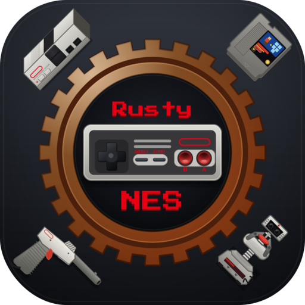
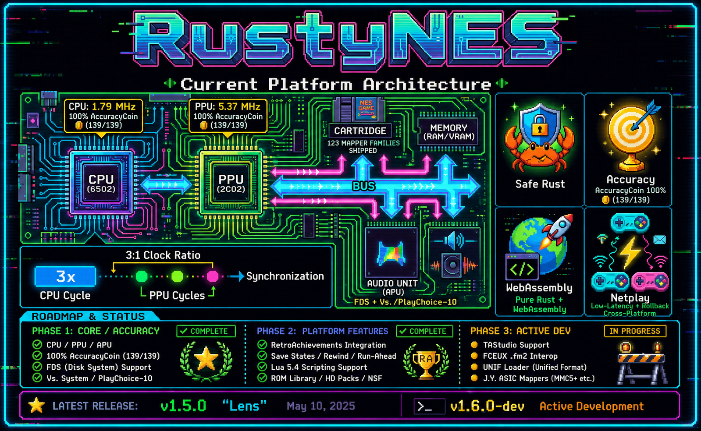
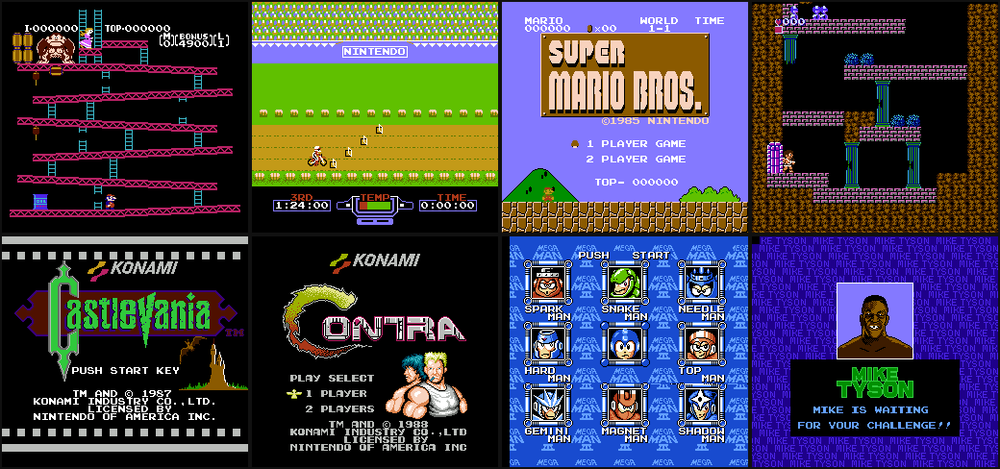
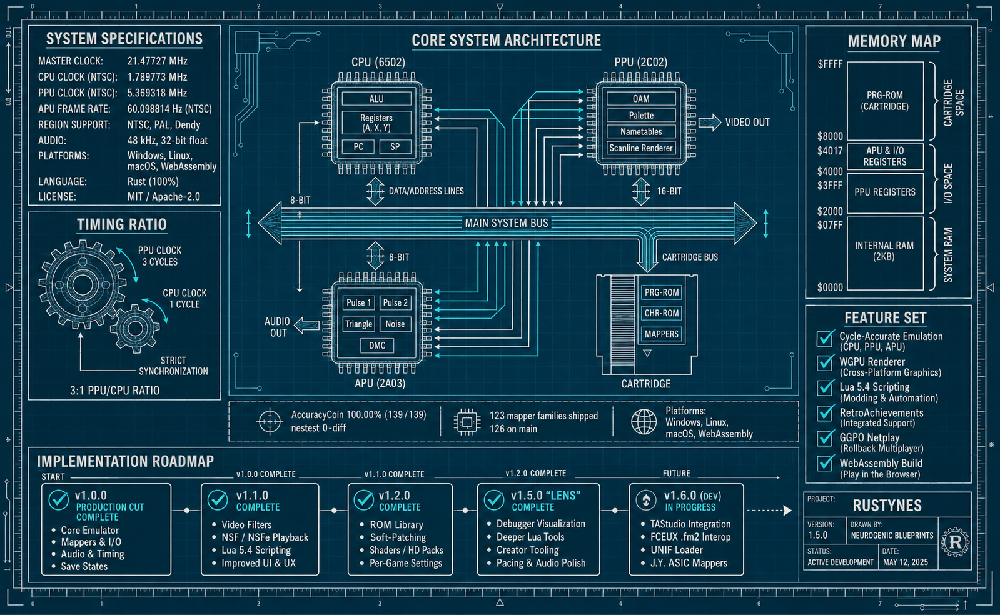
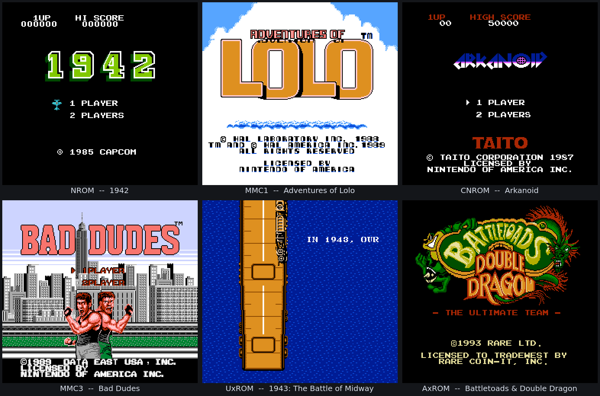

# RustyNES



> **Precise. Pure. Powerful.**

<p align="center">
  
</p>

<p align="center">
  <a href="https://github.com/doublegate/RustyNES/actions"></a> <a href="#license"></a> <a href="https://github.com/doublegate/RustyNES/releases"></a> <a href="rust-toolchain.toml"></a><br>
  <a href="#accuracy"></a> <a href="#accuracy"></a> <a href="docs/mappers.md"></a> <a href="https://doublegate.github.io/RustyNES/"></a><br>
  <a href="#platforms"></a>
</p>

**RustyNES is a cycle-accurate Nintendo Entertainment System emulator written in
pure Rust.** It aims at the Mesen2 / higan / ares accuracy bar: one master clock,
every CPU cycle a real bus access, and the PPU caught up to each half of it, so a
sprite-zero hit, a mid-scanline scroll write or an MMC3 IRQ lands on the exact dot
without a per-game patch. It passes **AccuracyCoin 144/144** and matches the
Nintendulator `nestest` log with **zero diff**.

Around that core sits a complete, modern platform: 191 mapper families, the
Famicom Disk System, Vs. System and PlayChoice-10 arcade boards, rollback
netplay, RetroAchievements, a TAStudio piano-roll editor, a Mesen2-class
debugger, HD packs, a shader stack, and native apps for desktop, the browser,
Android, iOS and RetroArch, all on one bit-deterministic core.

**[Play it in your browser](https://doublegate.github.io/RustyNES/)**, no
install required.

> **Development note: AI-assisted.** RustyNES is built with LLM tooling under a
> human-directed, test-driven workflow, with public test ROMs as the oracle. See
> [`docs/originality-and-provenance.md`](docs/originality-and-provenance.md) for
> what that means for originality and licensing. The accuracy claims are meant to
> be *checked* by running the public suites, not taken on faith. A comparison to
> another emulator is a comparison, not a claim of being better.

<p align="center">
  
</p>

---

## Contents

- [Highlights](#highlights)
- [Quick start](#quick-start)
- [Features](#features)
- [Controls](#controls)
- [Accuracy](#accuracy)
- [Platforms](#platforms)
- [Architecture](#architecture)
- [Documentation](#documentation)
- [Current release](#current-release)
- [Roadmap](#roadmap)
- [The MiSTer core](#the-mister-core)
- [Contributing](#contributing)
- [License](#license)
- [Acknowledgments](#acknowledgments)

---

## Highlights

| | |
| --- | --- |
| **Cycle-accurate** | CPU, PPU and APU on one master clock: AccuracyCoin 144/144, `nestest` 0-diff, blargg's CPU, APU and PAL suites |
| **191 mapper families** | NROM through MMC5, the whole VRC line, Sunsoft FME-7, Namco 163, Taito, J.Y. Company, the MMC3 and MMC1 multicarts, Waixing and Nanjing boards, homebrew flash boards with working saves, and a UNIF (`.unf`) loader. Each is classified Core, Curated or BestEffort by the evidence behind it |
| **Famicom Disk System** | Real-BIOS boot, writable disks, side swapping, a timed disk-head model and 2C33 wavetable audio |
| **Vs. / PlayChoice-10** | Arcade boards in true 2C03 / 2C04 / 2C05 RGB, per-game DIP presets, and Vs. DualSystem two-screen cabinets |
| **Rollback netplay** | GGPO-style, up to four players over UDP or browser WebRTC, with room codes, TURN traversal and spectators |
| **RetroAchievements** | Achievements, leaderboards, rich presence and hardcore mode through the `rcheevos` library |
| **TAStudio** | A piano-roll TAS editor with a greenzone, branches and markers, plus `.fm2` / `.bk2` / `.fcm` / `.fmv` / `.vmv` import |
| **Debugger** | Conditional breakpoints, watchpoints, a hex editor, RAM search, a callstack, `.dbg` source maps, and editable palette, nametable, CHR and OAM |
| **Video and audio** | NTSC composite filtering, a CRT shader stack, HD packs with OGG audio, `.pal` palettes, a generated NTSC palette, and an NSF / NSFe player |
| **Save states, rewind, run-ahead** | All on the deterministic snapshot path, so a replay is bit-identical |
| **Lua scripting** | A sandboxed Lua 5.4 engine with memory access, callbacks, an HUD and a TAStudio API |
| **Everywhere** | Linux, macOS and Windows binaries, a WebAssembly build, Android and iOS apps, and a libretro core for RetroArch |

---

## Quick start

### Download

Pre-built binaries for every release are on the
[Releases page](https://github.com/doublegate/RustyNES/releases): Linux `x86_64`,
macOS (Apple silicon) and Windows `x86_64`.

```bash
# Linux / macOS
tar xf rustynes-<tag>-<target>.tar.gz && ./rustynes path/to/rom.nes
# Windows (PowerShell)
Expand-Archive rustynes-<tag>-x86_64-pc-windows-msvc.zip; .\rustynes.exe path\to\rom.nes
```

Launch it without a ROM and use **F12**, the File menu, or drag and drop a
`.nes` / `.fds` onto the window.

### Build from source

You need **Rust 1.96** (pinned in `rust-toolchain.toml`; [rustup](https://rustup.rs)
installs it) and Git.

```bash
git clone https://github.com/doublegate/RustyNES.git
cd RustyNES
cargo run --release -p rustynes-frontend -- path/to/rom.nes

# Everything native at once: RetroAchievements, Lua, host IPC, HD packs,
# debugger telemetry and A/V recording.
cargo full-run path/to/rom.nes
```

On Linux, the window, GPU and audio stack need a few system libraries:

```bash
# Ubuntu / Debian
sudo apt-get install -y libxkbcommon-dev libwayland-dev libxkbcommon-x11-dev libasound2-dev libudev-dev
# Arch / CachyOS
sudo pacman -S --needed libxkbcommon wayland alsa-lib systemd-libs
```

macOS and Windows need nothing extra; the optional `retroachievements` feature
needs a C compiler on every platform.

`rustynes --help` lists the command-line options, and `rustynes help` opens an
interactive guide to the controls, hotkeys, mappers, configuration, scripting and
netplay.

### In the browser

The hosted build is at **[doublegate.github.io/RustyNES](https://doublegate.github.io/RustyNES/)**.
To build it yourself, install [trunk](https://trunkrs.dev) and run `trunk serve`
in `crates/rustynes-frontend/web`.

---

## Features

### Emulation core

- **One master clock.** A single cycle counter drives the CPU, PPU and APU at the
  region-exact ratios (3:1 NTSC and Dendy, 3.2:1 PAL). Every CPU cycle is clocked in
  two halves with the PPU caught up to each, so events inside an instruction are
  visible to the next access.
- **6502.** All 256 opcodes including the unstable ones, per-cycle bus access,
  exact interrupt polling, and OAM and DMC DMA through one unified model.
- **2C02.** A per-dot pipeline, the cycle-resolution sprite-evaluation state
  machine with its hardware overflow bug, and the rendering-time `$2007` behaviour.
- **2A03.** The non-linear mixer, band-limited synthesis, the analog filter chain,
  and expansion audio for VRC6, VRC7, MMC5, Namco 163, Sunsoft 5B and the FDS.
- **Determinism.** The same seed, ROM and input give a bit-identical framebuffer
  and audio, which is what makes save states, replays, regression tests and
  rollback netplay correct by construction.

### Cartridges

- **191 mapper families**, written from the NESdev wiki and pinned by test ROMs,
  unit tests and a commercial-ROM oracle. [`docs/mappers.md`](docs/mappers.md)
  lists every family, its tier and its evidence.
- **Self-flashing homebrew boards** (GTROM, UNROM 512) emulate their SST39SF040
  flash chip, so games that save by rewriting their own ROM keep those saves.
- **Battery saves** persist on desktop, Android and iOS.
- **Famicom Disk System** with a user-supplied `disksys.rom`, and **UNIF** boards
  mapped to their iNES numbers.

### Playing

- **Netplay:** GGPO-style rollback for two to four players over UDP or browser
  WebRTC, with a deployable signaling bundle in [`deploy/`](deploy/).
- **RetroAchievements** on desktop, Android, iOS and the libretro core.
- **Speed and pacing:** 25-300% speed, fast-forward, frame advance, rewind,
  run-ahead, and display-synced, VRR or wall-clock pacing.
- **Input:** USB gamepads with hot-plug and remapping, turbo, the Four Score,
  Zapper, Arkanoid paddle, Power Pad, keyboards and mouse.
- **Cheats:** a Game Genie encoder with a ~10,800-code database, and raw RAM
  cheats.

### Creating and debugging *(opt-in features)*

- **TAStudio:** a piano-roll editor with a save-state greenzone, lag log,
  markers and branches, and movie import from FCEUX, BizHawk and others.
- **Debugger:** breakpoints on expressions and conditions, R/W/X watchpoints, a
  trace logger, an event viewer, a hex editor, RAM search, a callstack, and
  `ca65` / `cc65` source maps. The inspectors become editors on request.
- **Lua 5.4 scripting:** memory and state access, per-frame and per-access
  callbacks, an HUD, and host IPC for automation. See
  [`docs/scripting.md`](docs/scripting.md).
- **HD packs:** a Mesen-format loader with OGG audio, and a builder that authors
  packs from the running game.
- **A/V recording** to `.mp4` / `.mkv` through `ffmpeg`.

### Display and audio

- An NES-NTSC composite / S-video filter, a CRT and scanline shader stack, hqNx
  and xBRZ upscalers, and a constrained RetroArch `.slangp` importer.
- Custom `.pal` palettes, a generated NTSC palette, and a choice of analog filter
  models.
- An NSF / NSFe player through the real APU and expansion synths.
- Every display option is off the core's path, so the emulated framebuffer is
  unchanged by it.

### Mobile

- **Android:** a Jetpack Compose app with touch and hardware controllers,
  the shared shader stack, save states, netplay, RetroAchievements and Lua.
  Distributed through GitHub Releases. See [`docs/android.md`](docs/android.md).
- **iOS / iPadOS:** a SwiftUI app on Metal with GameController support, iCloud
  save sync and ReplayKit. Distributed through TestFlight. See
  [`docs/ios.md`](docs/ios.md).

Both apps run the same core as desktop, and both are free: RustyNES is
permanently non-commercial ([ADR 0035](docs/adr/0035-rustynes-is-permanently-non-commercial.md)).

---

## Controls

Every binding can be changed in Settings or in the TOML config; the
[controls guide](docs/user-guide/controls.md) has the full list. USB gamepads bind
to player 1 automatically.

| Action | Player 1 | Player 2 |
| --- | --- | --- |
| D-pad | Arrow keys | W / A / S / D |
| A / B | Z / X | Q / E |
| Start / Select | Enter / Right Shift | P / R |

| Action | Key | Action | Key |
| --- | --- | --- | --- |
| Pause | Space | Save / load state | F1 / F4 |
| Fast-forward (hold) | Tab | Rewind (hold) | F5 |
| Frame advance | `\` | Reset / power cycle | F2 / F3 |
| Speed up / down / reset | = / - / 0 | Open ROM | F12 |
| TAS record / play / branch | F6 / F7 / F8 | FDS disk side | F9 |
| Menu bar | M | Vs. coin | F10 |
| Debugger | `` ` `` | Fullscreen | F11 |
| Quit | Esc | Famicom microphone | N (hold) |

---

## Accuracy

| Suite | Result |
| --- | --- |
| **AccuracyCoin** | **144/144 (100.00%)**, read from RAM rather than the screen |
| `nestest` | 0-diff against the Nintendulator log |
| blargg `cpu_interrupts_v2` | 5/5, and the unstable-store tests 6/6 |
| blargg APU (NTSC and PAL) | 11/11 and 10/10 |
| blargg `apu_test` frame-counter probes | 10/10 |
| `region_timing` | 4/4, including PAL's 3.2:1 ratio |
| Holy Mapperel | every committed variant reports detail code `0000` |
| Commercial-ROM oracle | 99 titles, SHA-256-pinned, byte-identical frames |

The one known residual in the battery is `mmc3_test_2/4-scanline_timing`
sub-test 3, a one-PPU-clock MMC3 reload timing that affects no AccuracyCoin
entry and no commercial game. Every other known approximation is listed, with its
evidence, in [`docs/accuracy-ledger.md`](docs/accuracy-ledger.md), and the
per-suite detail is in [`docs/STATUS.md`](docs/STATUS.md).

When a document and a passing test ROM disagree, the ROM wins: that is this
project's definition of cycle-accurate.

**Mapper tiers.** Of the 191 families, 160 are *accuracy-gated*: 51 Core and 109
Curated, each backed by a test ROM, a commercial dump, or a precise register
description with a synthetic fixture. The other 31 are *BestEffort*: their
documentation is thin, and a CI gate keeps them out of every accuracy claim.

---

## Platforms

| Platform | Status |
| --- | --- |
| Linux `x86_64`, Windows `x86_64`, macOS (Apple silicon) | Release binaries |
| macOS (Intel), Linux ARM64 | Build from source |
| WebAssembly | [Hosted](https://doublegate.github.io/RustyNES/) and buildable |
| Android (arm64) | GitHub Releases (sideload) |
| iOS / iPadOS | TestFlight |
| RetroArch | `rustynes_libretro` core, published by the libretro buildbot |

A GPU with a `wgpu` backend is required: Vulkan, Metal, DX12, or WebGPU / WebGL2 in
the browser. The headless core runs a frame in about 4 ms on an Intel i9-10850K,
about four times faster than real time; [`docs/performance.md`](docs/performance.md)
has the measurements.

---

## Architecture

RustyNES is a Cargo workspace of focused crates. Three decisions carry the design,
detailed in [`docs/architecture.md`](docs/architecture.md) and
[`docs/scheduler.md`](docs/scheduler.md):

1. **One master clock.** Each CPU cycle runs in two halves around its bus access,
   and the PPU, APU and DMA are caught up to each half.
2. **The bus owns everything mutable.** It holds the PPU, APU, cartridge, work RAM
   and controllers, and the CPU borrows it one instruction at a time. That single
   choice avoids the borrow-checker fight of the alternative.
3. **A one-directional dependency graph.** The chip crates are `no_std` and do not
   depend on each other, so each can be fuzzed and benchmarked alone.

<p align="center">
  
</p>

| Crate | Role |
| --- | --- |
| `rustynes-cpu`, `rustynes-ppu`, `rustynes-apu` | The 6502, 2C02 and 2A03 |
| `rustynes-mappers` | 191 mapper families, expansion audio, the UNIF loader |
| `rustynes-core` | The bus, scheduler, console and save states |
| `rustynes-frontend` | The `winit` + `wgpu` + `cpal` + `egui` application (`rustynes`) |
| `rustynes-netplay` | Rollback netcode over UDP and WebRTC |
| `rustynes-script` | Sandboxed Lua 5.4 |
| `rustynes-cheevos`, `rustynes-ra` | RetroAchievements |
| `rustynes-hdpack`, `rustynes-gfx-shaders` | HD packs and the shared WGSL shaders |
| `rustynes-mobile`, `rustynes-android`, `rustynes-ios` | The mobile bridge and platform glue |
| `rustynes-libretro` | The RetroArch core |
| `rustynes-test-harness` | Integration tests and the accuracy oracles |

---

## Documentation

| | |
| --- | --- |
| [User guide](docs/user-guide/README.md) | Installing, controls, save states, the debugger, configuration, FAQ |
| [Documentation handbook](https://doublegate.github.io/RustyNES/docs/) | The subsystem specs and user guide as a website |
| [API documentation](https://doublegate.github.io/RustyNES/api/) | Rustdoc for the whole workspace |
| [Status](docs/STATUS.md) | Current state: per-suite results, the mapper matrix, feature flags |
| [Changelog](CHANGELOG.md) | Every release, newest first |
| [Hardware specs](docs/) | [CPU](docs/cpu-6502.md), [PPU](docs/ppu-2c02.md), [APU](docs/apu-2a03.md), [mappers](docs/mappers.md), [testing](docs/testing-strategy.md), [netplay](docs/netplay-webrtc.md) |
| [Decisions](docs/adr/) | Architecture Decision Records |
| [Libretro core](docs/libretro/WALKTHROUGH.md) | The RetroArch core and how to set it up |
| [Accuracy ledger](docs/accuracy-ledger.md) | Every known approximation, with its evidence |

---

## Current release

RustyNES's current release is **v2.9.6 "Roster"** (2026-09-30) — seventeen mapper families written from their NESdev pages (174 → 191), GTROM promoted to Curated with a modelled flash chip whose saves persist, mapper 4's NES 2.0 submappers corrected (MMC6, NEC, MC-ACC, T9552), and the local commercial suites re-baselined after drifting unread since about v2.0.0. Built on **v2.9.5 "Caliper"** (2026-09-29) — every open accuracy item measured, then fixed or closed.

The per-release detail, back to v0.1.0, is in [`CHANGELOG.md`](CHANGELOG.md) and
on the [Releases page](https://github.com/doublegate/RustyNES/releases).

---

## Roadmap

The line runs to **v3.0.0**, the API major with a release-candidate MiSTer core
([ADR 0043](docs/adr/0043-v3-is-the-api-major-and-a-release-candidate-core.md)).
Before it: more mapper families, platform features that are already designed,
performance work, and a final re-audit. v3.0.0 removes the APIs deprecated since
v2.7.5 ([ADR 0042](docs/adr/0042-v3-removes-the-v2-7-5-deprecations-and-the-dead-nmi-edge-detector.md)).
Verifying the MiSTer core on hardware comes after it, in v3.x.

The full plan is [`to-dos/ROADMAP.md`](to-dos/ROADMAP.md), with one plan per
release in [`to-dos/plans/`](to-dos/plans/README.md). A free mobile store listing
may follow later, with no monetization of any kind.

---

## The MiSTer core

A sibling project writes a **new** NES core in SystemVerilog for the MiSTer FPGA
platform, from public hardware documentation, and uses this emulator as its
verification oracle through `crates/rustynes-cosim`. RustyNES itself is not being
ported to an FPGA: what can be built is a new implementation checked against this
one, cycle by cycle.

Its co-simulation ladder covers the 6502, the bus and interrupts, the 2C02, the
2A03, AccuracyCoin parity and six mapper boards. Each release attaches a timing-closed
bitstream. **No hardware has run any bitstream yet**, so a booting core, a synced
display, audible sound and a working pad are not claimed. The details, and what
each rung can and cannot verify, are in [`docs/mister.md`](docs/mister.md).

<p align="center">
  
  <br>
  <sub>Six commercial cartridges, one per supported board, rendered by the MiSTer core's RTL under
  Verilator, each <b>byte-identical to this emulator</b> over all 61,440 pixels. <b>No hardware has run it.</b></sub>
</p>

---

## Contributing

Contributions of every kind are welcome. [`CONTRIBUTING.md`](CONTRIBUTING.md)
explains the quality gates, the Conventional Commit format, and the rule that a
change to chip behaviour updates its `docs/<subsystem>.md` in the same pull request.

```bash
cargo fmt --all --check
cargo clippy --workspace --all-targets -- -D warnings
cargo test --workspace
```

Questions are welcome in
[GitHub Discussions](https://github.com/doublegate/RustyNES/discussions).

---

## License

RustyNES is licensed **[GPL-3.0-or-later](LICENSE)**.

It is a **derivative work** of GPL-licensed NES emulators: it incorporates code
derived from **Mesen2** (GPL-3.0-or-later) and, for a few subsystems, from
**puNES**, **FCEUX** and **Nestopia UE** (GPL-2.0-or-later). An earlier version
described that code as "oracle cross-checks" and licensed it MIT/Apache-2.0,
which was wrong; after a NESdev community review the project was relicensed and
every derivation credited in
[`docs/originality-and-provenance.md`](docs/originality-and-provenance.md) and
[`NOTICE`](NOTICE) ([ADR 0036](docs/adr/0036-relicense-gplv3-derivative-work.md)).

How that happened, and the rules that keep it from recurring, are public:
[`docs/provenance-failure-postmortem.md`](docs/provenance-failure-postmortem.md)
and [`docs/ai-emulator-provenance-guardrails.md`](docs/ai-emulator-provenance-guardrails.md).
Reference emulators are black-box oracles: their output may be compared, and their
source is never read.

Permissive components (emu2413, TriCNES, `rcheevos`, blip_buf and the bundled
fonts) are credited in `NOTICE`. The test ROMs under `tests/roms/` are CC0, MIT or
zlib. **No commercial ROMs are included**: dumps for the commercial-ROM oracle must
come from cartridges you own.

---

## Acknowledgments

- The **[NESdev wiki](https://www.nesdev.org/wiki/)** community, for decades of
  hardware documentation and research.
- **[Mesen2](https://github.com/SourMesen/Mesen2)**, the primary derivation source,
  and **[higan](https://github.com/higan-emu/higan)** and
  **[ares](https://github.com/ares-emulator/ares)**, which set the accuracy bar.
- **[puNES](https://github.com/punesemu/puNES)**,
  **[FCEUX](https://github.com/TASEmulators/fceux)** and
  **[Nestopia UE](https://github.com/0ldsk00l/nestopia)**, for specific subsystems.
- **[TetaNES](https://github.com/lukexor/tetanes)**, for the bus-owns-everything
  lesson.
- **blargg**, kevtris' **nestest**, Tepples' **[Holy Mapperel](https://github.com/pinobatch/holy-mapperel-build)**
  and 100thCoin's **[AccuracyCoin](https://github.com/100thCoin/AccuracyCoin)**, which
  define "cycle-accurate" here.
- **[RetroAchievements](https://retroachievements.org/)** and
  **[`rcheevos`](https://github.com/RetroAchievements/rcheevos)**.
- **[emu2413](https://github.com/digital-sound-antiques/emu2413)** (VRC7 audio) and
  **[TriCNES](https://github.com/100thCoin/TriCNES)** (PPU and DMA models).
- The shader authors whose looks RustyNES reimplements: CRT-Royale, crt-guest-advanced,
  Sony Megatron, [NTSC-CRT](https://github.com/LMP88959/NTSC-CRT) and Bisqwit's
  composite model.

Full attribution is in [`NOTICE`](NOTICE).

### Citation

```bibtex
@software{rustynes2026,
  author  = {RustyNES Contributors},
  title   = {RustyNES: A Cycle-Accurate NES Emulator in Rust},
  year    = {2026},
  url     = {https://github.com/doublegate/RustyNES},
  note    = {Cycle-accurate NES emulator; AccuracyCoin 144/144, nestest 0-diff}
}
```

<p align="center">
  <a href="#quick-start">Get started</a> ·
  <a href="https://doublegate.github.io/RustyNES/">Play in the browser</a> ·
  <a href="CONTRIBUTING.md">Contribute</a> ·
  <a href="https://github.com/doublegate/RustyNES/discussions">Discuss</a>
</p>
