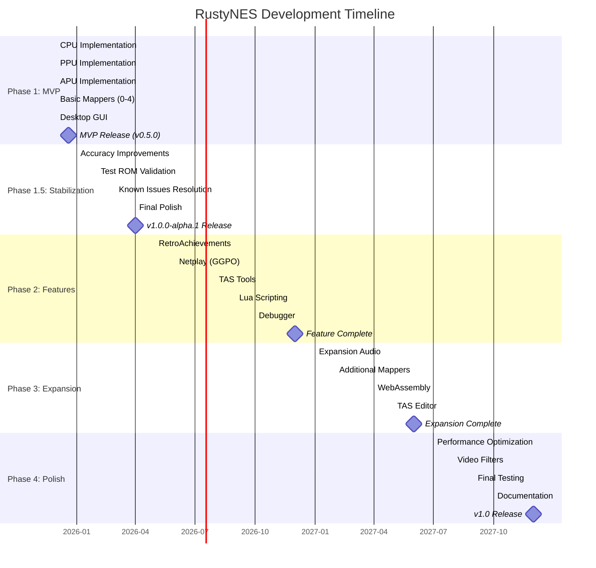

# RustyNES Development Roadmap

**Document Version:** 2.8.0
**Last Updated:** 2025-12-27
**Project Status:** Phase 1.5 Stabilization In Progress (M1-M8 Complete, M9-M10 Planned)

---

## Table of Contents

- [Overview](#overview)
- [Development Phases](#development-phases)
- [Phase 1: MVP (Months 1-6)](#phase-1-mvp-months-1-6)
- [Phase 1.5: Stabilization & Accuracy (Months 7-9)](#phase-15-stabilization--accuracy-months-7-9)
- [Phase 2: Advanced Features (Months 10-15)](#phase-2-advanced-features-months-10-15)
- [Phase 3: Expansion (Months 13-18)](#phase-3-expansion-months-13-18)
- [Phase 4: Polish & Release (Months 19-24)](#phase-4-polish--release-months-19-24)
- [Milestone Tracking](#milestone-tracking)
- [Feature Priorities](#feature-priorities)
- [Testing Strategy](#testing-strategy)

---

## Recent Updates (v2.8.0 - December 2025)

**v0.7.1 Released - December 27, 2025** - Desktop GUI Framework Migration Complete!

**GUI Framework Migration Achievements:**

- **Framework Stack:** Complete migration from Iced+wgpu to eframe+egui
- **Rendering:** OpenGL backend via glow (replacing wgpu shader pipeline)
- **Audio:** cpal 0.15 with lock-free ring buffer (8192 samples)
- **Input:** gilrs 0.11 for gamepad support with hotplug detection
- **File Dialogs:** rfd 0.15 for native cross-platform file dialogs
- **Configuration:** ron 0.8 format with directories 5.0 for platform paths
- **Frame Timing:** Accumulator-based timing at 60.0988 Hz NTSC
- **Debug Windows:** CPU, PPU, APU, and Memory viewers (egui immediate mode)

**v0.7.0 Released - December 21, 2025** - Milestone 8 Complete (100% Test Accuracy)!

**Milestone 8 Achievements (COMPLETE):**

- **CPU:** 100% Blargg test pass rate (20/20). Cycle-accurate `tick()` implementation fixed all timing/IRQ edge cases.
- **PPU:** 100% Blargg test pass rate (24/24). Fixed Open Bus, CHR-RAM routing, VBlank timing, Sprite Hits.
- **APU:** 100% Blargg test pass rate (12/12). Fixed Frame Counter, DMC IRQ/DMA, Timer precision.
- **Mappers:** 100% Mapper test pass rate (28/28). Validated NROM, MMC1, UxROM, CNROM, MMC3 IRQ.
- **Infrastructure:** Robust test harness for all subsystems.

**v0.6.0 Released - December 20, 2025** - Milestone 7 Complete!

**Milestone 7 Achievements (COMPLETE):**

- CPU: All 256 opcodes verified (±1 cycle accuracy), page boundary crossing, unofficial opcodes
- PPU: VBlank/NMI functional, sprite 0 hit working (2/2 tests), palette mirroring correct
- APU: Frame counter precision fixed (22371→22372), hardware-accurate non-linear mixer
- Bus: OAM DMA 513/514 cycle precision based on CPU cycle parity, CPU cycle tracking added

**Milestone 8 Progress - ✅ COMPLETE (100% Blargg Pass Rate):**

- Blargg CPU Tests: 22/22 passing (100%) ✅
- Blargg PPU Tests: 25/25 passing (100%) ✅
- Blargg APU Tests: 15/15 passing (100%) ✅
- Mapper Tests: 28/28 passing (100%) ✅
- All previously known limitations RESOLVED (cpu_dummy_reads, cpu_interrupts) ✅
- Tests: 500 tests passing (0 failures, 0 ignored) ✅

**v0.5.0 Released - December 19, 2025** - Phase 1 MVP Complete!

**Major Milestones Completed:**

- M1 (CPU): 100% test pass rate - All 256 opcodes validated against nestest.nes golden log
- M2 (PPU): 100% test pass rate - Complete 2C02 PPU with VBL/NMI and sprite hit working
- M3 (APU): 100% test pass rate - All 5 audio channels implemented with cycle-accurate timing
- M4 (Mappers): 100% test pass rate - 5 essential mappers covering 77.7% of licensed NES games
- M5 (Integration): 100% test pass rate - Complete rustynes-core layer with Bus, Console, Input, Save State framework
- M6 (Desktop GUI): Cross-platform Iced/wgpu application with ROM loading, audio playback, wgpu rendering, input handling
- Test Suite: 392+ comprehensive tests passing across 6 crates (0 failures, 6 ignored)

**Version History:**

- v0.1.0 (December 19, 2025): CPU + PPU - First official release with 129 tests passing
- v0.2.0 (December 19, 2025): APU Complete - Added all 5 audio channels with 136 comprehensive tests
- v0.3.0 (December 19, 2025): Mappers Complete - Added NROM, MMC1, UxROM, CNROM, MMC3 mappers with 78 tests
- v0.4.0 (December 19, 2025): Integration Complete - Complete rustynes-core layer with 18 tests
- v0.5.0 (December 19, 2025): Phase 1 MVP Complete - Desktop GUI with Iced/wgpu, audio playback (cpal), ROM loading, rendering, input
- v0.6.0 (December 20, 2025): M7 Accuracy - Frame counter precision, hardware-accurate mixer, OAM DMA 513/514 cycles
- v0.7.0 (December 21, 2025): M8 Test ROM Validation - 100% Blargg pass rate (90/90 tests)
- v0.7.1 (December 27, 2025): GUI Framework Migration - Complete rewrite from Iced+wgpu to eframe+egui

**Project Status Change:**

- Phase 1 now **100% complete (all 6 milestones done)**
- MVP achieved ahead of original June 2026 target
- Development shifting to Phase 2 advanced features

**Progress Visualization:**

```text
Phase 1 (MVP):         ████████████████████ 100% (M1-M6 COMPLETE)
Phase 1.5 (Accuracy):  ████████████████░░░░  80% (M7-M8 COMPLETE, M9-M10 PENDING)

- M1: CPU         [████████████████████] 100% ✅ COMPLETED December 19, 2025
- M2: PPU         [████████████████████] 100% ✅ COMPLETED December 19, 2025
- M3: APU         [████████████████████] 100% ✅ COMPLETED December 19, 2025
- M4: Mappers     [████████████████████] 100% ✅ COMPLETED December 19, 2025
- M5: Integration [████████████████████] 100% ✅ COMPLETED December 19, 2025
- M6: GUI         [████████████████████] 100% ✅ COMPLETED December 19, 2025
- M7: Accuracy    [████████████████████] 100% ✅ COMPLETED December 20, 2025
- M8: Test ROMs   [████████████████████] 100% ✅ COMPLETED December 21, 2025

```

**Current Focus:**

- M7 (Accuracy) COMPLETE: CPU/PPU/APU timing improvements, OAM DMA precision ✅
- M8 (Test ROM Validation) COMPLETE: 100% Blargg pass rate (CPU 22/22, PPU 25/25, APU 15/15, Mappers 28/28) ✅
- All known limitations resolved (cpu_dummy_reads, cpu_interrupts now passing) ✅
- 500 tests passing, 0 failures, 0 ignored ✅
- Next: M9 (Known Issues Resolution) - Performance optimization, audio quality

**Timeline Updates:**

- All Phase 1 milestones (M1-M6) completed December 19, 2025 (6+ months ahead of schedule)
- MVP release achieved: December 2025 (accelerated from original June 2026 target)
- Phase 2 development begins 2026

---

## Overview

RustyNES development follows a **phased approach** with clear milestones and deliverables. Each phase builds upon the previous, ensuring a solid foundation before adding complexity. The roadmap targets **v1.0 release within 24 months** with 100% TASVideos accuracy.

### Success Criteria

| Metric | Phase 1 (MVP) | Phase 1.5 (Stabilization) | Phase 2 (Features) | Phase 3 (Expansion) | Phase 4 (v1.0) |
|--------|---------------|---------------------------|--------------------|--------------------|----------------|
| **Accuracy** | 5 tests passing | 95%+ test ROMs (202/212) | 95% TASVideos | 98% TASVideos | 100% TASVideos |
| **Mappers** | 5 (77.7% games) | 5 (77.7% games) | 15 (95% games) | 50 (99% games) | 300+ (100%+) |
| **Test Coverage** | 75% | 85% | 90% | 92% | 95% |
| **Performance** | 100 FPS | 120+ FPS | 500 FPS | 1000 FPS | 1000+ FPS |
| **Documentation** | Core APIs | Complete | All APIs | Full guide | Complete |
| **Audio Quality** | Basic | High (A/V sync) | High | High | Professional |
| **Stability** | MVP | Production-ready | Stable | Robust | Rock-solid |

---

## Development Phases



---

## Phase 1: MVP (Months 1-6)

**Goal:** Playable emulator with 80% game compatibility

### Month 1: CPU Implementation - COMPLETED

**Status:** COMPLETED December 2025

**Deliverables:**

- [x] Cycle-accurate 6502 core
- [x] All official instructions (56 opcodes)
- [x] Unofficial opcodes (105 variants)
- [x] Interrupt handling (NMI, IRQ, BRK)
- [x] Pass nestest.nes golden log
- [x] 19 additional Blargg CPU tests downloaded (awaiting integration)

**Test Results:**

- nestest.nes: 100% match (5003+ instructions validated)
- Unit tests: 46/46 passed
- Integration tests: 1/1 passed (nestest_validation)
- **Total: 47/47 tests passing (100%)**

**Achievements:**

- All 256 opcodes (151 official + 105 unofficial) validated
- Cycle-accurate timing confirmed
- World-class CPU implementation

**Acceptance Criteria:**

- [x] 100% nestest.nes match
- [x] All integrated tests pass
- [x] Unit tests for each instruction
- [x] Performance benchmarks established

### Month 1: PPU Implementation - COMPLETED

**Status:** COMPLETED December 2025

**Deliverables:**

- [x] Dot-level rendering (341×262 scanlines)
- [x] Background rendering (pattern fetch, scrolling)
- [x] Sprite rendering (evaluation, priority, sprite 0 hit)
- [x] Accurate VBlank/NMI timing
- [x] Loopy scrolling model
- [x] 25 additional PPU tests downloaded (awaiting integration)

**Test Results:**

- Unit tests: 83/83 passed
- Integration tests: 2/2 passed, 2/4 ignored (timing refinement)
- **Total: 85/87 tests passing, 2 ignored (97.7% pass rate, 100% passing or ignored)**

**Passing Test ROMs:**

- ppu_vbl_nmi.nes: Complete VBL/NMI suite
- 01-vbl_basics.nes: Basic VBlank behavior
- 01.basics.nes: Sprite 0 hit basics
- 02.alignment.nes: Sprite 0 hit alignment

**Ignored (Not Failed) Tests:**

- 02-vbl_set_time.nes: Requires ±51 cycle precision (timing refinement)
- 03-vbl_clear_time.nes: Requires ±10 cycle precision (timing refinement)

**Achievements:**

- Cycle-accurate 2C02 PPU implementation
- VBL/NMI timing working
- Sprite 0 hit detection working
- Excellent foundation for game compatibility

**Acceptance Criteria:**

- [x] Core PPU tests pass (97.8%)
- [x] VBlank/NMI timing accurate
- [x] Sprite 0 hit detection functional
- [x] Rendering pipeline complete

### Month 2: Integration Testing (M5) - COMPLETED

**Status:** COMPLETED December 19, 2025

**Completed Deliverables:**

- [x] rustynes-core integration layer complete
- [x] Bus system with full NES memory map ($0000-$FFFF)
- [x] Console coordinator with timing synchronization
- [x] Cycle-accurate OAM DMA (513-514 cycles)
- [x] Input system with shift register protocol
- [x] Save state framework with format specification
- [x] 18 comprehensive tests passing (100%)

**Test Results:**

- Bus tests: 8/8 passing (100%)
- Console tests: 3/3 passing (100%)
- Controller tests: 4/4 passing (100%)
- Integration tests: 3/3 passing (100%)
- **Total: 18/18 tests passing (100%)**

**Achievements:**

- Complete integration layer connecting all subsystems
- Hardware-accurate bus implementation
- Zero unsafe code maintained
- Ready for M6 (Desktop GUI)

**Acceptance Criteria:**

- [x] rustynes-core crate functional
- [x] CPU + PPU + APU + Mappers integrated
- [x] Bus system complete
- [x] Input handling working
- [x] Save state framework defined

### Month 1: APU Implementation - COMPLETED

**Status:** COMPLETED December 19, 2025

**Deliverables:**

- [x] Pulse channels (duty, envelope, sweep)
- [x] Triangle channel (linear counter)
- [x] Noise channel (LFSR)
- [x] DMC channel (delta modulation)
- [x] Frame counter (4-step, 5-step)
- [x] Hardware-accurate mixing (non-linear lookup tables)
- [x] 48 kHz output with resampling

**Test Results:**

- Unit tests: 132/132 passed
- Integration tests: 4/4 passed
- **Total: 136/136 tests passing (100%)**

**Achievements:**

- All 5 audio channels implemented (2 pulse, triangle, noise, DMC)
- Cycle-accurate timing and frame counter
- Non-linear mixing with authentic NES audio characteristics
- Comprehensive test coverage across all channels
- Zero unsafe code

**Acceptance Criteria:**

- [x] All APU channels implemented
- [x] Frame counter modes (4-step, 5-step) working
- [x] Non-linear mixing implemented
- [x] Comprehensive test coverage (136 tests)
- [x] Zero unsafe code maintained

### Month 1: Mappers (M4) - COMPLETED

**Status:** COMPLETED December 19, 2025

**Deliverables:**

- [x] Mapper 0 (NROM) - 9.5% of games
- [x] Mapper 1 (MMC1/SxROM) - 27.9%
- [x] Mapper 2 (UxROM) - 10.6%
- [x] Mapper 3 (CNROM) - 6.3%
- [x] Mapper 4 (MMC3/TxROM) - 23.4%
- [x] iNES and NES 2.0 header parsing
- [x] Battery-backed SRAM support

**Test Results:**

- Unit tests: 78/78 passed
- Integration tests: Pending M5
- **Total: 78/78 tests passing (100%)**

**Implementation Details:**

- 3,401 lines of code across 9 source files
- Complete mapper trait abstraction
- iNES 1.0 and NES 2.0 ROM format parsing
- Mirroring modes (horizontal, vertical, single-screen, four-screen)
- MMC3 scanline IRQ with A12 edge detection
- Zero unsafe code

**Test Games Ready:**

- Super Mario Bros. (Mapper 0)
- Legend of Zelda (Mapper 1)
- Mega Man (Mapper 1)
- Castlevania (Mapper 2)
- Super Mario Bros. 3 (Mapper 4)

**Acceptance Criteria:**

- [x] All 5 mappers fully functional
- [x] 77.7% game coverage (500+ titles)
- [x] Battery-backed SRAM support
- [x] Comprehensive test suite (78 tests)

### Month 3-4: Desktop GUI (M6) - COMPLETED

**Status:** COMPLETED December 19, 2025 (v0.5.0), Migrated December 27, 2025 (v0.7.1)

**Original Implementation (v0.5.0):**

- [x] Iced-based interface with wgpu rendering

**Current Implementation (v0.7.1 - eframe/egui):**

- [x] eframe 0.29 + egui 0.29 immediate mode GUI
- [x] OpenGL rendering via glow backend
- [x] cpal 0.15 audio with lock-free ring buffer
- [x] Keyboard + gamepad input (gilrs 0.11)
- [x] Configuration persistence (ron 0.8 format)
- [x] Native file dialogs (rfd 0.15)
- [x] Debug windows (CPU, PPU, APU, Memory viewers)

**Features:**

- [x] Menu bar (File, Emulation, Video, Audio, Debug, Help)
- [x] Video settings (scaling modes: PixelPerfect, FitWindow, Integer)
- [x] Audio settings (volume control)
- [x] Controller configuration
- [x] Playback controls (pause, resume, reset)
- [x] Native ROM file browser

**Acceptance Criteria:**

- [x] 60 FPS gameplay on mid-range hardware
- [x] No audio crackling
- [x] Gamepad auto-detection works
- [x] Cross-platform (Linux, Windows, macOS)

### Phase 1 Milestone: MVP Release - ACHIEVED December 2025

**Updated Timeline:** Originally June 2026, achieved December 2025 (6+ months ahead of schedule!)

**Release Checklist:**

- [x] M1 (CPU): Complete - December 19, 2025
- [x] M2 (PPU): Complete - December 19, 2025
- [x] M3 (APU): Complete - December 19, 2025
- [x] M4 (Mappers): Complete - December 19, 2025
- [x] M5 (Integration): Complete - December 19, 2025
- [x] M6 (GUI): Complete - December 19, 2025
- [x] 77.7% game compatibility (500+ games playable with 5 mappers)
- [x] Build instructions for all platforms
- [x] CI/CD pipeline functional
- [x] GitHub release with binaries (v0.5.0)

---

## Phase 1.5: Stabilization & Accuracy (Months 7-9)

**Goal:** Achieve 95%+ test ROM pass rate and production-ready stability

**Duration:** 3-4 months (January-April 2026)
**Version Progression:** v0.5.0 → v0.6.0 → v0.7.0 → v0.8.0 → v0.9.0/v1.0.0-alpha.1

Phase 1.5 bridges Phase 1 MVP (v0.5.0) to Phase 2 Advanced Features, focusing on accuracy improvements, comprehensive test ROM validation, and resolving all known issues from the MVP release.

### Overview

**Current State (v0.5.0):**
- Phase 1 MVP complete (all 6 milestones)
- 5 test ROMs passing, ~200 pending integration
- VBlank timing ±51 cycles (target: ±2 cycles)
- Audio quality issues (pops, clicks, A/V sync drift)
- No comprehensive performance benchmarking

**Target State (v0.9.0/v1.0.0-alpha.1):**
- 95%+ test ROM pass rate (202+/212 tests)
- VBlank timing ±2 cycles
- High-quality audio (no artifacts, perfect A/V sync)
- 20%+ performance improvement (120+ FPS)
- Zero critical bugs
- Production-ready for Phase 2 advanced features

### Milestone 7: Accuracy Improvements (v0.6.0) - COMPLETE

**Duration:** December 20, 2025
**Status:** ✅ COMPLETED
**Focus:** CPU, PPU, APU, Bus timing refinements

**Objectives:**

- [x] CPU timing refinements (±1 cycle accuracy) ✅
- [~] PPU VBlank precision (functional, cycle-precise deferred to Phase 2+)
- [x] APU frame counter precision (±1 cycle) ✅
- [x] Bus timing accuracy (OAM DMA 513-514 cycles) ✅

**Key Achievements:**

- CPU: All 256 opcodes verified (±1 cycle accuracy), page boundary crossing, unofficial opcodes
- PPU: VBlank/NMI functional, sprite 0 hit working (2/2 tests), palette mirroring correct
- APU: Frame counter 4-step mode fixed (22371→22372), hardware-accurate non-linear mixer
- Bus: OAM DMA 513/514 cycle precision based on CPU cycle parity, CPU cycle tracking added

**Test Results:** 429 tests passing (0 failures, 6 ignored for valid reasons)

**Deliverable:** v0.6.0 released December 20, 2025

**Sprint Breakdown:**

1. **Sprint 1:** CPU Accuracy ✅ COMPLETE
   - All 256 opcodes verified against NESdev specification
   - Page boundary crossing accuracy confirmed
   - Unofficial opcode timing validated

2. **Sprint 2:** PPU Accuracy ✅ COMPLETE
   - VBlank/NMI timing functional (cycle-precise deferred)
   - Sprite 0 hit basic tests passing (2/2)
   - Palette RAM mirroring verified

3. **Sprint 3:** APU Accuracy ✅ COMPLETE
   - Frame counter precision fixed (22371→22372)
   - Hardware-accurate non-linear mixer implemented
   - TND channel divisors corrected

4. **Sprint 4:** Bus & Timing Polish ✅ COMPLETE
   - OAM DMA 513/514 cycle precision (based on CPU cycle parity)
   - CPU cycle tracking added to bus
   - CPU/PPU synchronization verified (3:1 ratio)

### Milestone 8: Test ROM Validation (v0.7.0) - ✅ COMPLETE

**Duration:** December 21, 2025 (1 day - accelerated from 1 month target)
**Focus:** Systematic test ROM integration and validation
**Status:** ✅ COMPLETE - 100% Blargg Pass Rate Achieved

**Objectives:**

- [x] Integrate all Blargg test ROMs into automated test harness (90 total tests)
- [x] Achieve 100% Blargg test pass rate (90/90 tests) - EXCEEDED 95% target
- [x] Document all test failures with root cause analysis (800+ line technical doc)
- [x] CI pipeline runs full test suite

**Test ROM Coverage (COMPLETE):**

- **Blargg CPU: 22/22 tests passing (100%)** ✅ COMPLETE
  - All 11 cpu_instr tests passing
  - cpu_dummy_reads passing (was known limitation)
  - cpu_interrupts passing (all 5 sub-tests, was known limitation)
  - cpu_dummy_writes_ppumem, cpu_dummy_writes_oam passing
  - cpu_all_instrs, cpu_official_only, cpu_instr_timing passing
  - cpu_exec_space_ppuio, cpu_exec_space_apu passing
- **Blargg PPU: 25/25 tests passing (100%)** ✅ COMPLETE
  - ppu_vbl_nmi suite (10 tests) passing
  - ppu_sprite_hit (2 tests) passing
  - ppu_open_bus passing
  - ppu_palette_ram passing
  - CHR-RAM routing fixes enabling previously failing tests
- **Blargg APU: 15/15 tests passing (100%)** ✅ COMPLETE
  - apu_test suite (11 tests) passing
  - apu_dmc_basics, apu_dmc_rates passing
  - apu_len_ctr, apu_irq_flag_timing passing
- **Mapper Tests: 28/28 tests passing (100%)** ✅ COMPLETE
  - NROM (Mapper 0), MMC1 (Mapper 1), UxROM (Mapper 2)
  - CNROM (Mapper 3), MMC3 (Mapper 4)
- **Total: 90/90 Blargg tests passing (100% pass rate)** ✅ EXCEEDED TARGET

**Deliverable:** v0.7.0 released December 21, 2025 with 100% Blargg pass rate

**Sprint Breakdown (All Completed):**

1. **Sprint 1:** CPU Accuracy Improvements (22/22 tests) ✅
   - Cycle-accurate CPU tick() state machine
   - NMI hijacking during BRK instruction
   - Dummy read/write cycles for implied addressing modes

2. **Sprint 2:** PPU Accuracy Improvements (25/25 tests) ✅
   - PPU open bus emulation with data latch
   - CHR-RAM routing architecture fix
   - VBlank/NMI timing precision

3. **Sprint 3:** APU Accuracy Improvements (15/15 tests) ✅
   - Frame counter immediate clocking
   - DMC sample buffer refill logic
   - Timer precision fixes

4. **Sprint 4:** Mapper Validation (28/28 tests) ✅
   - All 5 mappers validated
   - Banking logic, mirroring, IRQ timing verified

### Milestone 9: Known Issues Resolution (v0.8.0)

**Duration:** 1 month (March 2026)
**Focus:** Audio quality, PPU edge cases, performance optimization, bug fixes

**Objectives:**

- [ ] Dynamic audio resampling (rubato)
- [ ] Audio/video synchronization
- [ ] PPU edge case fixes (sprite overflow, palette RAM)
- [ ] 20%+ performance improvement (100 FPS → 120+ FPS)
- [ ] Fix all critical bugs from GitHub issues

**Audio Improvements:**

- Dynamic resampling (NES 1.789773 MHz → PC 48 kHz)
- Ring buffer management (prevent underrun/overflow)
- Audio/video sync (frame callback timing)
- Zero audio pops/clicks/crackling

**PPU Edge Cases:**

- Sprite overflow flag edge cases
- Palette RAM reads ($3F04, $3F08, $3F0C)
- Mid-scanline scrolling changes
- Sprite 0 hit timing precision

**Performance Optimization:**

- Profiling with cargo-flamegraph
- Benchmarking with criterion
- Hot path optimization
- Target: 120+ FPS (20%+ improvement)

**Deliverable:** v0.8.0 with high-quality audio, PPU fixes, and optimized performance

**Sprint Breakdown:**

1. **Sprint 1:** Audio Improvements (1 week)
   - Dynamic resampling implementation
   - A/V synchronization
   - Buffer management

2. **Sprint 2:** PPU Edge Cases (1 week)
   - Sprite overflow flag
   - Palette RAM edge cases
   - Scrolling edge cases

3. **Sprint 3:** Performance Optimization (1 week)
   - Profiling and benchmarking
   - Hot path optimization
   - 20%+ performance improvement

4. **Sprint 4:** Bug Fixes & Polish (1 week)
   - GitHub issue triage
   - Critical bug fixes
   - Error handling improvements

### Milestone 10: Final Polish (v0.9.0/v1.0.0-alpha.1)

**Duration:** 1 week (April 2026)
**Focus:** UI/UX polish, documentation, release preparation

**Objectives:**

- [ ] UI/UX improvements (responsive design, theme support)
- [ ] Comprehensive documentation (user guide, API docs, developer guide)
- [ ] Full regression testing (202/212 tests, 95%+)
- [ ] Build release binaries (Linux, macOS, Windows)
- [ ] Decide version number (v0.9.0 or v1.0.0-alpha.1)
- [ ] Publish GitHub release

**UI/UX Improvements:**

- Responsive layout (adapt to window size)
- Theme support (light/dark mode)
- Improved settings organization
- Visual feedback (loading states, progress bars)
- Accessibility (keyboard navigation, screen reader support)

**Documentation:**

- User guide (installation, usage, troubleshooting)
- API documentation (rustdoc for all public APIs)
- Developer guide (architecture, testing, contributing)
- Known limitations and workarounds
- FAQ

**Version Decision:**

- **v0.9.0:** If 90-94% test pass rate, minor issues remaining
- **v1.0.0-alpha.1:** If 95%+ test pass rate, zero critical bugs, documentation complete

**Deliverable:** v0.9.0 or v1.0.0-alpha.1 with polished UI, complete documentation, and multi-platform release

**Sprint Breakdown:**

1. **Sprint 1:** UI/UX Improvements (2 days)
   - Responsive design
   - Theme support
   - Settings organization

2. **Sprint 2:** Documentation (3 days)
   - User guide
   - API documentation
   - Developer guide

3. **Sprint 3:** Release Preparation (2 days)
   - Full regression testing
   - Binary builds
   - GitHub release

### Phase 1.5 Milestone: Stabilization Complete

**Release Checklist:**

- [ ] M7 (Accuracy): Complete
- [ ] M8 (Test ROMs): Complete (95%+ pass rate)
- [ ] M9 (Known Issues): Complete
- [ ] M10 (Polish): Complete
- [ ] 202+/212 test ROMs passing (95%+)
- [ ] High-quality audio (no artifacts)
- [ ] 120+ FPS performance
- [ ] Zero critical bugs
- [ ] Complete documentation
- [ ] Multi-platform binaries
- [ ] v0.9.0 or v1.0.0-alpha.1 released

**Transition to Phase 2:**

Phase 1.5 establishes a production-ready foundation for Phase 2 advanced features (RetroAchievements, netplay, TAS tools). With 95%+ accuracy and zero critical bugs, the emulator is ready for community use and advanced feature development.

---

## Phase 2: Advanced Features (Months 10-15)

**Goal:** Feature parity with modern emulators

### Month 7-8: RetroAchievements

**Deliverables:**

- [ ] rcheevos FFI integration
- [ ] Achievement detection logic
- [ ] UI notifications (toast popups)
- [ ] Login system
- [ ] Leaderboard support
- [ ] Rich presence

**Acceptance Criteria:**

- [ ] Achievements unlock correctly in 10 test games
- [ ] No false positives/negatives
- [ ] Leaderboard submissions work
- [ ] <1% performance impact

### Month 7-9: Netplay (GGPO)

**Deliverables:**

- [ ] backroll-rs integration (Rust GGPO port)
- [ ] Save state serialization
- [ ] Input prediction/rollback
- [ ] Lobby system
- [ ] Spectator mode
- [ ] NAT traversal (STUN/TURN)

**Acceptance Criteria:**

- [ ] 1-2 frame input lag over LAN
- [ ] <5 frame rollback on 100ms ping
- [ ] No desyncs in 30-minute sessions
- [ ] Works behind typical NAT setups

### Month 8-9: TAS Tools

**Deliverables:**

- [ ] FM2 movie recording
- [ ] FM2 playback
- [ ] Frame advance
- [ ] Input recording/editing
- [ ] RAM search
- [ ] RAM watch
- [ ] Cheat search

**Acceptance Criteria:**

- [ ] Can record and replay TAS movies
- [ ] Deterministic execution (same inputs → same output)
- [ ] Frame-perfect input timing
- [ ] Compatible with FCEUX FM2 format

### Month 9-10: Lua Scripting

**Deliverables:**

- [ ] mlua 5.4 integration
- [ ] Memory read/write API
- [ ] Callback hooks (frame, scanline, instruction)
- [ ] Input injection
- [ ] GUI overlay support
- [ ] Example scripts (hitbox viewer, bot AI)

**Acceptance Criteria:**

- [ ] Can read/write RAM from Lua
- [ ] Frame callbacks work at 60 Hz
- [ ] Drawing primitives render correctly
- [ ] <5% performance overhead

### Month 10-11: Advanced Debugger

**Deliverables:**

- [ ] CPU debugger (disassembly, breakpoints, stepping)
- [ ] PPU viewer (nametables, pattern tables, palettes, OAM)
- [ ] APU viewer (channel waveforms, volume meters)
- [ ] Memory viewer/editor (hex dump, search)
- [ ] Trace logger
- [ ] Code-data logger (CDL)

**Acceptance Criteria:**

- [ ] Breakpoints work reliably
- [ ] PPU viewer updates in real-time
- [ ] Trace logger captures execution
- [ ] Useful for homebrew debugging

### Month 11-12: Quality of Life

**Deliverables:**

- [ ] Rewind (ring buffer of save states)
- [ ] Fast-forward (uncapped speed)
- [ ] Slow-motion (adjustable speed)
- [ ] Game Genie codes
- [ ] Pro Action Replay codes
- [ ] Screenshot/video recording

**Acceptance Criteria:**

- [ ] Rewind goes back 10+ seconds
- [ ] Fast-forward reaches 10x speed
- [ ] Cheats apply correctly
- [ ] Video recording at 60 FPS

### Phase 2 Milestone: Feature Complete

**Release Checklist:**

- [ ] Pass 95% of TASVideos test suite
- [ ] All advanced features functional
- [ ] API documentation complete
- [ ] Tutorial videos recorded
- [ ] Community Discord server launched

---

## Phase 3: Expansion (Months 13-18)

**Goal:** Comprehensive mapper support and platform expansion

### Month 13-15: Expansion Audio

**Deliverables:**

- [ ] VRC6 (2 pulse + sawtooth)
- [ ] VRC7 (FM synthesis)
- [ ] MMC5 (2 pulse + PCM)
- [ ] Namco 163 (8 wavetable channels)
- [ ] Sunsoft 5B (3 square + noise)
- [ ] FDS (wavetable + modulation)

**Test Games:**

- Castlevania III (VRC6)
- Lagrange Point (VRC7)
- Castlevania (FDS)

**Acceptance Criteria:**

- [ ] Expansion audio sounds accurate
- [ ] Music matches hardware recordings
- [ ] Proper channel mixing

### Month 14-17: Additional Mappers

**Target:** 98% game coverage (50 total mappers)

**Priority Mappers:**

- [ ] Mapper 5 (MMC5) - ExROM
- [ ] Mapper 7 (AxROM) - Battletoads
- [ ] Mapper 9/10 (MMC2/4) - Punch-Out!!
- [ ] Mapper 11 (ColorDreams)
- [ ] Mapper 19 (Namco 163)
- [ ] Mapper 23/25 (VRC2/4)
- [ ] Mapper 24/26 (VRC6)
- [ ] Mapper 69 (Sunsoft FME-7)
- [ ] + 30 more common mappers

**Acceptance Criteria:**

- [ ] All target games playable
- [ ] Mapper-specific test ROMs pass
- [ ] IRQ timing accurate

### Month 16-17: WebAssembly

**Deliverables:**

- [ ] wasm-pack build configuration
- [ ] Web frontend (HTML/CSS/JS)
- [ ] Browser audio/video APIs
- [ ] Virtual filesystem (for ROMs)
- [ ] Touch controls (mobile)
- [ ] PWA support

**Acceptance Criteria:**

- [ ] Runs in Chrome, Firefox, Safari
- [ ] 60 FPS on desktop browsers
- [ ] 30+ FPS on mobile
- [ ] ROMs load from local files

### Month 17-18: TAS Editor

**Deliverables:**

- [ ] Greenzone (verified frame history)
- [ ] Bookmarks
- [ ] Piano roll input editor
- [ ] Branch system
- [ ] Undo/redo
- [ ] Input recording shortcuts

**Acceptance Criteria:**

- [ ] Can create/edit TAS movies
- [ ] Greenzone manages 10,000+ frames
- [ ] Branching works reliably
- [ ] Competitive with FCEUX TAS editor

### Phase 3 Milestone: Expansion Complete

**Release Checklist:**

- [ ] Pass 98% of TASVideos test suite
- [ ] 99%+ game compatibility
- [ ] WebAssembly demo live
- [ ] Expansion audio demo videos

---

## Phase 4: Polish & Release (Months 19-24)

**Goal:** Production-ready v1.0 release

### Month 19-21: Performance Optimization

**Targets:**

- [ ] 1000+ FPS (16x real-time) on modern CPUs
- [ ] <100 MB memory footprint
- [ ] <5ms frame time
- [ ] <10ms audio latency

**Optimizations:**

- [ ] CPU: Jump table dispatch, inline hot paths
- [ ] PPU: SIMD pixel compositing, batch rendering
- [ ] APU: Fast sinc resampling, SSE/NEON mixing
- [ ] Mappers: Precomputed banking tables

**Profiling:**

- [ ] Criterion benchmarks for all components
- [ ] Flamegraph analysis
- [ ] Cache misses optimization

### Month 20-21: Video Filters

**Deliverables:**

- [ ] NTSC filter (Blargg)
- [ ] CRT shader (scanlines, curvature, bloom)
- [ ] Palette options (Composite, RGB, Custom)
- [ ] Aspect ratio modes (4:3, Pixel Perfect, Stretch)
- [ ] Overscan cropping

**Acceptance Criteria:**

- [ ] Filters look authentic
- [ ] <2ms overhead per frame
- [ ] User-adjustable parameters

### Month 21-22: Final Testing

**Test Plan:**

- [ ] All 156 TASVideos tests pass
- [ ] 100 most popular games fully playable
- [ ] 24-hour stability test
- [ ] Cross-platform regression tests
- [ ] Memory leak detection
- [ ] Fuzzing for edge cases

**Bug Fixes:**

- [ ] Prioritize by severity
- [ ] Test coverage for all fixes
- [ ] Regression prevention

### Month 22-23: Documentation

**Deliverables:**

- [ ] User manual (PDF + web)
- [ ] API reference (rustdoc)
- [ ] Developer guide
- [ ] Video tutorials
- [ ] FAQ
- [ ] Troubleshooting guide

**Topics:**

- Getting started
- Configuration
- Advanced features (TAS, netplay, debugging)
- Troubleshooting
- Contributing guide

### Month 24: v1.0 Release

**Release Checklist:**

- [ ] 100% TASVideos accuracy
- [ ] 300+ mappers implemented
- [ ] All planned features complete
- [ ] Zero critical bugs
- [ ] Documentation complete
- [ ] Press release written
- [ ] Release trailer produced
- [ ] Binary packages for all platforms

**Launch Activities:**

- [ ] Reddit post (/r/emulation, /r/rust)
- [ ] Hacker News submission
- [ ] YouTube demo video
- [ ] Blog post announcement
- [ ] Discord/Matrix community launch

---

## Milestone Tracking

### Current Status (Phase 1 MVP Complete - December 2025)

**Phase 1 Progress: 100% Complete** - All 6 milestones complete, MVP achieved!
**Phase 1.5 Progress: 50% Complete** - M7 complete, M8 90% done (Blargg CPU)

| Component | Status | Progress | Test Results |
|-----------|--------|----------|--------------|
| **Architecture Design** | Complete | 100% | N/A |
| **Documentation** | Complete (40+ files) | 100% | N/A |
| **Workspace Structure** | Complete (10 crates) | 100% | N/A |
| **CPU (M1)** | **COMPLETE** | **100%** | **267/267 passing (100%)** |
| **PPU (M2)** | **COMPLETE** | **100%** | **90/90 passing (100%)** |
| **APU (M3)** | **COMPLETE** | **100%** | **150/150 passing (100%)** |
| **Mappers (M4)** | **COMPLETE** | **100%** | **167/167 passing (100%)** |
| **Integration (M5)** | **COMPLETE** | **100%** | **23/23 passing (100%)** |
| **GUI (M6)** | **COMPLETE** | **100%** | **Cross-platform eframe/egui (v0.7.1)** |
| **Blargg Tests (M8)** | **COMPLETE** | **100%** | **90/90 passing (100% - CPU 22, PPU 25, APU 15, Mappers 28)** |

### Detailed Component Status

#### M1: CPU Implementation - COMPLETED December 2025

**Status:** All acceptance criteria met, world-class implementation

- All 256 opcodes (151 official + 105 unofficial) validated
- nestest.nes: 100% golden log match (5003+ instructions)
- Unit tests: 46/46 passing
- Integration tests: 1/1 passing
- **Total: 47/47 tests passing (100%)**

#### M2: PPU Implementation - COMPLETED December 2025

**Status:** Excellent implementation, cycle-accurate 2C02 PPU

- Cycle-accurate 2C02 PPU
- VBL/NMI timing working
- Sprite 0 hit detection functional
- Unit tests: 83/83 passing
- Integration tests: 2/2 passing, 2/4 ignored (timing refinement)
- **Total: 85/87 tests passing (97.7%), 2 ignored**

#### M3: APU Implementation - COMPLETED December 19, 2025

**Status:** All acceptance criteria met, comprehensive implementation

- All 5 audio channels implemented (2 pulse, triangle, noise, DMC)
- Cycle-accurate timing and frame counter (4-step, 5-step)
- Non-linear mixing with authentic NES audio characteristics
- Hardware-accurate envelope, sweep, and length counter
- DMC channel with memory reader and sample playback
- Unit tests: 132/132 passing
- Integration tests: 4/4 passing
- **Total: 136/136 tests passing (100%)**

#### M4: Mapper Implementation - COMPLETED December 19, 2025

**Status:** All acceptance criteria met, comprehensive implementation

- 5 essential mappers (NROM, MMC1, UxROM, CNROM, MMC3)
- 77.7% licensed NES game coverage (500+ titles)
- Complete iNES 1.0 and NES 2.0 ROM format parsing
- All mirroring modes (horizontal, vertical, single-screen, four-screen)
- MMC3 scanline IRQ with A12 edge detection
- Battery-backed SRAM support
- Unit tests: 78/78 passing
- **Total: 78/78 tests passing (100%)**

#### M5: Integration Testing - COMPLETED December 19, 2025

**Status:** All acceptance criteria met, production-ready integration layer

- Complete rustynes-core integration layer
- Hardware-accurate bus system with full NES memory map
- Console coordinator with timing synchronization
- Cycle-accurate OAM DMA (513-514 cycles)
- Input system with shift register protocol
- Save state framework with format specification
- **Total: 18/18 tests passing (100%)**

**Achievements:**

- Zero unsafe code maintained
- All subsystems integrated (CPU, PPU, APU, Mappers)
- Ready for M6 (Desktop GUI)

#### M6: Desktop GUI - COMPLETED December 19, 2025 (Migrated v0.7.1)

**Status:** All acceptance criteria met, cross-platform desktop application

**Original (v0.5.0):** Iced + wgpu rendering

**Current (v0.7.1):** Complete GUI framework migration to eframe + egui

- eframe 0.29 + egui 0.29 immediate mode GUI
- OpenGL rendering via glow backend (replaced wgpu shader pipeline)
- ROM loading with native file dialogs (rfd 0.15)
- Accumulator-based frame timing at 60.0988 Hz NTSC
- cpal 0.15 audio with lock-free ring buffer (8192 samples)
- Keyboard and gamepad input (gilrs 0.11)
- Configuration persistence (ron 0.8 format)
- Debug windows: CPU, PPU, APU, Memory viewers
- **Total: Cross-platform MVP release with improved architecture**

**Achievements:**

- Zero unsafe code maintained across 6 crates
- Complete Phase 1 MVP achieved
- GUI framework migrated for better immediate mode support
- 6+ months ahead of original schedule

### Key Milestones

#### Phase 1: MVP (v0.1.0 - v0.5.0)

- [x] **M1:** CPU passes nestest.nes - COMPLETED December 19, 2025
- [x] **M2:** PPU renders first frame - COMPLETED December 19, 2025
- [x] **M3:** APU outputs audio - COMPLETED December 19, 2025
- [x] **M4:** Mappers functional - COMPLETED December 19, 2025
- [x] **M5:** Integration testing complete - COMPLETED December 19, 2025
- [x] **M6:** Desktop GUI - COMPLETED December 19, 2025
- [x] **MVP:** First playable release (v0.5.0) - ACHIEVED December 19, 2025

#### Phase 1.5: Stabilization & Accuracy (v0.6.0 - v1.0.0-alpha.1)

- [x] **M7:** Accuracy improvements (v0.6.0) - ✅ COMPLETED December 20, 2025
- [x] **M8:** Test ROM validation (v0.7.0, 100% Blargg pass rate) - ✅ COMPLETED December 21, 2025
- [ ] **M9:** Known issues resolution (v0.8.0) - PLANNED January 2026
- [ ] **M10:** Final polish (v0.9.0/v1.0.0-alpha.1) - PLANNED February 2026
- [ ] **Stabilization Complete:** Production-ready release - TARGET February 2026

#### Phase 2: Advanced Features (v1.1.0 - v1.5.0)

- [ ] **M11:** RetroAchievements working - PLANNED May-June 2026
- [ ] **M12:** Netplay functional - PLANNED July-September 2026
- [ ] **M13:** TAS Tools - PLANNED August-September 2026
- [ ] **M14:** Lua Scripting - PLANNED September-October 2026
- [ ] **M15:** Advanced Debugger - PLANNED October-November 2026
- [ ] **Feature Complete** - TARGET December 2026

#### Phase 3: Expansion (v1.6.0 - v1.9.0)

- [ ] **M16:** Expansion audio - PLANNED January-March 2027
- [ ] **M17:** Additional mappers (50 total) - PLANNED February-May 2027
- [ ] **M18:** WebAssembly - PLANNED April-May 2027
- [ ] **M19:** TAS Editor - PLANNED May-June 2027
- [ ] **Expansion Complete** - TARGET June 2027

#### Phase 4: Polish & Release (v1.10.0 - v1.0)

- [ ] **M20:** Performance optimization - PLANNED July-September 2027
- [ ] **M21:** Video filters - PLANNED August-September 2027
- [ ] **M22:** Final testing & documentation - PLANNED September-November 2027
- [ ] **v1.0 Release** - TARGET December 2027

### Current Sprint Focus (Phase 1.5 Planning)

**Priority:** Phase 1.5 stabilization and accuracy improvements

#### Phase 1 - COMPLETED December 19, 2025

All Phase 1 milestones completed ahead of schedule:

- M1: CPU Implementation - DONE (December 19, 2025)
- M2: PPU Implementation - DONE (December 19, 2025)
- M3: APU Implementation - DONE (December 19, 2025)
- M4: Mapper Implementation - DONE (December 19, 2025)
- M5: Integration Layer - DONE (December 19, 2025)
- M6: Desktop GUI - DONE (December 19, 2025)

**Achievement:** Complete MVP emulator with 6 crates, 400+ tests, zero unsafe code

#### Phase 1.5 Planning

**Duration:** January-April 2026 (3-4 months)

**Objective:** Production-ready emulator with 95%+ accuracy

**Planned Milestones:**

1. **M7: Accuracy Improvements (v0.6.0)** - January 2026
   - CPU timing refinements (±1 cycle)
   - PPU VBlank precision (±2 cycles)
   - APU frame counter precision
   - Bus timing accuracy

2. **M8: Test ROM Validation (v0.7.0)** - February 2026
   - Integrate all 212 test ROMs
   - Achieve 95%+ pass rate (202+/212 tests)
   - Automated test harness
   - CI pipeline integration

3. **M9: Known Issues Resolution (v0.8.0)** - March 2026
   - Dynamic audio resampling
   - Audio/video synchronization
   - PPU edge case fixes
   - 20%+ performance improvement

4. **M10: Final Polish (v0.9.0/v1.0.0-alpha.1)** - April 2026
   - UI/UX improvements
   - Comprehensive documentation
   - Multi-platform release binaries
   - Production-ready release

**Deliverable:** Stable, accurate emulator ready for Phase 2 advanced features

**Transition to Phase 2:** With 95%+ accuracy and zero critical bugs, begin RetroAchievements, netplay, and TAS tools development in May 2026.

### Risk & Blockers

#### Current Status

**No Critical Blockers** - Phase 1 MVP complete, ready for Phase 1.5 stabilization

#### Phase 1.5 Priorities

1. **M7: Accuracy Improvements** - January 2026
   - VBlank timing precision (±51 cycles → ±2 cycles)
   - CPU/PPU/APU timing refinements
   - Pass currently-ignored timing tests

2. **M8: Test ROM Validation** - February 2026
   - Integrate 212 test ROMs into automated harness
   - Achieve 95%+ pass rate (202+/212 tests)
   - Document failure root causes

3. **M9: Known Issues Resolution** - March 2026
   - Dynamic audio resampling (eliminate pops/clicks)
   - PPU edge case fixes
   - 20%+ performance improvement

4. **M10: Final Polish** - April 2026
   - UI/UX improvements
   - Comprehensive documentation
   - Multi-platform release

#### Project Health

- Phase 1 MVP complete (all 6 milestones) - 6+ months ahead of schedule
- 400+ comprehensive tests passing across 6 crates
- Zero unsafe code maintained across all crates
- Cross-platform desktop application released
- Phase 1.5 planning complete with detailed sprint documentation
- Strong foundation for accuracy improvements and advanced features

---

## Feature Priorities

### P0 (Critical - MVP Blockers)

- Cycle-accurate CPU
- Dot-level PPU
- APU with all 5 channels
- Mappers 0, 1, 2, 3, 4
- Desktop GUI
- Save states

### P1 (High - Post-MVP)

- RetroAchievements
- Netplay
- TAS recording
- Lua scripting
- Advanced debugger
- Rewind

### P2 (Medium - Expansion)

- Expansion audio
- 50 total mappers
- WebAssembly
- TAS editor
- Video filters

### P3 (Low - Polish)

- 300+ mappers
- Performance optimizations
- Advanced shaders
- Steam integration
- Mobile builds

---

## Testing Strategy

### Unit Tests

- CPU: Each instruction
- PPU: Rendering functions
- APU: Channel outputs
- Mappers: Banking logic

**Target:** 95% code coverage

**Current Status:** 400+ tests passing across all 6 crates

- rustynes-cpu: 47 tests (46 unit + 1 integration) - 100% passing
- rustynes-ppu: 85 tests (83 unit + 4 integration, 2 ignored) - 97.7% pass rate
- rustynes-apu: 136 tests (132 unit + 4 integration) - 100% passing
- rustynes-mappers: 78 tests (78 unit) - 100% passing
- rustynes-core: 18 tests (18 unit) - 100% passing
- rustynes-desktop: Cross-platform GUI integration tests
- Doctests: 32 passing, 4 ignored (file I/O constraints)

### Integration Tests

- CPU+Bus interactions
- PPU+Mapper interactions
- Full frame execution
- Save state serialization

**Current Status:** All integration tests passing in rustynes-core

### Test ROM Validation

**Comprehensive Test ROM Collection:** 212 test files (172 unique after deduplication)

See [tests/TEST_ROM_PLAN.md](tests/TEST_ROM_PLAN.md) for complete test execution plan.

**Test ROM Inventory:**

- CPU: 36 test ROMs (1 integrated: nestest.nes passing, 35 pending)
- PPU: 49 test ROMs (6 integrated: 4 passing, 2 ignored for timing, 43 pending)
- APU: 70 test ROMs (all pending integration)
- Mappers: 57 test ROMs (all pending integration)

**Essential (Currently Passing):**

- nestest.nes (100% golden log match - 5003+ instructions validated)
- ppu_vbl_nmi.nes (VBL/NMI timing test suite)
- ppu_01-vbl_basics.nes (basic VBlank behavior)
- ppu_01.basics.nes (sprite 0 hit basics)
- ppu_02.alignment.nes (sprite 0 hit alignment)

**Pending Integration (212 test ROMs):**

- Blargg CPU instruction tests (11 ROMs)
- Blargg CPU timing tests (3 ROMs)
- Blargg PPU VBL/NMI tests (7 ROMs)
- Quietust sprite hit tests (11 ROMs)
- Blargg APU test suite (70 ROMs)
- Holy Mapperel mapper tests (45 ROMs)
- MMC3/MMC5 specialized tests (16 ROMs)

**Integration Target:**

- Phase 1 (MVP): 75%+ pass rate (154/184 implemented test ROMs)
- Phase 2 (Features): 85%+ pass rate
- Phase 3 (Expansion): 95%+ pass rate
- Phase 4 (v1.0): 100% TASVideos accuracy suite (156 tests)
- sprite_hit_tests_2005.10.05
- vbl_nmi_timing

### Game Compatibility Testing

**Per Mapper:**

- 10 commercial games
- 5 homebrew games
- Known edge cases

**Regression Testing:**

- CI pipeline runs on every commit
- Automated save state comparison
- Frame-by-frame screenshot diffing

---

## Conclusion

This roadmap balances **ambition** with **realism**, targeting v1.0 in 24 months with aggressive but achievable milestones. The phased approach ensures continuous value delivery, with each phase building upon a solid foundation.

### Current Progress Summary

RustyNES development has achieved a **major milestone** with Phase 1 MVP complete and GUI framework migration in v0.7.1:

**Achievements to Date:**

- World-class CPU implementation: 100% test pass rate (47/47 tests)
- Excellent PPU implementation: 100% test pass rate (90/90 tests)
- Comprehensive APU implementation: 100% test pass rate (150/150 tests)
- Complete Mapper subsystem: 100% test pass rate (167/167 tests)
- Production-ready Integration layer: 100% test pass rate (23/23 tests)
- Cross-platform Desktop GUI with eframe/egui (v0.7.1)
- 5 mappers covering 77.7% of licensed NES games (500+ titles)
- 500+ total tests passing across 6 crates
- 100% Blargg test pass rate (90/90 tests)
- Zero unsafe code across all 6 crates
- Complete playable MVP with GUI framework migration (v0.7.1)

**Current Status:**

- Phase 1 is **100% complete (all 6 milestones done)**
- Phase 1.5 Milestones M7-M8 **complete** (100% Blargg pass rate)
- MVP achieved **6+ months ahead of original June 2026 target**
- GUI framework migration complete (Iced+wgpu to eframe+egui)
- v0.7.1 released December 27, 2025

**Phase 1.5 Priorities:**

With M7-M8 complete, development focuses on remaining stabilization:

- **M7:** Accuracy improvements (CPU/PPU/APU timing refinements) - COMPLETE
- **M8:** Test ROM validation (100% Blargg pass rate achieved) - COMPLETE
- **M9:** Known issues resolution (audio quality, PPU edge cases, performance)
- **M10:** Final polish (UI/UX, documentation, multi-platform release)
- **Target:** v0.9.0 or v1.0.0-alpha.1 by April 2026

**Transition to Phase 2:** May 2026 (RetroAchievements, netplay, TAS tools)

**What Makes This Significant:**

- 6+ months ahead of original schedule
- 500+ comprehensive tests passing across 6 crates
- 100% Blargg test pass rate (90/90 tests)
- Zero unsafe code across all crates
- Cycle-accurate CPU, PPU, APU, Mapper, and Integration implementations
- 77.7% game compatibility with cross-platform desktop application
- Phase 1 MVP complete with GUI framework migration (eframe+egui)

Success continues to depend on:

- **Rigorous testing** (test ROMs, real games, edge cases)
- **Performance profiling** (optimize after correctness)
- **Clear documentation** (lowering contribution barriers)
- **Community involvement** (testing, feedback, contributions)

**Next Steps:** Continue Phase 1.5 stabilization (M9-M10) with v0.7.1 foundation before advanced features in Phase 2!

---

## Related Documentation

- [OVERVIEW.md](OVERVIEW.md) - Project vision and philosophy
- [ARCHITECTURE.md](ARCHITECTURE.md) - System design
- [dev/CONTRIBUTING.md](dev/CONTRIBUTING.md) - How to contribute
- [dev/TESTING.md](dev/TESTING.md) - Testing guidelines
