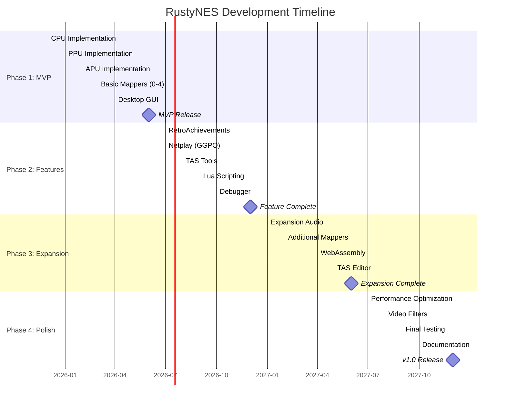

# RustyNES Development Roadmap

**Document Version:** 1.0.0
**Last Updated:** 2025-12-18
**Project Status:** Pre-Implementation (Architecture Complete)

---

## Table of Contents

- [Overview](#overview)
- [Development Phases](#development-phases)
- [Phase 1: MVP (Months 1-6)](#phase-1-mvp-months-1-6)
- [Phase 2: Advanced Features (Months 7-12)](#phase-2-advanced-features-months-7-12)
- [Phase 3: Expansion (Months 13-18)](#phase-3-expansion-months-13-18)
- [Phase 4: Polish & Release (Months 19-24)](#phase-4-polish--release-months-19-24)
- [Milestone Tracking](#milestone-tracking)
- [Feature Priorities](#feature-priorities)
- [Testing Strategy](#testing-strategy)

---

## Overview

RustyNES development follows a **phased approach** with clear milestones and deliverables. Each phase builds upon the previous, ensuring a solid foundation before adding complexity. The roadmap targets **v1.0 release within 24 months** with 100% TASVideos accuracy.

### Success Criteria

| Metric | Phase 1 (MVP) | Phase 2 | Phase 3 | Phase 4 (v1.0) |
|--------|---------------|---------|---------|----------------|
| **Accuracy** | 85% TASVideos | 95% TASVideos | 98% TASVideos | 100% TASVideos |
| **Mappers** | 5 (80% games) | 15 (95% games) | 50 (99% games) | 300+ (100%+) |
| **Test Coverage** | 75% | 85% | 90% | 95% |
| **Performance** | 100 FPS | 500 FPS | 1000 FPS | 1000+ FPS |
| **Documentation** | Core APIs | All APIs | Full guide | Complete |

---

## Development Phases

---

## Phase 1: MVP (Months 1-6)

**Goal:** Playable emulator with 80% game compatibility

### Month 1-2: CPU Implementation

**Deliverables:**
- [ ] Cycle-accurate 6502 core
- [ ] All official instructions (56 opcodes)
- [ ] Unofficial opcodes (100+ variants)
- [ ] Interrupt handling (NMI, IRQ, BRK)
- [ ] Pass nestest.nes golden log
- [ ] Pass all Blargg CPU tests

**Test ROMs:**
- nestest.nes (automated mode)
- instr_test-v5 (all official instructions)
- cpu_interrupts_v2
- cpu_dummy_reads
- cpu_exec_space

**Acceptance Criteria:**
- [ ] 100% nestest.nes match
- [ ] All Blargg CPU tests pass
- [ ] Unit tests for each instruction
- [ ] <1000 ns per instruction (benchmark)

### Month 2-4: PPU Implementation

**Deliverables:**
- [ ] Dot-level rendering (341×262 scanlines)
- [ ] Background rendering (pattern fetch, scrolling)
- [ ] Sprite rendering (evaluation, priority, sprite 0 hit)
- [ ] Accurate VBlank/NMI timing
- [ ] Loopy scrolling model
- [ ] Pass all Blargg PPU tests

**Test ROMs:**
- ppu_vbl_nmi
- ppu_sprite_hit
- ppu_sprite_overflow
- scrolltest
- spritecans-2011
- oam_stress

**Acceptance Criteria:**
- [ ] All Blargg PPU tests pass
- [ ] Sprite 0 hit works in Super Mario Bros.
- [ ] Scrolling works in Zelda, Metroid
- [ ] No visual glitches in test games

### Month 3-5: APU Implementation

**Deliverables:**
- [ ] Pulse channels (duty, envelope, sweep)
- [ ] Triangle channel (linear counter)
- [ ] Noise channel (LFSR)
- [ ] DMC channel (delta modulation)
- [ ] Frame counter (4-step, 5-step)
- [ ] Hardware-accurate mixing
- [ ] 48 kHz output with resampling

**Test ROMs:**
- apu_test
- blargg_apu_2005.07.30
- dmc_tests
- square_timer_div2
- len_halt_timing

**Acceptance Criteria:**
- [ ] 95%+ Blargg APU tests pass
- [ ] Music sounds correct in 10 test games
- [ ] <20ms audio latency
- [ ] No pops/clicks during gameplay

### Month 4-6: Mappers & Integration

**Deliverables:**
- [ ] Mapper 0 (NROM) - 9.5% of games
- [ ] Mapper 1 (MMC1/SxROM) - 27.9%
- [ ] Mapper 2 (UxROM) - 10.6%
- [ ] Mapper 3 (CNROM) - 6.3%
- [ ] Mapper 4 (MMC3/TxROM) - 23.4%
- [ ] iNES and NES 2.0 header parsing
- [ ] Save state support

**Test Games:**
- Super Mario Bros. (Mapper 0)
- Legend of Zelda (Mapper 1)
- Mega Man (Mapper 1)
- Castlevania (Mapper 2)
- Super Mario Bros. 3 (Mapper 4)

**Acceptance Criteria:**
- [ ] All 5 mappers fully functional
- [ ] 100+ games playable
- [ ] Save states work correctly
- [ ] Battery-backed SRAM persists

### Month 5-6: Desktop GUI

**Deliverables:**
- [ ] egui-based interface
- [ ] wgpu rendering backend
- [ ] SDL2 or cpal audio output
- [ ] Keyboard + gamepad input
- [ ] Configuration system
- [ ] File browser for ROM loading

**Features:**
- [ ] Menu bar (File, Emulation, Settings)
- [ ] Video settings (scale, filters)
- [ ] Audio settings (volume, sample rate)
- [ ] Controller configuration
- [ ] Save state hotkeys
- [ ] Screenshot capture

**Acceptance Criteria:**
- [ ] 60 FPS gameplay on mid-range hardware
- [ ] No audio crackling
- [ ] Gamepad auto-detection works
- [ ] Cross-platform (Linux, Windows, macOS)

### Phase 1 Milestone: MVP Release

**Release Checklist:**
- [ ] Pass 85% of TASVideos test suite
- [ ] 80%+ game compatibility (500+ games playable)
- [ ] User documentation complete
- [ ] Build instructions for all platforms
- [ ] CI/CD pipeline functional
- [ ] GitHub release with binaries

---

## Phase 2: Advanced Features (Months 7-12)

**Goal:** Feature parity with modern emulators

### Month 7-8: RetroAchievements

**Deliverables:**
- [ ] rcheevos FFI integration
- [ ] Achievement detection logic
- [ ] UI notifications (toast popups)
- [ ] Login system
- [ ] Leaderboard support
- [ ] Rich presence

**Acceptance Criteria:**
- [ ] Achievements unlock correctly in 10 test games
- [ ] No false positives/negatives
- [ ] Leaderboard submissions work
- [ ] <1% performance impact

### Month 7-9: Netplay (GGPO)

**Deliverables:**
- [ ] backroll-rs integration (Rust GGPO port)
- [ ] Save state serialization
- [ ] Input prediction/rollback
- [ ] Lobby system
- [ ] Spectator mode
- [ ] NAT traversal (STUN/TURN)

**Acceptance Criteria:**
- [ ] 1-2 frame input lag over LAN
- [ ] <5 frame rollback on 100ms ping
- [ ] No desyncs in 30-minute sessions
- [ ] Works behind typical NAT setups

### Month 8-9: TAS Tools

**Deliverables:**
- [ ] FM2 movie recording
- [ ] FM2 playback
- [ ] Frame advance
- [ ] Input recording/editing
- [ ] RAM search
- [ ] RAM watch
- [ ] Cheat search

**Acceptance Criteria:**
- [ ] Can record and replay TAS movies
- [ ] Deterministic execution (same inputs → same output)
- [ ] Frame-perfect input timing
- [ ] Compatible with FCEUX FM2 format

### Month 9-10: Lua Scripting

**Deliverables:**
- [ ] mlua 5.4 integration
- [ ] Memory read/write API
- [ ] Callback hooks (frame, scanline, instruction)
- [ ] Input injection
- [ ] GUI overlay support
- [ ] Example scripts (hitbox viewer, bot AI)

**Acceptance Criteria:**
- [ ] Can read/write RAM from Lua
- [ ] Frame callbacks work at 60 Hz
- [ ] Drawing primitives render correctly
- [ ] <5% performance overhead

### Month 10-11: Advanced Debugger

**Deliverables:**
- [ ] CPU debugger (disassembly, breakpoints, stepping)
- [ ] PPU viewer (nametables, pattern tables, palettes, OAM)
- [ ] APU viewer (channel waveforms, volume meters)
- [ ] Memory viewer/editor (hex dump, search)
- [ ] Trace logger
- [ ] Code-data logger (CDL)

**Acceptance Criteria:**
- [ ] Breakpoints work reliably
- [ ] PPU viewer updates in real-time
- [ ] Trace logger captures execution
- [ ] Useful for homebrew debugging

### Month 11-12: Quality of Life

**Deliverables:**
- [ ] Rewind (ring buffer of save states)
- [ ] Fast-forward (uncapped speed)
- [ ] Slow-motion (adjustable speed)
- [ ] Game Genie codes
- [ ] Pro Action Replay codes
- [ ] Screenshot/video recording

**Acceptance Criteria:**
- [ ] Rewind goes back 10+ seconds
- [ ] Fast-forward reaches 10x speed
- [ ] Cheats apply correctly
- [ ] Video recording at 60 FPS

### Phase 2 Milestone: Feature Complete

**Release Checklist:**
- [ ] Pass 95% of TASVideos test suite
- [ ] All advanced features functional
- [ ] API documentation complete
- [ ] Tutorial videos recorded
- [ ] Community Discord server launched

---

## Phase 3: Expansion (Months 13-18)

**Goal:** Comprehensive mapper support and platform expansion

### Month 13-15: Expansion Audio

**Deliverables:**
- [ ] VRC6 (2 pulse + sawtooth)
- [ ] VRC7 (FM synthesis)
- [ ] MMC5 (2 pulse + PCM)
- [ ] Namco 163 (8 wavetable channels)
- [ ] Sunsoft 5B (3 square + noise)
- [ ] FDS (wavetable + modulation)

**Test Games:**
- Castlevania III (VRC6)
- Lagrange Point (VRC7)
- Castlevania (FDS)

**Acceptance Criteria:**
- [ ] Expansion audio sounds accurate
- [ ] Music matches hardware recordings
- [ ] Proper channel mixing

### Month 14-17: Additional Mappers

**Target:** 98% game coverage (50 total mappers)

**Priority Mappers:**
- [ ] Mapper 5 (MMC5) - ExROM
- [ ] Mapper 7 (AxROM) - Battletoads
- [ ] Mapper 9/10 (MMC2/4) - Punch-Out!!
- [ ] Mapper 11 (ColorDreams)
- [ ] Mapper 19 (Namco 163)
- [ ] Mapper 23/25 (VRC2/4)
- [ ] Mapper 24/26 (VRC6)
- [ ] Mapper 69 (Sunsoft FME-7)
- [ ] + 30 more common mappers

**Acceptance Criteria:**
- [ ] All target games playable
- [ ] Mapper-specific test ROMs pass
- [ ] IRQ timing accurate

### Month 16-17: WebAssembly

**Deliverables:**
- [ ] wasm-pack build configuration
- [ ] Web frontend (HTML/CSS/JS)
- [ ] Browser audio/video APIs
- [ ] Virtual filesystem (for ROMs)
- [ ] Touch controls (mobile)
- [ ] PWA support

**Acceptance Criteria:**
- [ ] Runs in Chrome, Firefox, Safari
- [ ] 60 FPS on desktop browsers
- [ ] 30+ FPS on mobile
- [ ] ROMs load from local files

### Month 17-18: TAS Editor

**Deliverables:**
- [ ] Greenzone (verified frame history)
- [ ] Bookmarks
- [ ] Piano roll input editor
- [ ] Branch system
- [ ] Undo/redo
- [ ] Input recording shortcuts

**Acceptance Criteria:**
- [ ] Can create/edit TAS movies
- [ ] Greenzone manages 10,000+ frames
- [ ] Branching works reliably
- [ ] Competitive with FCEUX TAS editor

### Phase 3 Milestone: Expansion Complete

**Release Checklist:**
- [ ] Pass 98% of TASVideos test suite
- [ ] 99%+ game compatibility
- [ ] WebAssembly demo live
- [ ] Expansion audio demo videos

---

## Phase 4: Polish & Release (Months 19-24)

**Goal:** Production-ready v1.0 release

### Month 19-21: Performance Optimization

**Targets:**
- [ ] 1000+ FPS (16x real-time) on modern CPUs
- [ ] <100 MB memory footprint
- [ ] <5ms frame time
- [ ] <10ms audio latency

**Optimizations:**
- [ ] CPU: Jump table dispatch, inline hot paths
- [ ] PPU: SIMD pixel compositing, batch rendering
- [ ] APU: Fast sinc resampling, SSE/NEON mixing
- [ ] Mappers: Precomputed banking tables

**Profiling:**
- [ ] Criterion benchmarks for all components
- [ ] Flamegraph analysis
- [ ] Cache misses optimization

### Month 20-21: Video Filters

**Deliverables:**
- [ ] NTSC filter (Blargg)
- [ ] CRT shader (scanlines, curvature, bloom)
- [ ] Palette options (Composite, RGB, Custom)
- [ ] Aspect ratio modes (4:3, Pixel Perfect, Stretch)
- [ ] Overscan cropping

**Acceptance Criteria:**
- [ ] Filters look authentic
- [ ] <2ms overhead per frame
- [ ] User-adjustable parameters

### Month 21-22: Final Testing

**Test Plan:**
- [ ] All 156 TASVideos tests pass
- [ ] 100 most popular games fully playable
- [ ] 24-hour stability test
- [ ] Cross-platform regression tests
- [ ] Memory leak detection
- [ ] Fuzzing for edge cases

**Bug Fixes:**
- [ ] Prioritize by severity
- [ ] Test coverage for all fixes
- [ ] Regression prevention

### Month 22-23: Documentation

**Deliverables:**
- [ ] User manual (PDF + web)
- [ ] API reference (rustdoc)
- [ ] Developer guide
- [ ] Video tutorials
- [ ] FAQ
- [ ] Troubleshooting guide

**Topics:**
- Getting started
- Configuration
- Advanced features (TAS, netplay, debugging)
- Troubleshooting
- Contributing guide

### Month 24: v1.0 Release

**Release Checklist:**
- [ ] 100% TASVideos accuracy
- [ ] 300+ mappers implemented
- [ ] All planned features complete
- [ ] Zero critical bugs
- [ ] Documentation complete
- [ ] Press release written
- [ ] Release trailer produced
- [ ] Binary packages for all platforms

**Launch Activities:**
- [ ] Reddit post (/r/emulation, /r/rust)
- [ ] Hacker News submission
- [ ] YouTube demo video
- [ ] Blog post announcement
- [ ] Discord/Matrix community launch

---

## Milestone Tracking

### Current Status (Pre-Implementation)

**Architecture & Documentation Complete** - Ready to begin Phase 1 CPU implementation.

| Component | Status | Progress |
|-----------|--------|----------|
| **Architecture Design** | Complete | 100% |
| **Documentation** | Complete (39 files) | 100% |
| **Workspace Structure** | Complete (10 crates) | 100% |
| **CPU** | Not Started | 0% |
| **PPU** | Not Started | 0% |
| **APU** | Not Started | 0% |
| **Mappers** | Not Started | 0% |
| **GUI** | Not Started | 0% |
| **Tests** | Not Started | 0% |

### Key Milestones

- [ ] **M1:** CPU passes nestest.nes (January 2026)
- [ ] **M2:** PPU renders first frame (March 2026)
- [ ] **M3:** APU outputs audio (April 2026)
- [ ] **M4:** First game playable (May 2026)
- [ ] **M5:** MVP release (June 2026)
- [ ] **M6:** RetroAchievements working (August 2026)
- [ ] **M7:** Netplay functional (September 2026)
- [ ] **M8:** Feature complete (December 2026)
- [ ] **M9:** WebAssembly demo (May 2027)
- [ ] **M10:** v1.0 release (December 2027)

---

## Feature Priorities

### P0 (Critical - MVP Blockers)

- Cycle-accurate CPU
- Dot-level PPU
- APU with all 5 channels
- Mappers 0, 1, 2, 3, 4
- Desktop GUI
- Save states

### P1 (High - Post-MVP)

- RetroAchievements
- Netplay
- TAS recording
- Lua scripting
- Advanced debugger
- Rewind

### P2 (Medium - Expansion)

- Expansion audio
- 50 total mappers
- WebAssembly
- TAS editor
- Video filters

### P3 (Low - Polish)

- 300+ mappers
- Performance optimizations
- Advanced shaders
- Steam integration
- Mobile builds

---

## Testing Strategy

### Unit Tests

- CPU: Each instruction
- PPU: Rendering functions
- APU: Channel outputs
- Mappers: Banking logic

**Target:** 95% code coverage

### Integration Tests

- CPU+Bus interactions
- PPU+Mapper interactions
- Full frame execution
- Save state serialization

### Test ROM Validation

**Essential (Must Pass):**
- nestest.nes
- blargg_nes_cpu_test5
- blargg_ppu_tests
- blargg_apu_2005.07.30

**Additional:**
- TASVideos accuracy test suite (156 ROMs)
- mmc3_test
- sprite_hit_tests_2005.10.05
- vbl_nmi_timing

### Game Compatibility Testing

**Per Mapper:**
- 10 commercial games
- 5 homebrew games
- Known edge cases

**Regression Testing:**
- CI pipeline runs on every commit
- Automated save state comparison
- Frame-by-frame screenshot diffing

---

## Conclusion

This roadmap balances **ambition** with **realism**, targeting v1.0 in 24 months with aggressive but achievable milestones. The phased approach ensures continuous value delivery, with each phase building upon a solid foundation.

Success depends on:
- **Community involvement** (testing, feedback, contributions)
- **Rigorous testing** (test ROMs, real games, edge cases)
- **Performance profiling** (optimize after correctness)
- **Clear documentation** (lowering contribution barriers)

**Next Steps:** Begin Phase 1 - CPU implementation!

---

## Related Documentation

- [OVERVIEW.md](OVERVIEW.md) - Project vision and philosophy
- [ARCHITECTURE.md](ARCHITECTURE.md) - System design
- [dev/CONTRIBUTING.md](dev/CONTRIBUTING.md) - How to contribute
- [dev/TESTING.md](dev/TESTING.md) - Testing guidelines
